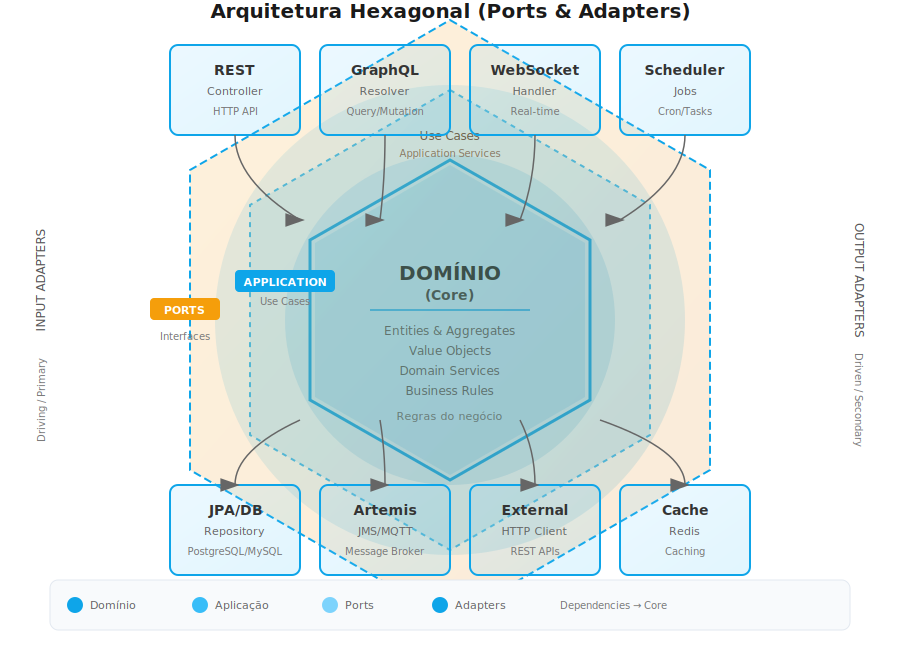

# Archbase Framework

[](https://central.sonatype.com/search?q=g:br.com.archbase)
[](https://openjdk.org/projects/jdk/17/)
[](https://spring.io/projects/spring-boot)

**Archbase** é um framework Java para aplicações empresariais construído sobre Spring Boot 3.5.6 e Java 17. Implementa Domain-Driven Design (DDD) com Onion Architecture, oferecendo uma base sólida e modular para aplicações complexas.

> **Versão 2.0.0** - Veja as [notas de release](CHANGELOG.md) para informações sobre atualizações.

## Características

- **Domain-Driven Design** - Suporte completo a entidades, agregados, value objects e repositórios
- **Multi-tenancy** - Isolamento de tenant com múltiplas estratégias de resolução
- **Segurança** - JWT com controle de permissões baseado em anotações
- **Event-Driven** - CQRS com buses separados para Commands, Queries e Events
- **Query Flexível** - Suporte a RSQL para filtros dinâmicos
- **Validação** - Framework de validação com fluent interface
- **Workflow Engine** - Orquestração de processos de negócio
- **Plugin System** - Carregamento dinâmico de extensões

## Quick Start

### Adicione a dependência

```xml
<dependency>
    <groupId>br.com.archbase</groupId>
    <artifactId>archbase-starter</artifactId>
    <version>2.0.0</version>
</dependency>
```

Ou use módulos específicos:

```xml
<!-- Para apenas DDD básico -->
<dependency>
    <groupId>br.com.archbase</groupId>
    <artifactId>archbase-starter-core</artifactId>
    <version>2.0.0</version>
</dependency>

<!-- Para segurança -->
<dependency>
    <groupId>br.com.archbase</groupId>
    <artifactId>archbase-starter-security</artifactId>
    <version>2.0.0</version>
</dependency>

<!-- Para multi-tenancy -->
<dependency>
    <groupId>br.com.archbase</groupId>
    <artifactId>archbase-starter-multitenancy</artifactId>
    <version>2.0.0</version>
</dependency>
```

### Configure a aplicação

```yaml
archbase:
  security:
    enabled: true
    jwt:
      secret: sua-chave-secreta-minimo-32-caracteres
      expiration: 86400000  # 24 horas

  multitenancy:
    enabled: true
    scan-packages: com.suaempresa

  rsql:
    enabled: true
    case-insensitive: true
```

### Crie uma entidade

```java
@Entity
@DomainEntity
public class Cliente extends PersistenceEntityBase<Cliente, UUID> {

    private String nome;
    private String email;

    @Override
    public ValidationResult validate() {
        return new Cliente.Validator().validate(this);
    }

    static class Validator extends AbstractArchbaseValidator<Cliente> {
        @Override
        public void rules() {
            ruleFor(Cliente::getNome)
                .must(not(stringEmptyOrNull()))
                .withMessage("Nome é obrigatório");

            ruleFor(Cliente::getEmail)
                .must(emailAddress())
                .withMessage("Email inválido");
        }
    }
}
```

### Crie um repositório

```java
@DomainRepository
public interface ClienteRepository
    extends Repository<Cliente, UUID, Long> {
    // CRUD automático disponível
}
```

### Crie um controller

```java
@RestController
@RequestMapping("/api/clientes")
@HasPermission(action = "VIEW", resource = "CLIENTE")
public class ClienteController {

    @Autowired
    private ClienteRepository repository;

    @GetMapping
    public Page<Cliente> buscar(
            @RequestParam(required = false) String filter,
            Pageable pageable) {

        ArchbaseSpecification<Cliente> spec = Specification.where(null);
        if (filter != null) {
            spec = ArchbaseRSQLJPASupport.toSpecification(filter, Cliente.class);
        }

        return repository.findAll(spec, pageable);
    }

    @PostMapping
    @HasPermission(action = "CREATE", resource = "CLIENTE")
    public Cliente criar(@RequestBody @Valid Cliente cliente) {
        return repository.save(cliente);
    }
}
```

## Módulos

| Módulo | Descrição |
|--------|-----------|
| `archbase-starter` | Starter completo com todos os módulos |
| `archbase-starter-core` | Configuração core (RSQL, Jackson, Swagger) |
| `archbase-starter-security` | Autenticação JWT e controle de permissões |
| `archbase-starter-multitenancy` | Suporte a multi-tenancy |
| `archbase-domain-driven-design` | Implementação base de DDD |
| `archbase-domain-driven-design-spec` | Padrão Specification para queries |
| `archbase-query` | Query handling e suporte RSQL |
| `archbase-security` | `@HasPermission` e autenticação programática |
| `archbase-multitenancy` | Isolamento de tenant e contexto |
| `archbase-event-driven` | CQRS com Command/Query/Event buses |
| `archbase-workflow-process` | Motor de workflow |
| `archbase-plugin-manager` | Carregamento dinâmico de plugins |
| `archbase-validation` | Framework de validação |
| `archbase-error-handling` | Tratamento centralizado de erros |

## Arquitetura

O framework segue **Hexagonal Architecture** (Ports & Adapters) com separação clara de responsabilidades:



## Recursos Avançados

### Multi-tenancy

```java
@Entity
@DomainEntity
public class Produto extends TenantPersistenceEntityBase<Produto, UUID> {
    // Tenant ID é adicionado automaticamente
}
```

### CQRS com Event Bus

```java
@Configuration
@HandlerScan(basePackages = "com.minhaempresa.handlers")
public class HandlerConfig {
}

@Component
public class CriarProdutoHandler {
    @CommandHandler
    public UUID handle(CriarProdutoCommand command) {
        // Lógica do comando
        return id;
    }

    @EventHandler
    public void on(ProdutoCriadoEvent event) {
        // Reage ao evento
    }
}
```

### Autenticação Programática

```java
@Autowired
private SystemUserContext systemUserContext;

public void processarJob() {
    systemUserContext.runAsSystemUser("system@empresa.com", () -> {
        // Executa como usuário do sistema
    });
}
```

### Workflow Engine

```java
Workflow workflow = Workflow.builder()
    .id("pedido-workflow")
    .step("validar")
    .step("processar-pagamento")
    .step("enviar-confirmacao")
    .build();

WorkflowEngine executor = new WorkflowEngine(workflow);
executor.execute(context);
```

## Documentação

Para documentação completa e detalhada, visite:

- [Guia do Usuário](https://docs.archbase.com.br)
- [API Reference](https://javadoc.io/doc/br.com.archbase/archbase-starter)
- [Exemplos](https://github.com/edsonmartins/archbase-examples)

## Requisitos

- Java 17 ou superior
- Spring Boot 3.5.6
- Maven 3.6+

## Licença

Copyright © 2024 Relevant Solutions

## Links Úteis

- [Site Oficial](https://www.archbase.com.br)
- [Documentação](https://docs.archbase.com.br)
- [Maven Central](https://central.sonatype.com/search?q=g:br.com.archbase)
- [GitHub](https://github.com/edsonmartins/archbase-app-framework)

## Versão 1.x

Para a versão 1.x do framework, use a branch [V1](https://github.com/edsonmartins/archbase-app-framework/tree/V1).
