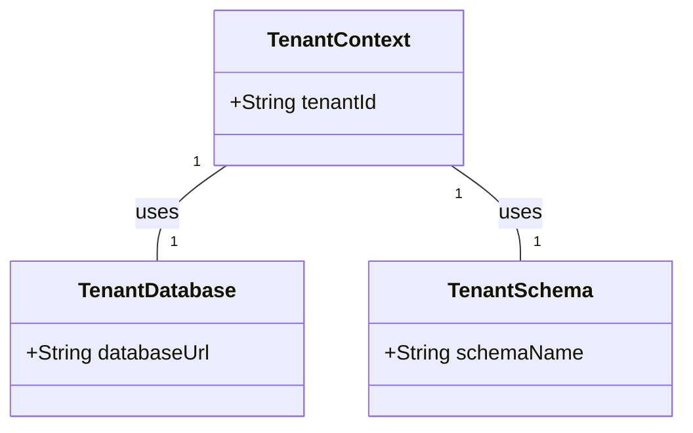

# Módulo Archbase-Multitenancy

O módulo `archbase-multitenancy` é projetado para facilitar a implementação de aplicações multi-inquilino em Spring Boot, oferecendo uma gestão eficiente de múltiplos inquilinos em um único ambiente de aplicação.

## Principais Funcionalidades

- **Isolamento de Dados**: Garante que os dados de cada inquilino sejam isolados e inacessíveis por outros inquilinos.
- **Configuração Flexível**: Suporta várias estratégias de isolamento de dados, tais como esquema separado, banco de dados separado, ou distinções dentro de um mesmo banco de dados.
- **Integração Transparente**: Facilmente integrável com o Spring Boot, usando abstrações simples para manipular a identidade do inquilino através de solicitações HTTP.

## Configuração do Módulo Archbase-Multitenancy

Para ativar e configurar o multitenancy em sua aplicação, ajuste as seguintes propriedades no seu `application.properties` ou `application.yml`:

```properties
# Ativar suporte a multitenancy
archbase.multitenancy.enabled=true

# Pacote para escanear anotações de permissão (requerido se usando controle de acesso por inquilino)
archbase.multitenancy.scan-packages=br.com.exemplo.minhaapp
```

## Diagrama de Entidades

O seguinte diagrama simplificado mostra como o multitenancy pode ser implementado usando entidades de contexto de inquilino:



## Uso Básico do Multitenancy

Depois de configurar o suporte a multitenancy, você pode acessar e manipular dados de maneira que respeite o contexto do inquilino atual. Isso é geralmente gerenciado automaticamente pelo framework, assegurando que as operações de banco de dados estejam corretamente contextualizadas pelo inquilino identificado.

### Exemplo de Configuração de Interceptador

Você pode configurar um interceptador para extrair e definir o ID do inquilino de cada solicitação HTTP, como mostrado abaixo:

```java
@Bean
public HandlerInterceptor tenantInterceptor() {
    return new TenantInterceptor();
}
```