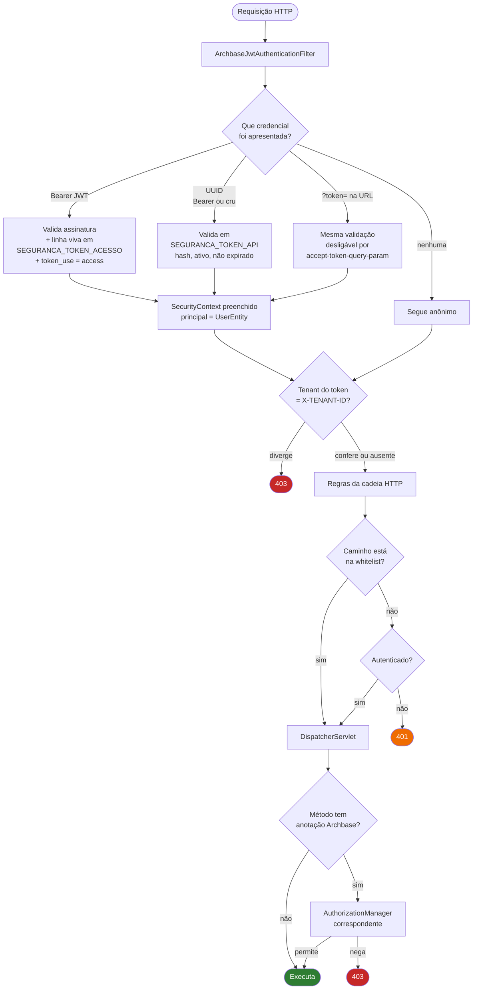
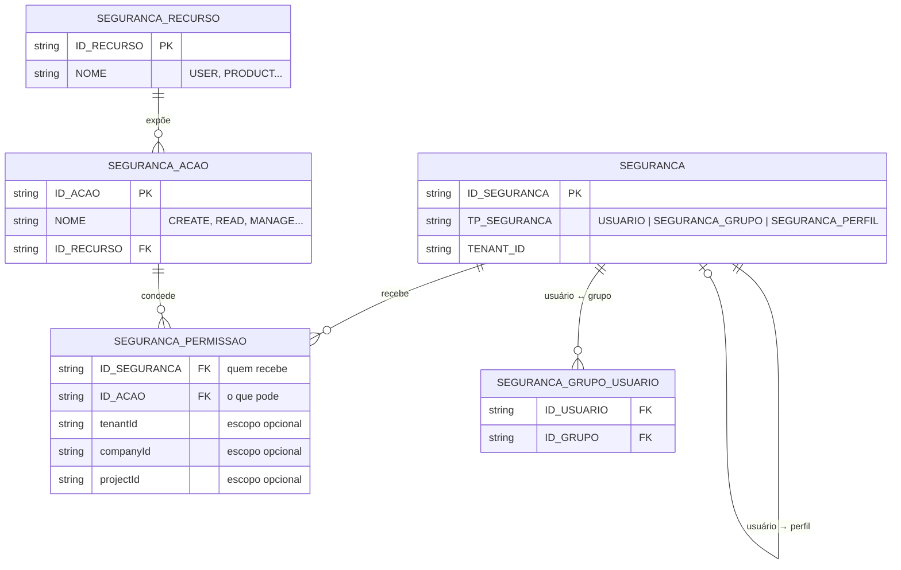
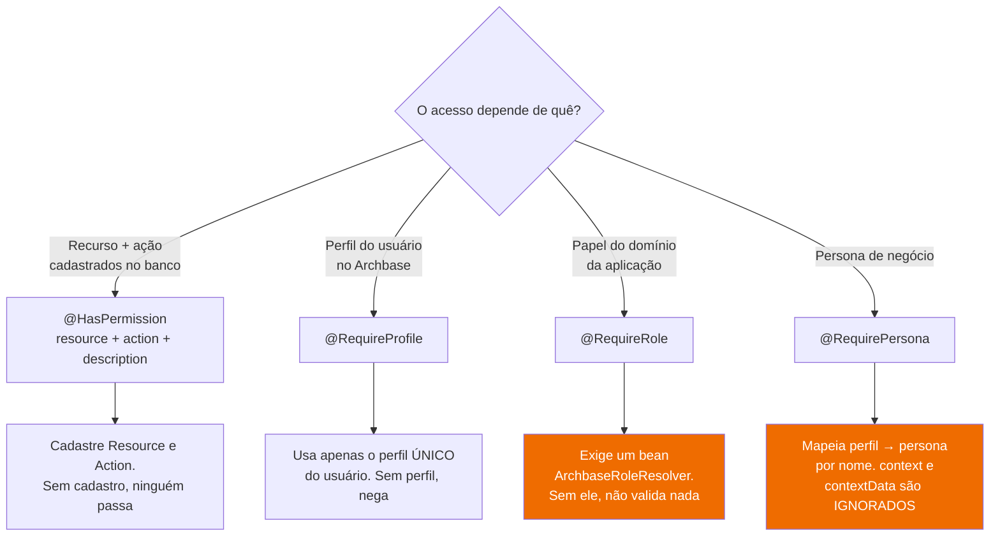
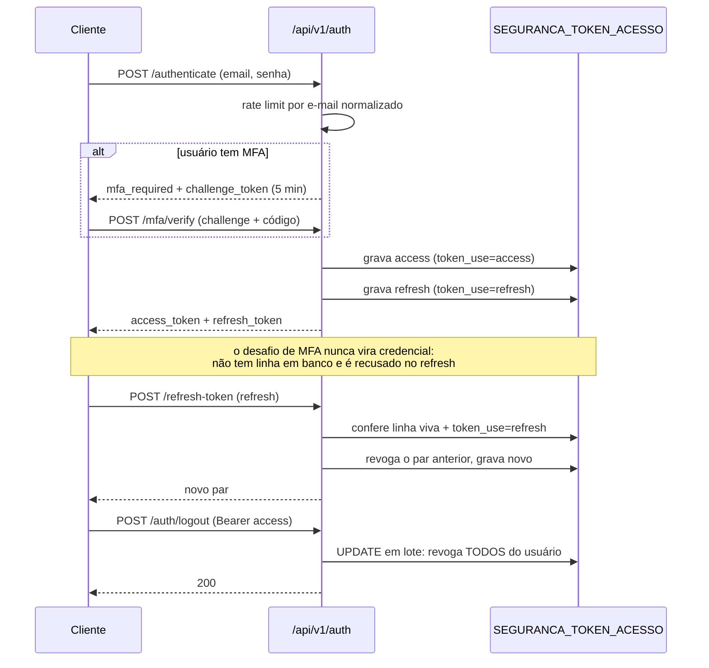
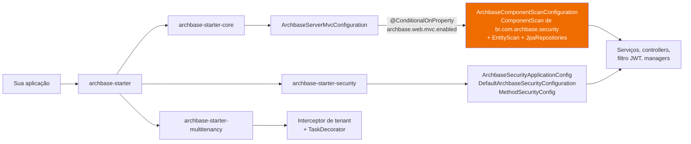

# Arquitetura do archbase-security

Referência de como o módulo funciona e como aplicá-lo. Escrito a partir do código, não da
documentação anterior — onde os dois divergem, este documento aponta a divergência
explicitamente na seção [Documentação × código](#documentação--código).

---

## Por que gera confusão

O módulo tem **quatro sistemas de autorização independentes** que coexistem, e nada no código
diz qual usar quando. Uma requisição pode ser barrada em dois lugares diferentes, por motivos
diferentes, com respostas diferentes:

| Camada | Onde decide | Granularidade | Configurada por |
|---|---|---|---|
| **1. Cadeia HTTP** | `SecurityFilterChain` | Caminho de URL | `archbase.security.whitelist` + `configureAuthorizationRules` |
| **2. Anotações de método** | 5 `AuthorizationManager` | Método Java | `@HasPermission`, `@RequireProfile`, `@RequireRole`, `@RequirePersona` |
| **3. Bypass de administrador** | `ArchbaseSecurityService` | Global | Campo `isAdministrator` do usuário |
| **4. Isolamento de tenant** | Filtro JWT + `@TenantId` | Linha do banco | Claim do token vs. header |

Some disso três fontes concretas de erro, todas verificadas no código:

1. **`hasRole()` e `hasAuthority()` do Spring nunca funcionam.** `UserEntity.getAuthorities()`
   devolve lista vazia. Um `@PreAuthorize("hasRole('ADMIN')")` **nega sempre**, silenciosamente.
   Autorização aqui é só pelas anotações do Archbase.
2. **`@HasPermission` exige `description`**, que não tem valor padrão. Todo exemplo da
   documentação antiga omite — e **não compila**.
3. **Oito propriedades são obrigatórias** e sem elas a aplicação não sobe, com erro de
   placeholder que não indica segurança. Ver [Configuração mínima](#configuração-mínima).

---

## Caminho de uma requisição



**O ponto que mais confunde:** a whitelist (camada 1) libera o *caminho*, mas **não desliga** as
anotações de método (camada 2). Um endpoint na whitelist com `@HasPermission` continua exigindo
permissão — e como não há usuário autenticado, nega. As duas camadas se somam, nunca se
substituem.

---

## Modelo de permissão

Usuário, grupo e perfil são **a mesma tabela** (`SEGURANCA`), separados por discriminador. É isso
que permite conceder permissão a qualquer um dos três de forma uniforme.



Ao avaliar `@HasPermission`, o framework monta o conjunto de identidades do usuário —
**id do próprio usuário + ids dos seus grupos + id do seu perfil** — e procura uma permissão
para qualquer uma delas. Herança é por união, não por hierarquia.

Duas regras que surpreendem:

- **Administrador ignora tudo.** `isAdministrator = true` faz `hasPermission` devolver `true`
  sem consultar o banco. Não existe recurso que um administrador não alcance.
- **Escopo nulo é curinga.** Permissão com `tenantId` nulo vale para qualquer tenant; o mesmo
  para company e project. O isolamento real entre tenants vem do `@TenantId` do Hibernate, não
  desses campos — eles são estreitamento *dentro* do tenant.

---

## Qual anotação usar



Recomendação prática, em ordem de preferência:

1. **`@HasPermission`** — é a única com modelo de dados completo por trás e escopo multi-tenant.
   Use como padrão.
2. **`@RequireProfile`** — atalho útil quando a regra é mesmo "só o perfil X". Lembre que o
   usuário tem **um** perfil, não vários: `requireAll = true` com dois perfis nunca passa.
3. **`@RequireRole`** — só faz sentido se a aplicação registrar `ArchbaseRoleResolver`. Sem isso
   o comportamento é decidido por `archbase.security.require-role.no-resolver-policy`.
4. **`@RequirePersona`** — o mapeamento embutido é um `switch` sobre nomes de perfil
   (`PLATFORM_ADMIN`, `STORE_ADMIN`, `CUSTOMER`, `DRIVER`); fora desses, compara o nome da
   persona com o nome do perfil. Os parâmetros `context` e `contextData` **não são lidos**.

**Anotações combinadas somam (AND).** Cada anotação tem seu próprio interceptador; todos precisam
permitir. Não existe OR entre elas.

**Nível de classe funciona** em `@RequireProfile`, `@RequireRole` e `@RequirePersona` — a
anotação no método vence a da classe. **`@HasPermission` é `@Target(METHOD)`**: na classe, não
compila.

---

## Ciclo de vida das credenciais



O access token é **stateful**: a assinatura sozinha não basta, a linha precisa existir e estar
viva. É isso que torna logout e revogação efetivos — e é por isso que apagar a tabela desloga
todo mundo.

---

## Fiação: o que entra com qual dependência



Dois detalhes que enganam, e ambos produzem o mesmo sintoma — a aplicação sobe, mas metade da
segurança não existe:

- **Quem varre os componentes é o `starter-core`, não o `starter-security`.** Usar só o
  `archbase-starter-security` registra as configurações e nenhum serviço. Na prática, use
  `archbase-starter`.
- **`archbase.web.mvc.enabled=false` desliga o scan inteiro.** A propriedade parece ser sobre
  MVC, mas a cadeia é
  `ArchbaseCoreAutoConfiguration → ArchbaseServerMvcConfiguration → ArchbaseComponentScanConfiguration`,
  e é essa última que registra os serviços de segurança, as entidades e os repositórios.

Para substituir a configuração de segurança, implemente `CustomSecurityConfiguration` e estenda
`BaseArchbaseSecurityConfiguration`. A `DefaultArchbaseSecurityConfiguration` é
`@ConditionalOnMissingBean(CustomSecurityConfiguration.class)` e sai de cena sozinha.

---

## Configuração mínima

Estas oito **não têm valor padrão**. Faltando qualquer uma, a aplicação não sobe:

```properties
archbase.security.jwt.secret-key=<Base64 de 32 bytes>
archbase.security.jwt.token-expiration=3600000
archbase.security.jwt.refresh-expiration=86400000
archbase.security.whitelist=
archbase.security.cors.allowed-origins=*
archbase.security.cors.allowed-methods=*
archbase.security.cors.allowed-headers=*
archbase.security.cors.allow-credentials=false
```

`whitelist` pode ficar vazia, mas **precisa estar declarada**. As demais propriedades do módulo
têm padrão e estão listadas no `CLAUDE.md`; as de endurecimento de segurança, em
[deployment/security-hardening.md](../deployment/security-hardening.md).

---

## Documentação × código

Divergências verificadas linha a linha. Todos os exemplos abaixo estão em documentos que os
desenvolvedores usam hoje.

| Divergência | Onde | Realidade no código |
|---|---|---|
| `@HasPermission(resource=, action=)` sem `description` | `readme-security.md`, `README.md` | `description()` é obrigatório — **o exemplo não compila** |
| `archbase.security.jwt.secret` e `.expiration` | `CLAUDE.md` | Os nomes corretos são `secret-key` e `token-expiration` |
| `refresh-expiration` não aparece em nenhum doc | todos | É **obrigatória** |
| `whitelist` e as quatro de CORS não documentadas | todos | São **obrigatórias** |
| "`@RequireRole` e `@RequirePersona` são extensíveis via enrichers" | `readme-security.md` | Não há ligação entre enrichers e os managers. `@RequireRole` usa `ArchbaseRoleResolver` |
| `@RequirePersona(context=, contextData=)` | `readme-security.md` | Nenhum dos dois é lido na decisão |
| `@RequireRole(requirePlatformAdmin=true)` descrito como "admin E role" | `readme-security.md` | `allowSystemAdmin` (padrão `true`) libera o admin **antes** dessa checagem |
| Login social listado como funcionalidade | `readme-security.md` | Sem um `ArchbaseSocialTokenValidator`, responde 501 |
| `groupId com.archbase`, versão `1.0.0` | `archbase-starter-security/readme.md` | É `br.com.archbase`, versão 3.0.x |

---

## Fragilidades arquiteturais

Não são bugs — são decisões de desenho que custam caro na manutenção.

**Quatro sistemas de autorização sem critério de uso.** `@RequireProfile`, `@RequireRole` e
`@RequirePersona` resolvem variações do mesmo problema com semânticas diferentes e graus de
completude muito diferentes. `@RequirePersona` chega a ter um `switch` com nomes de negócio
(`STORE_ADMIN`, `DRIVER`) embutido no framework — regra de uma aplicação específica dentro do
código compartilhado. Consolidar em `@HasPermission` + um SPI para papéis reduziria a superfície
sem perder capacidade.

**Perfil é um só.** `UserEntity.profile` é `@ManyToOne` — um único perfil por usuário. Toda a API
de `@RequireProfile` fala em arrays e `requireAll`, sugerindo múltiplos. `requireAll = true` com
mais de um perfil é uma condição que nunca pode ser satisfeita.

**O bypass de administrador é absoluto e invisível.** Não há como marcar um recurso como
inalcançável por administrador, nem registro de que o bypass ocorreu.

**`getAuthorities()` vazio desliga o Spring Security padrão.** Qualquer expressão `hasRole`,
`hasAuthority` ou `@Secured` nega silenciosamente. Falha fechada, mas quem não souber vai perder
tempo. Vale documentar no lugar mais visível ou popular as authorities a partir do perfil.

**Token de acesso stateful a cada requisição.** Toda chamada autenticada faz uma consulta em
`SEGURANCA_TOKEN_ACESSO`. É o que dá revogação imediata, mas é uma leitura por requisição — vale
saber ao dimensionar.
