# Arquitetura do archbase-security

Referência de como o módulo decide quem pode o quê — e de como aplicá-lo sem tentativa e erro.
Escrito a partir do código.

> **Se você tem cinco minutos**, leia [O modelo em uma imagem](#o-modelo-em-uma-imagem) e
> [Qual anotação usar](#qual-usar). O resto é referência.

---

## Comece por aqui

| Você quer… | Use | Seção |
|---|---|---|
| Proteger um endpoint por uma capacidade de negócio | `@HasPermission` | [As anotações](#as-anotações-o-que-cada-uma-declara) |
| Impedir que uma capacidade sensível valha para quem não deveria | `minimumLevel` + nível no perfil | [Nível de acesso](#nível-de-acesso) |
| Tirar uma pessoa de algo que o time inteiro tem | `effect = DENY` na permissão | [Negação explícita](#negação-explícita) |
| Restringir por perfil, papel ou persona | `@RequireProfile` / `@RequireRole` / `@RequirePersona` | [As anotações](#as-anotações-o-que-cada-uma-declara) |
| Entender por que fulano recebeu 403 | Endpoints de diagnóstico | [Diagnóstico](#diagnóstico-por-que-esta-pessoa-não-passou) |
| Ligar uma proteção sem quebrar produção | Flags + validador de subida | [Configuração](#configuração) |

---

## O modelo em uma imagem

Toda decisão de acesso passa por **cinco portões, na mesma ordem, sempre**. E há uma regra que
organiza tudo:

> **Os portões 1 a 4 só sabem NEGAR. Só o portão 5 CONCEDE.**

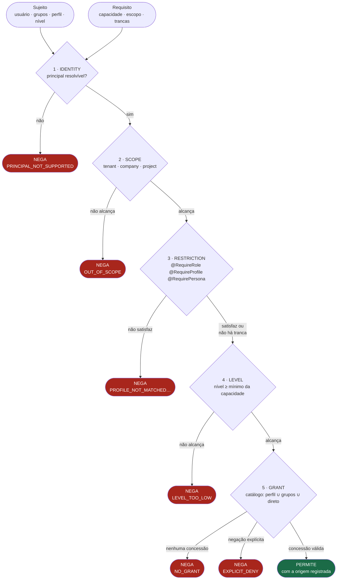

### Por que essa regra resolve a confusão

Restrição e catálogo **nunca competem**, porque fazem coisas de natureza diferente: uma tranca, a
outra abre.

- Uma tranca fechada **não é contornável** por concessão nenhuma. Ter a capacidade atribuída no
  admin não basta se o perfil errado bateu no portão 3, ou se o nível não alcança no portão 4.
- Passar por todas as trancas **não abre nada sozinho**. Sem concessão no catálogo, o acesso é
  negado no portão 5.

Não há "qual caminho seguir": os dois são usados, cada um no seu papel.

### Quem decide

Um objeto só: `ArchbaseAccessEvaluator`.

```java
public interface ArchbaseAccessEvaluator {
    AccessDecision decide(AccessSubject subject, AccessRequirement requirement);
}
```

**As anotações não decidem — elas declaram.** Cada uma monta um `AccessRequirement` e delega.
`ArchbaseSecurityService.hasPermission()` continua existindo e devolvendo `boolean`, mas por baixo
é o mesmo avaliador.

E a decisão carrega o **motivo**:

```java
public record AccessDecision(
    boolean allowed,
    Gate deniedAt,            // em qual portão parou
    String reasonCode,        // LEVEL_TOO_LOW, EXPLICIT_DENY, NO_GRANT, OUT_OF_SCOPE…
    String message,           // legível, para o log e para o 403
    String grantedBy,         // id do perfil/grupo/usuário que concedeu
    String grantedByName,
    List<GateOutcome> chain   // a cadeia inteira
) {}
```

É isso que permite responder *"por que essa pessoa não passou?"* sem abrir grupo por grupo no admin.

### O administrador

`isAdministrator` **não é um desvio no topo**. São duas propriedades do sujeito:

- nível `TENANT_ADMIN`, o topo da escala — nunca barrado pelo portão 4;
- concessão universal no portão 5 — não consulta o catálogo.

Consequência: um administrador continua sujeito a **escopo** (portão 2) e a **restrição explícita**
(portão 3). Um `@RequireProfile(allowSystemAdmin = false)` nega o administrador que não tem o
perfil — e sempre negou.

---

## Caminho de uma requisição

Antes de chegar aos portões, a requisição atravessa a cadeia HTTP.

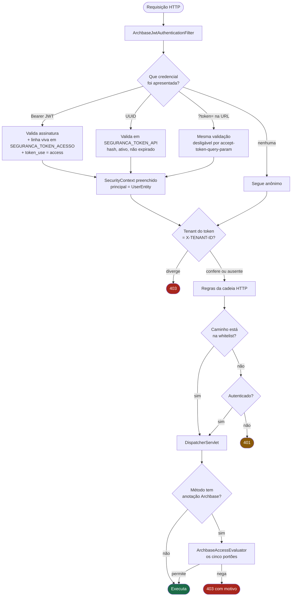

**O ponto que mais confunde:** a whitelist libera o *caminho*, mas **não desliga** as anotações de
método. Um endpoint na whitelist com `@HasPermission` continua exigindo permissão — e, sem usuário
autenticado, nega. As duas camadas se somam, nunca se substituem.

**Segundo ponto:** `hasRole()` e `hasAuthority()` do Spring **nunca funcionam** aqui.
`UserEntity.getAuthorities()` devolve lista vazia, então `@PreAuthorize("hasRole('ADMIN')")` **nega
sempre**, em silêncio. Autorização neste módulo é pelas anotações do Archbase.

---

## As anotações: o que cada uma declara

| Anotação | Declara | Pode conceder? | Precisa de |
|---|---|---|---|
| `@HasPermission` | uma **capacidade** (recurso + ação) | **sim** — é a única | catálogo alimentado |
| `@RequireProfile` | tranca por perfil | não, só nega | o usuário ter perfil |
| `@RequireRole` | tranca por papel do domínio | não, só nega | um `ArchbaseRoleResolver` |
| `@RequirePersona` | tranca por persona | não, só nega | mapeamento perfil → persona |
| `@ArchbaseResource` | o recurso da classe | — | vai na **classe** |

### `@HasPermission` — a que concede

```java
@RestController
@RequestMapping("/api/v1/ordens-servico")
@ArchbaseResource(value = "tms.ordemservico", description = "Ordem de serviço")
public class OrdemServicoController {

    @GetMapping
    @HasPermission(action = "view", description = "Listar ordens de serviço")
    public ResponseEntity<Page<OrdemServicoDto>> listar(...) { ... }

    @PostMapping("/{id}/iniciar")
    @HasPermission(action = "iniciar_execucao", description = "Iniciar a execução da OS",
                   minimumLevel = AccessLevel.OPERATOR)
    public ResponseEntity<Void> iniciar(@PathVariable String id) { ... }

    @PostMapping("/{id}/aprovar-custo")
    @HasPermission(action = "aprovar_custo", description = "Aprovar o custo da OS",
                   minimumLevel = AccessLevel.SUPERVISOR)
    public ResponseEntity<Void> aprovarCusto(@PathVariable String id) { ... }
}
```

Três coisas importantes nesse bloco:

1. **`description` é obrigatória.** Não é burocracia: o texto vira a descrição da Action no
   catálogo, e é o que quem administra lê na hora de conceder. Sem valor padrão — por isso todo
   exemplo antigo que omite o campo **não compila**.
2. **`@ArchbaseResource` na classe** evita repetir o recurso. Só o recurso é herdado, nunca a ação —
   herdar a ação faria um `DELETE` exigir a mesma capacidade de um `GET`.
3. **`minimumLevel` é semente, não lei.** Gravado no primeiro registro da ação e nunca sobrescrito
   depois; a partir daí quem manda é o admin. O desenvolvedor declara o piso que conhece, a operação
   ajusta o que ela conhece melhor — sem deploy.

`@HasPermission` é `@Target(METHOD)`. Na classe, não compila — e é de propósito.

### As três trancas

```java
// Só quem tem o perfil SUPERVISOR passa. Administrador é isento por padrão.
@RequireProfile("SUPERVISOR")
public void fecharCompetencia() { ... }

// Administrador NÃO é isento: a tranca vale para todos.
@RequireProfile(value = "AUDITORIA", allowSystemAdmin = false)
public void exportarTrilha() { ... }

// Papel do domínio da aplicação — exige ArchbaseRoleResolver registrado.
@RequireRole("GESTOR_FROTA")
public void reatribuirVeiculo() { ... }
```

Detalhes que mudam o resultado:

- **`allowSystemAdmin` nasce `true`** nas três, e isenta o administrador **daquela tranca
  específica**. É isenção local, não desvio global.
- **A ordem de checagem difere entre elas.** `@RequireRole` verifica conta desativada **antes** da
  isenção de administrador; `@RequireProfile` e `@RequirePersona`, depois. É comportamento
  histórico, preservado de propósito.
- **O usuário tem um perfil só.** `requireAll = true` com dois perfis é insatisfazível por
  construção.
- **`@RequirePersona` traz uma tabela fixa** de outro domínio embutida no framework
  (`PLATFORM_ADMIN`, `STORE_ADMIN`, `CUSTOMER`, `DRIVER`); fora dela, compara o nome da persona com
  o do perfil. `context` e `contextData` **não são lidos**. Evite em código novo.

### Uma tranca sozinha concede

Este é o ponto que mais gera engano:

```java
@RequireProfile("SUPERVISOR")   // sem @HasPermission
public void fecharCompetencia() { ... }
```

Sem capacidade declarada, **não há catálogo a consultar** — então passar na tranca é a decisão
inteira. Qualquer pessoa com o perfil `SUPERVISOR` executa, sem que ninguém tenha concedido nada.

Isso é legítimo quando a regra é mesmo "só o perfil X". Mas **não é** um substituto de
`@HasPermission`: não aparece no catálogo, não pode ser concedido ou revogado pelo admin, e não
muda sem deploy.

### Combinando

Anotações somam — todas precisam permitir. Não existe OR entre elas.

```java
@PostMapping("/{id}/cancelar")
@RequireProfile(value = "SUPERVISOR", allowSystemAdmin = false)
@HasPermission(action = "cancelar", description = "Cancelar a OS",
               minimumLevel = AccessLevel.SUPERVISOR)
public ResponseEntity<Void> cancelar(@PathVariable String id) { ... }
```

Lê-se: *precisa ser SUPERVISOR (mesmo sendo admin), precisa ter a capacidade concedida, e precisa
alcançar o nível.*

### Qual usar

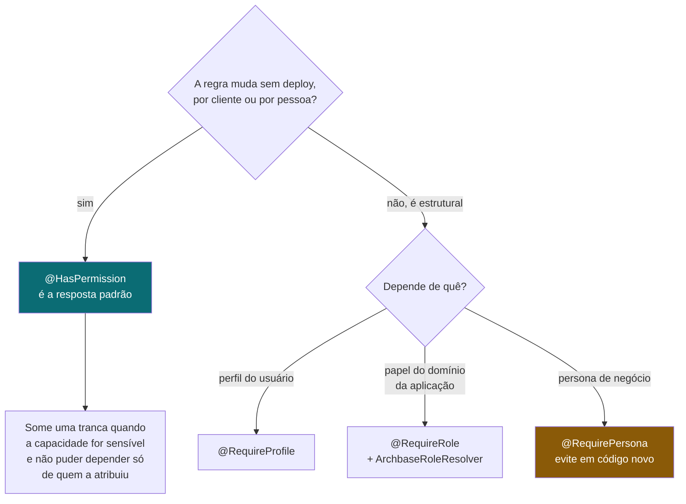

**Regra de bolso:** comece sempre por `@HasPermission`. Acrescente uma tranca quando a resposta a
*"e se alguém atribuir isso para quem não devia?"* for inaceitável.

---

## O catálogo: Resource e Action

`@HasPermission` não é só uma checagem: é uma **declaração**. A anotação alimenta um catálogo no
banco, e é desse catálogo que as permissões são concedidas.

Existem **dois catálogos**, separados pelo campo `TIPO` do recurso, com ciclos de vida opostos:

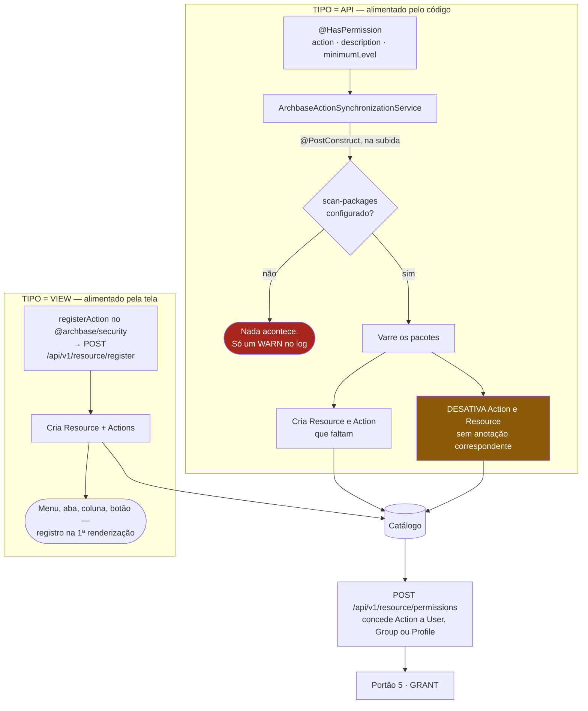

**Os dois planos são simétricos e propositais.** `registerAction()` no frontend é o irmão de
`@HasPermission` no backend; nos dois a descrição é obrigatória, pela mesma razão. Tratar uma
affordance de tela — menu, aba, coluna, botão — como ação é o desenho pretendido, e é o que dá
controle fino sem código.

### A armadilha que já causou incidente

`disableUnusedActionsAndResources` desativa toda entrada de tipo `API` sem anotação correspondente.
Numa aplicação que **ainda não anotou nada**, ela não encontra capacidade alguma e desativa o
catálogo API inteiro.

Isso aconteceu: no gestor-rq, 8 recursos criados por seed foram desativados por `archbase` em
31/07/2026, sem que ninguém tivesse pedido.

**Antes de ligar o primeiro `@HasPermission` num sistema existente:**

```properties
archbase.security.sync.mode=report
```

Nesse modo a varredura **não escreve nada** — apenas registra em log o que faria, incluindo a lista
nominal do que desativaria. Leia, confirme, e só então volte para `apply`.

### As outras armadilhas

**1. Sem `archbase.security.scan-packages`, nada é sincronizado.** Padrão vazio; quando vazia, um
`WARN` e retorna. O sintoma é desconcertante: métodos anotados, catálogo vazio, e `@HasPermission`
**negando todo mundo** — porque sem Action não existe permissão que possa apontar para ela.

```properties
archbase.security.scan-packages=com.suaempresa.seuapp
```

**2. A varredura roda só no tenant padrão.** `Resource` e `Action` são `@TenantId`, e o
`@PostConstruct` acontece fora de requisição — o resolvedor cai em `archbase.app.tenant.default.id`.
Numa aplicação multi-tenant, os demais tenants ficam **sem catálogo API**. Popule por migration ou
por `/resource/register` nesse cenário. *(Limitação conhecida — ver [Em aberto](#em-aberto).)*

**3. `active` não corta acesso — por padrão.** A consulta de autorização casa por nome de ação e
recurso, sem filtrar `active`. Uma Action desativada **continua concedendo** no caminho do
`@HasPermission`.

E há uma assimetria que surpreende: a listagem que o **frontend** consome sempre filtrou
`action.active`. Ou seja, uma concessão sobre ação inativa é **invisível na tela** e **honrada pelo
backend**. No gestor-rq isso alcança 1.279 de 2.229 concessões — 57%.

Para alinhar os dois lados:

```properties
archbase.security.permission.require-active=true
```

**Ligar isso tira acesso.** Rode o relatório de efetivo antes — ver [Diagnóstico](#diagnóstico-por-que-esta-pessoa-não-passou).

**4. Renomear a anotação deixa a permissão órfã.** Trocar `action = "view"` por `action = "listar"`
cria uma Action nova, sem nenhuma permissão concedida — o método passa a negar todo mundo. Renomear
é, na prática, revogar.

**5. O espaço de nomes é único entre os dois catálogos.** `ensureResourceExists` busca só pelo nome,
sem filtrar tipo. Trate nomes de recurso como únicos, independentemente de `VIEW` ou `API`.

### Concessão

Conceder é sempre pelo **id da Action**, nunca pelo nome:

```
GET  /api/v1/resource/permissions                     lista o catálogo com os ids
POST /api/v1/resource/permissions                     { actionId, securityId, type }
                                                      type = USER | GROUP | PROFILE
DELETE /api/v1/resource/permissions/{id}              revoga
GET  /api/v1/resource/permissions/{resourceName}      o que o usuário logado pode aqui
```

Como `User`, `Group` e `Profile` são a mesma tabela, `securityId` aceita qualquer um dos três — é o
campo `type` que diz onde procurar.

---

## Nível de acesso

O portão 4 responde a uma pergunta que o catálogo sozinho não responde: *e se alguém atribuir uma
capacidade sensível a quem não deveria tê-la?*

```java
public enum AccessLevel { NONE, READER, OPERATOR, SUPERVISOR, TENANT_ADMIN }
```

> **Piso, não substituto.** Alcançar o nível **não concede nada**. O acesso continua dependendo de
> permissão no catálogo. O nível apenas **impede** que uma concessão indevida valha.

### De onde sai o nível de uma pessoa

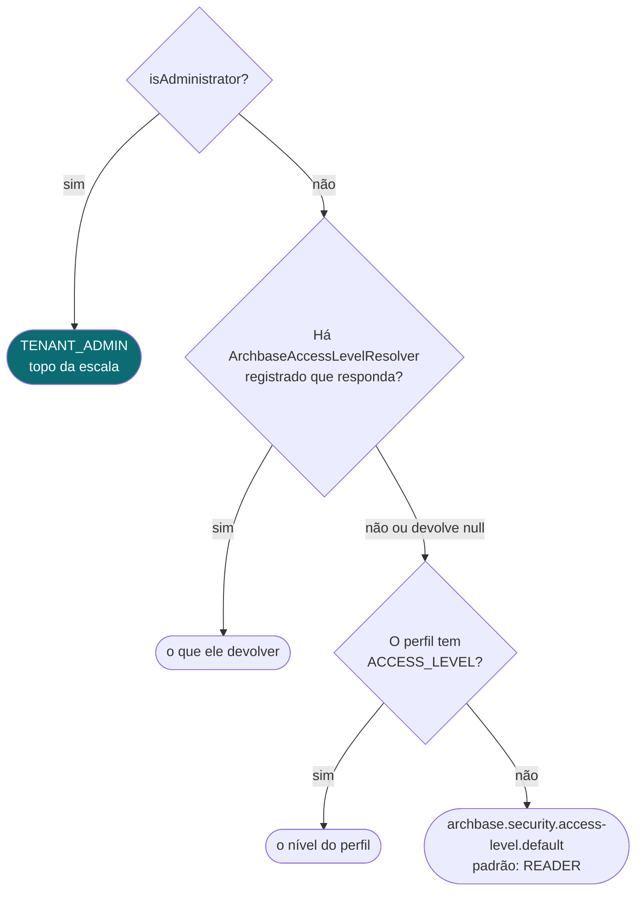

**Por que o perfil, e não o grupo:** o nível é ordinal e precisa de valor único. O usuário tem **um**
perfil; grupos, vários — e escolher entre o maior e o menor seria arbitrário nos dois sentidos.

Quem modela senioridade fora do perfil registra um resolver:

```java
@Component
public class NivelPorCargo implements ArchbaseAccessLevelResolver {

    @Override
    public AccessLevel resolveLevel(AccessSubject subject) {
        // null significa "não sei" — a resolução volta ao perfil
        return cargoRepository.findByUserId(subject.userId())
                .map(this::traduzir)
                .orElse(null);
    }
}
```

### A escala é curta de propósito

Quatro degraus. Vontade de ter oito é sinal de estar tentando expressar no nível o que pertence à
capacidade: `tms.ordemservico:aprovar_custo` já se distingue de `:iniciar_execucao` sem precisar de
degrau próprio.

Os **rótulos** exibidos são do cliente; a **ordem** é do framework. É o que permite que cada cliente
use seu vocabulário sem que o core precise conhecê-lo.

### Ligar com segurança

```properties
archbase.security.access-level.enabled=true
archbase.security.access-level.default=READER
```

**A armadilha:** num sistema onde todo perfil tem `ACCESS_LEVEL` nulo, ligar isso joga todo mundo no
padrão — e qualquer capacidade com mínimo acima disso passa a **negar em massa no primeiro deploy**,
sem ninguém ter mexido em permissão.

O validador de subida avisa: conta os perfis sem nível, diz quantos são, e aponta o endpoint de
efetivo para ver quem perde o quê.

---

## Negação explícita

Até aqui o modelo só sabia somar — perfil ∪ grupos ∪ direto, união pura. Excluir uma pessoa de algo
que o time inteiro tem exigia criar um grupo paralelo só para ela.

| | como funciona |
|---|---|
| Conceder | perfil, grupo ou usuário |
| Combinar | união (OR) |
| Negar | `SEGURANCA_PERMISSAO.EFFECT = 'DENY'` |
| Desempate | **DENY vence, em qualquer nível** |

Uma frase, explicável para analista de negócio sem diagrama:

> O perfil libera para o time inteiro, e a negação no usuário tira daquela pessoa.

**Escopo:** a negação vale **dentro do escopo em que foi declarada**. `DENY` com `tenantId = A` não
afeta o tenant B; sem escopo, vence em todos. Mesma semântica que a concessão sempre teve.

`EFFECT` nulo é `GRANT` — é o que toda concessão existente significa.

---

## Modelo de dados

Usuário, grupo e perfil são **a mesma tabela**, separados por discriminador. É isso que permite
conceder a qualquer um dos três de forma uniforme.

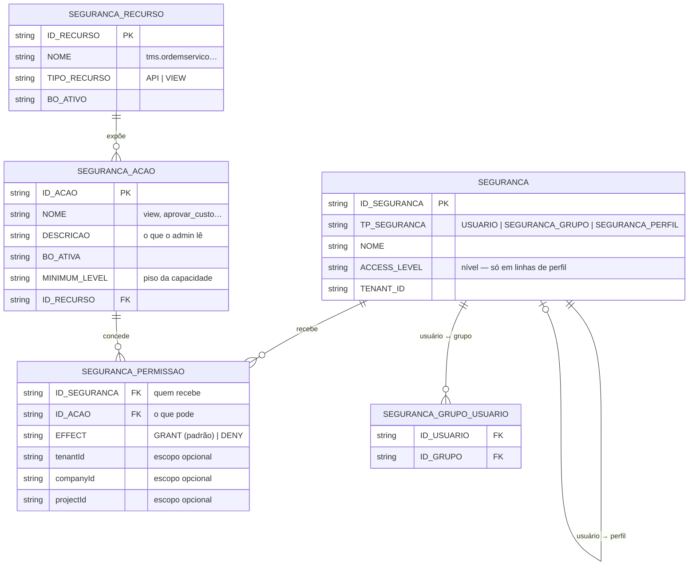

As três colunas do core — `ACCESS_LEVEL`, `MINIMUM_LEVEL`, `EFFECT` — entram **nulas** pela migration
repetível do próprio framework
(`src/main/resources/db/migration/archbase/R__archbase_security_schema.sql`). Nenhum backfill, nenhum
`not null`. Um sistema existente sobe idêntico.

> ⚠ O arquivo de migration é **específico de PostgreSQL** (`add column if not exists`,
> `comment on column`). Em MySQL e Oracle o Flyway falha e a aplicação não sobe. Limitação
> pré-existente ao core.

**Escopo nulo é curinga.** Permissão com `tenantId` nulo vale para qualquer tenant. O isolamento real
entre tenants vem do `@TenantId` do Hibernate, não desses campos — eles são estreitamento *dentro*
do tenant.

---

## Diagnóstico: por que esta pessoa não passou?

Três endpoints, todos alimentados pelo **mesmo avaliador que decide em produção**. Não há motor
paralelo — um diagnóstico que diverge da realidade é pior do que nenhum.

```properties
archbase.security.diagnostics.enabled=true
```

**Desligados por padrão**, e mesmo ligados **exigem `isAdministrator`** — verificado no próprio
controlador, sem depender de `admin-endpoints.policy`. Revelam a estrutura de acesso do tenant:
mantenha ligado só enquanto durar a investigação.

### Simulação — "esta pessoa conseguiria fazer isto?"

```http
POST /api/v1/security/diagnostics/simulate
{ "email": "fulano@empresa.com", "resource": "tms.ordemservico", "action": "aprovar_custo" }
```

```json
{
  "allowed": false,
  "deniedAt": "LEVEL",
  "reasonCode": "LEVEL_TOO_LOW",
  "message": "A permissão está concedida, mas tms.ordemservico:aprovar_custo exige nível SUPERVISOR e o usuário alcança OPERATOR. Ter a capacidade atribuída não basta.",
  "chain": [
    { "gate": "IDENTITY", "passed": true,  "detail": "Usuário fulano@empresa.com resolvido" },
    { "gate": "SCOPE",    "passed": true,  "detail": "Escopo compatível" },
    { "gate": "LEVEL",    "passed": false, "reasonCode": "LEVEL_TOO_LOW",
      "detail": "Nível OPERATOR; tms.ordemservico:aprovar_custo exige SUPERVISOR" }
  ]
}
```

Avalia **sem executar nada**. A resposta diz em que portão parou e por quê.

### Efetivo — "o que esta pessoa pode?"

```http
GET /api/v1/security/diagnostics/users/{id}/effective
GET /api/v1/security/diagnostics/effective?email=fulano@empresa.com
```

```json
{
  "userLabel": "fulano@empresa.com",
  "profileName": "SUPERVISOR",
  "groupNames": ["GESTORES-FROTA", "TIME-TRANSPORTE"],
  "administrator": false,
  "granted": 20, "effective": 13, "inert": 7,
  "capabilities": [
    { "resource": "tms.ordemservico", "action": "aprovar_custo",
      "grantedByName": "GESTORES-FROTA", "grantedByType": "Group",
      "actionActive": true, "situation": "EFFECTIVE" },
    { "resource": "tms.pneu", "action": "instalar",
      "grantedByName": "TIME-TRANSPORTE", "grantedByType": "Group",
      "actionActive": false, "situation": "INERT" }
  ]
}
```

A coluna **origem** é o que não existia em lugar nenhum antes do core. `INERT` marca exatamente as
concessões que deixariam de valer com `require-active=true` — **é o relatório que se lê antes de
ligar a flag**.

### Panorama — "como está o conjunto?"

```http
GET /api/v1/security/diagnostics/overview
```

Devolve os contadores do tenant **junto do estado das proteções** — de propósito. Uma concessão
inerte é inofensiva enquanto nada consulta o catálogo, e vira acesso indevido no dia em que algo
consultar. Número sem esse contexto não é interpretável.

---

## Códigos de motivo

Quando um 403 aparece, o `reasonCode` diz onde olhar.

| Código | Portão | O que aconteceu | Onde corrigir |
|---|---|---|---|
| `PRINCIPAL_NOT_SUPPORTED` | IDENTITY | O principal não é `UserEntity` — geralmente `UserDetailsService` próprio | Faça o seu `UserDetailsService` devolver `UserEntity` |
| `PRINCIPAL_INCOMPLETE` | IDENTITY | `isAdministrator` nulo no banco | Preencha a coluna com `true` ou `false` |
| `OUT_OF_SCOPE` | SCOPE | A permissão existe, mas para outro tenant/empresa/projeto | Revise o escopo da concessão |
| `PROFILE_NOT_MATCHED` | RESTRICTION | Perfil diferente do exigido | Perfil do usuário, ou a anotação |
| `PERSONA_NOT_MATCHED` | RESTRICTION | Persona não corresponde ao perfil | Ver a tabela fixa de personas |
| `ROLE_NOT_MATCHED` | RESTRICTION | O resolver não devolveu o papel exigido | Seu `ArchbaseRoleResolver` |
| `ROLE_RESOLVER_MISSING` | RESTRICTION | `no-resolver-policy=deny` sem resolver registrado | Registre o resolver, ou volte para `permit` |
| `PLATFORM_ADMIN_REQUIRED` | RESTRICTION | `requirePlatformAdmin` exigido de não-administrador | — |
| `NOT_OWNER` | RESTRICTION | `ownerOnly` não confirmado pelo SPI | Com >1 resolver, `isOwner` não tem resposta |
| `ACCOUNT_NOT_ACTIVE` | RESTRICTION | Conta desativada ou bloqueada | — |
| `LEVEL_TOO_LOW` | LEVEL | Concessão existe, nível não alcança | Nível do perfil, ou `MINIMUM_LEVEL` da ação |
| `NO_GRANT` | GRANT | Ninguém concedeu — nem direto, nem grupo, nem perfil | Conceda no admin |
| `EXPLICIT_DENY` | GRANT | Há uma permissão `DENY` alcançando o escopo | Remova a negação |
| `EMPTY_REQUIREMENT` | — | Requisito sem capacidade e sem tranca | Erro de programação do adaptador |

**Um caso que engana:** `NO_GRANT` num sistema recém-anotado quase sempre significa **catálogo
vazio**, não permissão faltando. Confira `archbase.security.scan-packages`.

---

## Receitas

### Proteger um CRUD inteiro

```java
@RestController
@RequestMapping("/api/v1/veiculos")
@ArchbaseResource(value = "tms.veiculo", description = "Veículo")
public class VeiculoController {

    @GetMapping
    @HasPermission(action = "view", description = "Listar veículos")
    public ... listar() { ... }

    @PostMapping
    @HasPermission(action = "create", description = "Cadastrar veículo",
                   minimumLevel = AccessLevel.OPERATOR)
    public ... criar(...) { ... }

    @PutMapping("/{id}")
    @HasPermission(action = "edit", description = "Editar veículo",
                   minimumLevel = AccessLevel.OPERATOR)
    public ... editar(...) { ... }

    @DeleteMapping("/{id}")
    @HasPermission(action = "delete", description = "Excluir veículo",
                   minimumLevel = AccessLevel.SUPERVISOR)
    public ... excluir(...) { ... }
}
```

### Excluir uma pessoa de algo que o grupo tem

Sem criar grupo paralelo: conceda ao grupo e crie uma permissão `DENY` no usuário, sobre a mesma
Action. A negação vence.

### Piloto num sistema que nunca usou `@HasPermission`

```
1. archbase.security.sync.mode=report        sobe, lê o log, confere o que seria desativado
2. archbase.security.scan-packages=…          garante que a varredura enxerga seus pacotes
3. anota UM domínio                           o mais bem modelado, com verbos de negócio reais
4. volta para sync.mode=apply                 o catálogo é criado
5. concede no admin                           antes que alguém precise
6. diagnostics.enabled=true                   valida com simulate antes de liberar
```

### Descobrir quem perde acesso ao ligar `require-active`

```http
GET /api/v1/security/diagnostics/users/{id}/effective
```

O campo `inert` de cada usuário é exatamente quantas capacidades ele perderia.

---

## Ciclo de vida das credenciais

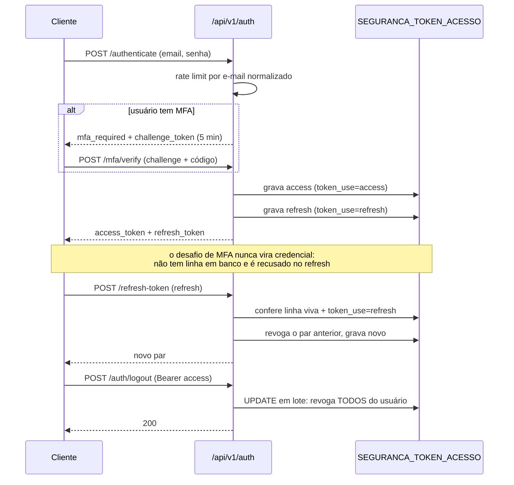

O access token é **stateful**: a assinatura sozinha não basta, a linha precisa existir e estar viva.
É isso que torna logout e revogação efetivos — e é uma leitura por requisição, o que vale saber ao
dimensionar.

---

## Tenant no login

### O modelo: um e-mail em N tenants são N usuários

Não existe entidade de vínculo "usuário ↔ tenants", e **não existe tabela de tenant** neste módulo. O
tenant é uma coluna da própria linha:

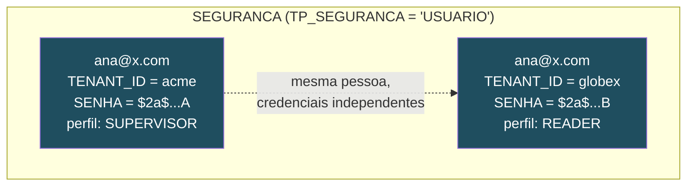

Consequência que orienta todo o resto: **não existe "a senha de Ana"** — existe a senha dela *naquele
tenant*. Os hashes podem divergir, e nada os sincroniza. Perfil, grupos e `BO_ADMINISTRADOR` também
são por linha.

### O bootstrap era circular

Para logar era preciso mandar `X-TENANT-ID`; mas o tenant só se descobre sabendo quem é a pessoa. As
aplicações resolviam embutindo o tenant numa variável de build — o que fixa **um tenant por build** —
ou consultando um endpoint anônimo de descoberta antes do login.

O servidor sempre soube resolver; o que faltava era contar:

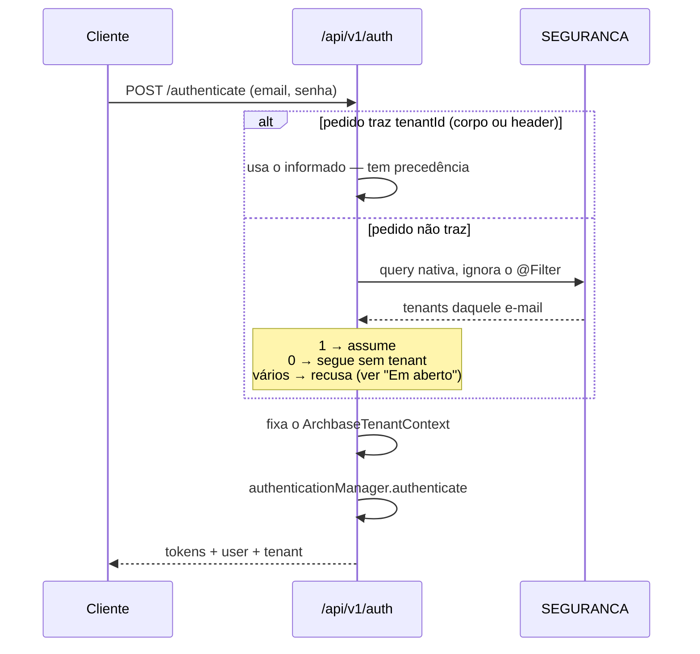

O campo `tenant` na resposta é o mesmo valor do claim `tenantId` do JWT — que continua sendo a fonte
de verdade inforjável. O campo só o torna legível sem decodificar o token. Vale para `/authenticate`,
`/login`, `/login-flexible`, `/login-social` e `/refresh-token`, porque é preenchido no funil único
`buildAuthenticationResponse`. **Não** vem no desafio de MFA, onde o login ainda não se completou.

### O rótulo é da aplicação, não do framework

`GET /api/v1/auth/tenants?email=` devolve **apenas o `tenantId`**.

Antes devolvia também `nome` e `descricao` — lidos das colunas `NOME`/`DESCRICAO` da linha de
`SEGURANCA`. Só que, para `TP_SEGURANCA='USUARIO'`, essas colunas são **o nome e a descrição da
pessoa**, não da organização: como não há tabela de tenant, não havia nome de empresa ali para dar. O
endpoint é anônimo, então qualquer um que soubesse um e-mail recebia o nome do titular — e o seletor
de tenant do cliente acabava exibindo o nome do próprio usuário no lugar da empresa.

Quem tem cadastro de organizações é a aplicação:

```java
@Bean
public ArchbaseTenantInfoResolver tenantInfoResolver(OrganizacaoRepository repository) {
    return tenantId -> repository.findById(tenantId)
            .map(org -> TenantLoginOption.builder()
                    .nome(org.getNomeFantasia())
                    .descricao(org.getRazaoSocial())
                    .build())
            .orElse(null);
}
```

Com o bean, os rótulos vêm preenchidos **na descoberta e na resposta do login**. Sem ele, o cliente
recebe o id. O `tenantId` sempre vem do banco, mesmo que o resolver não o preencha. Exceção lançada
pelo resolver vai para o log e não derruba o login: o id sozinho basta para o cliente funcionar.

### Duas contagens na descoberta, e por que duas

| chave | contém |
|---|---|
| **origem (IP)** | **enumeração** — a varredura usa um e-mail diferente a cada palpite; contar só por e-mail daria orçamento novo a cada tentativa e nunca bloquearia |
| **e-mail** | martelo sobre um alvo específico, vindo de várias origens |

Qualquer uma basta para recusar com `429` + `Retry-After`. O escopo é **separado do `login`**: abusar
da descoberta não pode trancar o login legítimo de quem tem aquele e-mail — seria negação de serviço
contra a vítima. Usa as chaves `archbase.security.rate-limit.*` já existentes.

### O 401 uniforme só vale se o relógio também for

E-mail inexistente e senha errada convergem para a mesma `BadCredentialsException` e devolvem o mesmo
corpo. Isso já era verdade — e era insuficiente, porque o **tempo** contava a diferença.

O `DaoAuthenticationProvider` do Spring se defende disso: quando o usuário não existe, ele confere a
senha apresentada contra um hash fictício e descarta o resultado, só para gastar o mesmo bcrypt. Mas
esse ramo vive em `catch (UsernameNotFoundException)`. O bean padrão resolvia o usuário com
`Optional.get()`, que lança `NoSuchElementException` e cai no `catch (Exception)` seguinte: a
mitigação existia, estava compilada e **nunca era alcançada**.

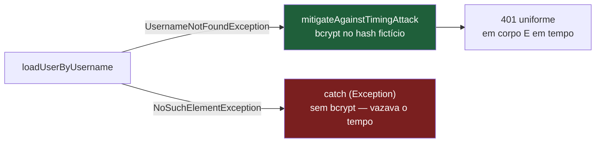

> **Se a sua aplicação registra o próprio `UserDetailsService`**, o bean do framework
> (`@ConditionalOnMissingBean`) não entra e a proteção é sua: lance `UsernameNotFoundException` — não
> `NoSuchElementException`, não `null`, não uma exceção própria.

---

## Fiação: o que entra com qual dependência

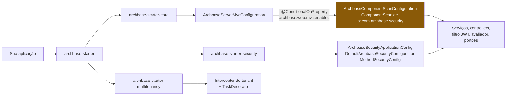

Dois detalhes que enganam, ambos com o mesmo sintoma — a aplicação sobe, metade da segurança não
existe:

- **Quem varre os componentes é o `starter-core`, não o `starter-security`.** Usar só o
  `archbase-starter-security` registra as configurações e nenhum serviço. Na prática, use
  `archbase-starter`.
- **`archbase.web.mvc.enabled=false` desliga o scan inteiro.** A propriedade parece ser sobre MVC,
  mas a cadeia é
  `ArchbaseCoreAutoConfiguration → ArchbaseServerMvcConfiguration → ArchbaseComponentScanConfiguration`,
  e é essa última que registra serviços, entidades e repositórios de segurança.

Para substituir a configuração, implemente `CustomSecurityConfiguration` e estenda
`BaseArchbaseSecurityConfiguration`. A `DefaultArchbaseSecurityConfiguration` é
`@ConditionalOnMissingBean` e sai de cena sozinha.

---

## Configuração

### Obrigatórias — sem elas a aplicação não sobe

```properties
archbase.security.jwt.secret-key=<Base64 de 32 bytes>
archbase.security.jwt.token-expiration=3600000
archbase.security.jwt.refresh-expiration=86400000
archbase.security.whitelist=
archbase.security.cors.allowed-origins=*
archbase.security.cors.allowed-methods=*
archbase.security.cors.allowed-headers=*
archbase.security.cors.allow-credentials=false
```

`whitelist` pode ficar vazia, mas **precisa estar declarada**.

### Obrigatória na prática se você usa `@HasPermission`

```properties
archbase.security.scan-packages=com.suaempresa.seuapp
```

Não impede a subida — desliga silenciosamente todo o catálogo de endpoint.

### Do core de autorização

```properties
archbase.security.access-level.enabled=false     # liga o portão LEVEL
archbase.security.access-level.default=READER    # nível de quem não tem perfil
archbase.security.permission.require-active=false # alinha o backend ao frontend
archbase.security.sync.mode=apply                # apply | report
archbase.security.diagnostics.enabled=false      # expõe /security/diagnostics/*
```

**Todos os padrões reproduzem o comportamento anterior ao core.** Ligar qualquer um é decisão
explícita, e o validador de subida checa os pré-requisitos:

```properties
archbase.security.hardening.validation=fail      # fail | warn | off
```

Com `fail`, uma proteção habilitada sem pré-requisito **impede a subida** com a instrução do que
fazer — em vez de produzir comportamento errado mais tarde, no meio de uma requisição.

As demais propriedades estão em [deployment/security-hardening.md](../deployment/security-hardening.md).

---

## Em aberto

Limitações conhecidas, registradas para não serem redescobertas.

**A varredura não é multi-tenant.** Roda em `@PostConstruct`, uma vez, no tenant padrão. Corrigir
exige saber de onde sai a lista de tenants, e o framework não tem esse registro.

**A interceptação ainda não é única.** A *regra* foi unificada no avaliador; a *interceptação*
continua com um interceptador por anotação, para não mudar ordem de execução nem semântica de falha
de aplicações em produção. Um método com `@HasPermission` e `@RequireProfile` produz duas cadeias de
motivo, e não uma. Unificar é passo próprio, atrás de flag.

**`@RequirePersona` carrega vocabulário de outro domínio.** A tabela `PLATFORM_ADMIN` / `STORE_ADMIN`
/ `CUSTOMER` / `DRIVER` está embutida no framework. Preservada porque removê-la mudaria decisão em
quem depende dela; substituir por resolução configurável é trabalho pendente.

**`getAuthorities()` vazio desliga o Spring Security padrão.** Qualquer `hasRole`, `hasAuthority` ou
`@Secured` nega em silêncio.

**A migration é específica de PostgreSQL.** MySQL e Oracle não sobem com o arquivo repetível do
framework.

**Uma consulta de sujeito por decisão.** O core acrescenta uma leitura onde antes havia uma. Cache
por requisição resolve, mas não está desenhado.

**O login recusa e-mail multi-tenant antes de conferir a senha.** Quando o pedido não traz tenant e o
e-mail existe em mais de um, o login lança sem chegar à autenticação — o que revela pertencimento a
várias organizações sem senha nenhuma, e ainda por um status diferente do 401 (`/authenticate` deixa
escapar como 500; `/login-flexible` responde 400). Fechar isso exige conferir a senha contra **cada**
linha candidata, já que cada uma tem o seu hash: nenhum acerto → 401 uniforme; um acerto → aquele
tenant; vários → devolver só esses, já autenticado. Muda semântica de autenticação, então é passo
próprio.

**A descoberta pré-login não pode simplesmente sumir.** Onde cada tenant tem servidor próprio, o
cliente precisa resolver o tenant antes de saber *para onde* postar o login. Remover o endpoint do
framework sem substituto empurra o problema para implementações caseiras, sem revisão — foi o que já
aconteceu fora daqui. O caminho é a resposta do login cobrir o caso de servidor único e a descoberta
sobreviver endurecida para o resto.

---

## Documentos relacionados

| Documento | Para quê |
|---|---|
| [MODELO_CORE_AUTORIZACAO.md](MODELO_CORE_AUTORIZACAO.md) | O desenho do core, as fases de implementação e a revisão crítica do plano |
| [PROPOSTA_MODELO_AUTORIZACAO.md](PROPOSTA_MODELO_AUTORIZACAO.md) | Registro do levantamento que originou o core — histórico |
| [deployment/security-hardening.md](../deployment/security-hardening.md) | Migração de cada flag de endurecimento |
| [readme-security.md](readme-security.md) | Autenticação, customização da configuração, endpoints |
