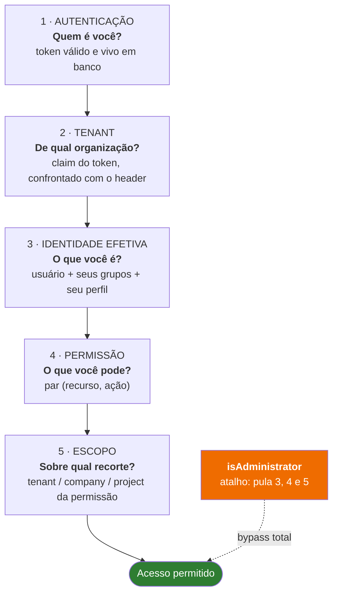
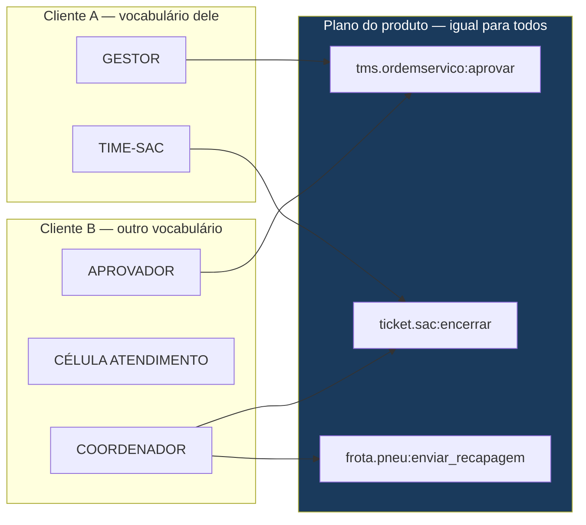

# Proposta: um único modelo de autorização

> ### ⚠ Documento histórico — superado
>
> Este é o **levantamento** que originou o core único de autorização, com as opções que estavam em
> aberto na época. As decisões foram tomadas e implementadas.
>
> - **Como o módulo funciona hoje:** [ARQUITETURA.md](ARQUITETURA.md)
> - **O desenho do core e as fases de implementação:** [MODELO_CORE_AUTORIZACAO.md](MODELO_CORE_AUTORIZACAO.md)
>
> Mantido porque registra o raciocínio — em especial a separação entre *capacidade* (fixa, do
> código) e *vocabulário* (do cliente), que continua sendo o princípio que sustenta o modelo.
> Onde este documento diverge dos dois acima, valem os dois acima.

Documento de decisão, escrito a partir da auditoria do framework e do uso real no Gestor-RQ.
O objetivo é eliminar a tentativa-e-erro: ao terminar a leitura, deve estar claro **onde declarar,
onde conceder, a quem conceder e como o conflito se resolve**.

---

## O diagnóstico em uma frase

> Não existem dois sistemas concorrentes. Existe **um** modelo de permissão completo — o granular
> — e **três anotações que não falam com ele**.

O que parece "RBAC misturado com granular" é RBAC pela metade: os papéis existem (perfil, grupo),
o modelo de permissão existe (recurso → ação → permissão), mas o código nunca faz a ponte. As
anotações `@RequireProfile`, `@RequireRole` e `@RequirePersona` decidem por conta própria, sem
consultar o catálogo — e `@RequireRole` sequer decide, porque depende de um resolver que ninguém
implementa.

**RBAC bem-feito é exatamente o sistema granular**, com papéis funcionando como pacotes de
permissão. Não são coisas diferentes que precisam conviver. É uma coisa só, hoje partida ao meio.

---

## A hierarquia: cinco perguntas, nesta ordem

A dúvida "qual a hierarquia disso tudo" tem resposta, e ela não está escrita em lugar nenhum hoje.
Toda requisição atravessa cinco níveis, cada um respondendo uma pergunta:



**Nível 3 é o que confunde.** Perfil, grupo e usuário **não são hierarquia** — são três formas de
carregar permissão, e o resultado é a **união** delas. Não existe "o perfil manda mais que o
grupo". Quem tem permissão por qualquer um dos três, tem.

Duas propriedades do modelo atual que precisam ser ditas em voz alta, porque a equipe assume o
contrário:

- **Não existe negação.** Uma permissão só concede. Não há como dizer "este grupo NÃO pode",
  porque o mais permissivo sempre vence.
- **Não existe herança de recurso.** `tms.manutencao` e `tms.manutencao.os` são recursos sem
  relação alguma. Permissão num não alcança o outro.

---

## As três regras para parar de adivinhar

### Regra 1 — O código declara, o admin concede

| | Código | Admin |
|---|---|---|
| Declara **que existe** (recurso, ação) | ✅ `@HasPermission` | ✅ tela de recursos |
| Decide **quem tem** | ❌ nunca | ✅ tela de permissões |

O desenvolvedor **nunca** escreve nomes de perfil, grupo ou papel no código. Ele escreve apenas
*qual permissão o endpoint exige*:

```java
@PostMapping
@HasPermission(resource = "tms.ordemservico", action = "aprovar",
               description = "Aprovar ordem de serviço")
public OrdemServico aprovar(@PathVariable String id) { ... }
```

Quem pode aprovar é decisão de negócio, muda sem deploy, e vive no admin. É essa separação que
hoje não existe — e é por isso que `SYSTEM_ADMIN`, `GESTOR` e `OPERADOR` acabaram cravados em 15
métodos.

### Regra 1b — Capacidade não é vocabulário

Esta é a chave para multi-cliente, e é onde a confusão nasce de verdade.

Há dois tipos de nome no sistema, e eles têm donos diferentes:

| | **Capacidade** | **Vocabulário** |
|---|---|---|
| Exemplo | `tms.ordemservico:aprovar` | `GESTOR`, `TIME-SAC`, `SUPERVISOR` |
| O que é | o que o software **sabe fazer** | como o cliente **chama seus papéis** |
| Dono | o produto | **o cliente** |
| Muda quando | o endpoint muda | o cliente quiser, a qualquer momento |
| Onde vive | no código, junto do método | **só no banco**, por tenant |
| Versionado com | o artefato | nada — é dado |

`tms.ordemservico:aprovar` **não é vocabulário** — é o nome de uma capacidade, tão estável quanto
o endpoint que ela protege. Um cliente não quer renomeá-la, do mesmo jeito que não quer renomear
`POST /ordens-servico/{id}/aprovar`. Já `GESTOR` é vocabulário puro: o cliente A chama de
`GESTOR`, o B de `COORDENADOR`, o C de `LÍDER DE CÉLULA` — e os três estão certos.

O erro de hoje é que **vocabulário entrou no código**. `@RequireRole({"SYSTEM_ADMIN", "GESTOR"})`
congela, no artefato, um nome que pertence ao cliente. Todo cliente novo herda a nomenclatura de
quem veio antes, ou exige alteração de código para chamar as coisas pelo nome dele.



**Regra prática:** se o nome pode mudar de cliente para cliente, ele **não pode aparecer em
`.java`**. O código declara capacidades; o cliente inventa os papéis e amarra um no outro pelo
admin — que é exatamente o que a interface já faz hoje para ações.

**E as "regras" diferentes por cliente?** Regra de acesso é uma amarração papel→capacidade
diferente, e resolve-se no admin sem deploy. Se a variação for de *processo* — "aqui aprovação
exige duas pessoas" — isso é regra de negócio, não de autorização, e não deve ser absorvida por
este modelo. Autorização responde "pode?", não "como".

**Como o cliente não começa do zero:** o produto entrega um **template de papéis** — um conjunto
sugerido de papéis já amarrados às capacidades, aplicado no onboarding e imediatamente
renomeável. É dado, não código. É o papel que `RBAC_SEEDS_GESTOR_RQ.md` tentou cumprir; a
diferença é que o template vira seed executável por tenant, em vez de documento.

### Regra 2 — Três níveis de atribuição, com propósito distinto

| Nível | Cardinalidade | Para que serve | Exemplo |
|---|---|---|---|
| **Perfil** | 1 por usuário | o **papel principal** da pessoa | `ATENDIMENTO`, `GESTOR_FROTA` |
| **Grupo** | N por usuário | **recortes transversais** ao papel | `TIME-SAC`, `CATALOGO-FOTOS` |
| **Usuário** | — | **exceção individual**, sempre temporária | acesso pontual a um relatório |

A pergunta a fazer ao conceder: *isso vale para todo mundo com este papel?* Se sim, perfil. *Vale
para um recorte que cruza papéis?* Grupo. *É exceção para uma pessoa?* Usuário — e anote por quê.

No Gestor-RQ isso já acontece na prática (1.088 permissões em perfis, 1.013 em grupos, 128 em
usuários). O que falta é a regra estar escrita, para as próximas concessões não serem por
intuição.

### Regra 3 — Toda tela protegida tem endpoint protegido

Recursos `VIEW` controlam o que aparece; recursos `API` controlam o que executa. **Um sem o outro
é falso.** Esconder o botão sem proteger o endpoint é segurança de fachada — que é a situação
atual do Gestor-RQ.

Convenção proposta: para cada recurso `VIEW` que esconde uma ação, existe um recurso `API` com o
mesmo nome de ação, protegendo o endpoint correspondente.

---

## O que muda no framework

Três mudanças, em ordem de custo. Nenhuma quebra o que existe.

### Fase 1 — Tornar visível o que hoje é invisível *(sem mudança de comportamento)*

O maior gerador de tentativa-e-erro é a **ausência de retorno**. Nada avisa quando o contrato
código↔admin não fecha. Proposta: um relatório na subida e um endpoint de diagnóstico, listando:

- endpoints **sem** `@HasPermission` (superfície desprotegida);
- `@HasPermission` cujo par (recurso, ação) **não existe** no catálogo do tenant;
- permissões concedidas a ações **inativas** — 57% do total no Gestor-RQ hoje;
- recursos/ações no catálogo **sem nenhum endpoint** correspondente.

Isso sozinho resolve boa parte da dúvida: o time passa a ver o descasamento em vez de descobri-lo
por reclamação de usuário.

### Fase 2 — Fazer `active` valer *(mudança de comportamento, atrás de chave)*

Hoje `bo_ativa` não participa da decisão: desativar uma ação no admin não corta acesso. Ou a
consulta passa a filtrar `active`, ou o campo sai da tela. Recomendo filtrar, atrás de
`archbase.security.permission.respect-active=true`, com o relatório da Fase 1 mostrando o impacto
antes de ligar — no Gestor-RQ, 1.279 permissões mudariam de efeito.

### Fase 3 — Herança por nome de recurso *(a "hierarquia" que falta)*

Adotar nome hierárquico com ponto (já é a convenção de fato: `tms.mecanico`, `ticket.kanban`) e
fazer a consulta reconhecer o prefixo:

```
permissão em  tms.manutencao.*     alcança  tms.manutencao.os, tms.manutencao.plano
permissão em  tms.manutencao.os    alcança  apenas ele
```

Resolve o crescimento do catálogo — hoje cada tela nova exige conceder tudo de novo, uma a uma —
sem tocar no schema: muda só o `WHERE` da consulta de permissão. É o que dá sensação de hierarquia
sem inventar um segundo modelo.

### Não recomendado agora — negação explícita

Permitiria "o perfil concede, mas este grupo nega". É poderoso e é a porta de entrada para
regras que ninguém consegue depurar depois ("por que fulano não vê a tela?"). Só vale se aparecer
um caso real que a união não resolva. Até lá, a ausência de negação é uma simplificação, não uma
limitação.

---

## O piso no código — princípio aceito

> **Ter a ação atribuída não basta.** Uma capacidade sensível deve exigir, além da permissão
> concedida no admin, que o solicitante satisfaça uma restrição declarada no código — que dado
> nenhum consegue afrouxar.

Este princípio está **aceito** e passa a orientar o desenho. `@HasPermission` sozinho é
inteiramente dirigido por dado: quem controla a tabela de permissões controla o acesso. Um piso
no artefato é defesa em profundidade legítima, e a intenção por trás de `@RequireProfile` /
`@RequireRole` / `@RequirePersona` é essa.

O que falta resolver não é *se* deve haver piso, mas **em que vocabulário ele é escrito** — já
que nome de papel pertence ao cliente. A resposta está em [Como expressar o
piso](#como-expressar-o-piso-sem-vocabulário-do-cliente), mais abaixo.

Antes disso, três constatações sobre o estado atual. Elas não contradizem o princípio; dizem que
ele **ainda não está entregue**, e que há um buraco maior sendo tapado pelo lado errado.

### 1. O piso de hoje não é piso

`@RequireProfile` e `@RequirePersona` têm `allowSystemAdmin() default true`, e o manager devolve
`true` **antes** de qualquer verificação de perfil:

```java
if (requireProfile.allowSystemAdmin() && user.getIsAdministrator() && user.isEnabled()) {
    return new AuthorizationDecision(true);   // sai aqui
}
```

Quem é `isAdministrator` atravessa as três anotações e o `@HasPermission`. No Gestor-RQ há **4
usuários assim**. Contra o cenário que preocupa — alguém com poder de administração concedendo
indevidamente — a proteção atual não oferece piso nenhum: quem pode conceder, pode passar.

E `@RequireRole` não valida coisa alguma sem um `ArchbaseRoleResolver`, que ninguém implementa.
Dos três, o único que hoje restringe de fato é `@RequireProfile` — e só contra não-administradores.

### 2. O vazamento está na concessão, não na verificação

O endpoint que concede permissão é `POST /api/v1/resource/permissions`, no `ResourceController`.
Ele está sob `archbase.security.admin-endpoints.policy`, cujo **padrão é `permit`**. Com a
configuração padrão do framework:

> **qualquer usuário autenticado pode conceder qualquer permissão a si mesmo.**

Não é preciso um administrador distraído — basta qualquer conta. Enquanto isso for verdade,
nenhuma anotação adicional no lado da verificação resolve, porque o atacante simplesmente se
concede o que falta. **A correção é `admin-endpoints.policy=admin-only`**, que já existe e está
documentada em `deployment/security-hardening.md`. É a mudança de maior efeito desta conversa
inteira.

### 3. O piso precisa valer contra administrador

Um piso que o `isAdministrator` atravessa não protege contra o cenário que motiva o princípio.
Seja qual for a forma escolhida abaixo, ela precisa ser avaliada **antes** e independentemente do
bypass — o oposto do que os managers fazem hoje.

---

## Como expressar o piso sem vocabulário do cliente

Duas formas, que respondem a perguntas diferentes e **compõem** entre si.

### Eixo A — sensibilidade da capacidade *(o que está sendo feito)*

O código declara **quão sensível** é a operação:

```java
@HasPermission(resource = "seguranca.permissao", action = "conceder",
               description = "Conceder permissões a usuários",
               sensibilidade = CRITICA)
```

| Nível | O framework exige, além da permissão |
|---|---|
| `NORMAL` | nada |
| `ALTA` | concessão só a perfil ou grupo, nunca direto a usuário; registro em auditoria |
| `CRITICA` | reautenticação ou segundo fator recente; quem concede precisa já possuir a capacidade |

### Eixo B — patamar mínimo do solicitante *(quem está fazendo)*

Mais próximo da sua formulação — "garantir que esse alguém passe por estas restrições". O código
declara o **patamar mínimo**, em vocabulário do produto:

```java
@HasPermission(resource = "financeiro.fechamento", action = "reabrir",
               description = "Reabrir fechamento financeiro",
               patamarMinimo = ADMINISTRADOR_TENANT)
```

O patamar é um eixo curto e fixo, do produto — algo como
`LEITOR < OPERADOR < SUPERVISOR < ADMINISTRADOR_TENANT < ADMINISTRADOR_PLATAFORMA`. O cliente
**mapeia os papéis dele** para esses patamares no admin: `COORDENADOR` → `SUPERVISOR`,
`LÍDER DE CÉLULA` → `OPERADOR`. Cada cliente com sua nomenclatura, todos falando um eixo comum.

É a mesma ideia de `@RequireProfile("ADMIN")`, com uma diferença decisiva: `ADMIN` é nome que o
cliente quer trocar; `ADMINISTRADOR_TENANT` é patamar do produto, que ele apenas *aponta* quem
ocupa.

### Qual adotar

**Os dois, nesta ordem.** O eixo B é o que atende diretamente ao princípio e é mais fácil de
explicar ao time — a anotação passa a dizer "além da permissão, precisa ser pelo menos X".
O eixo A cobre o que patamar não alcança: obrigar auditoria, proibir concessão direta a usuário,
exigir segundo fator. Começar por B e acrescentar A quando aparecer capacidade que peça.

O custo do eixo B é uma amarração nova a manter: papel do cliente → patamar. É pouco (dezenas de
papéis, não centenas de capacidades) e cabe na mesma interface de admin que já existe.

### O que fazer nesta ordem

1. `admin-endpoints.policy=admin-only` — fecha o buraco real, hoje, sem escrever código.
2. Auditoria de concessão: registrar quem concedeu o quê a quem. Hoje não há registro.
3. Proibir autoconcessão: quem concede não pode ser o destinatário.
4. Só então avaliar o nível de sensibilidade, que é a formalização do piso.

Os itens 1 a 3 cobrem o cenário que preocupa com muito menos superfície do que manter três
sistemas de anotação em paralelo.

---

## O que aposentar

| Anotação | Situação | Destino |
|---|---|---|
| `@HasPermission` | completa, integrada ao catálogo | **única recomendada** |
| `@RequireProfile` | é o único que restringe de fato, mas crava vocabulário do cliente no código e é atravessado por administrador | manter enquanto não existir nível de sensibilidade; migrar depois |
| `@RequireRole` | não valida nada sem resolver | `@Deprecated` |
| `@RequirePersona` | ignora `context`/`contextData`; tem nomes de negócio de um cliente dentro do framework | `@Deprecated` |

Depreciar não é remover: o código existente continua compilando e se comportando igual. Muda a
recomendação, e o Javadoc passa a apontar o caminho.

---

## Caminho para o Gestor-RQ

Ordem sugerida, do mais barato ao mais estrutural:

1. **Medir.** Rodar o diagnóstico da Fase 1 e ver o tamanho real do descasamento.
2. **Proteger o que importa.** Anotar com `@HasPermission` os endpoints sensíveis, reaproveitando
   os nomes de recurso que **já estão no catálogo** — os 8 recursos `API` já existem, com 132
   permissões concedidas, só aguardando alguém apontar para eles.
3. **Reconciliar os documentos.** `RBAC_ROLES_PERMISSIONS.md` e `RBAC_SEEDS_GESTOR_RQ.md`
   descrevem sistemas que não existem. Corrigir ou marcar como proposta.
4. **Tirar o vocabulário do código — não unificá-lo.** Havia aqui, numa versão anterior deste
   documento, a recomendação de "escolher um vocabulário". Estava errada: num produto multi-cliente
   o vocabulário **tem** que ser plural, porque é do cliente. O que precisa ser único é o plano de
   **capacidades**. Concretamente: os 15 `@RequireRole({"SYSTEM_ADMIN", ...})` viram
   `@HasPermission` sobre capacidades, e `SYSTEM_ADMIN`/`GESTOR`/`OPERADOR` deixam de existir no
   código — passam a ser papéis que o Gestor-RQ define no admin, como qualquer outro cliente
   definiria os dele.
5. **Só então** avaliar as Fases 2 e 3.

---

## Decisões que dependem de vocês

Este documento propõe; não decide. Quatro pontos precisam da sua palavra:

1. **`@HasPermission` como única forma de autorizar** — aceita depreciar as outras três? É o que
   tira o vocabulário do código e viabiliza cada cliente com a sua nomenclatura.

1b. **Template de papéis por tenant** — o produto deve entregar um conjunto inicial de papéis já
   amarrado às capacidades, aplicável no onboarding e renomeável? Sem isso, cada cliente novo
   monta as amarrações do zero, no admin, para centenas de capacidades.
2. **Herança por nome de recurso** (Fase 3) — resolve o problema que vocês sentem, ou o catálogo
   plano é suficiente?
3. **`active` passar a valer** (Fase 2) — sabendo que 57% das permissões do Gestor-RQ mudariam de
   efeito.
4. **Negação explícita** — existe hoje algum caso real que a união não resolve?

5. **Como expressar o piso** — patamar mínimo do solicitante (eixo B), sensibilidade da
   capacidade (eixo A), ou os dois? O princípio já está aceito; a pergunta é só a forma.

6. **O piso vale contra administrador?** Se sim, `isAdministrator` deixa de ser bypass absoluto —
   o que é a mudança de comportamento mais profunda desta proposta, e precisa ser decidida
   conscientemente.
