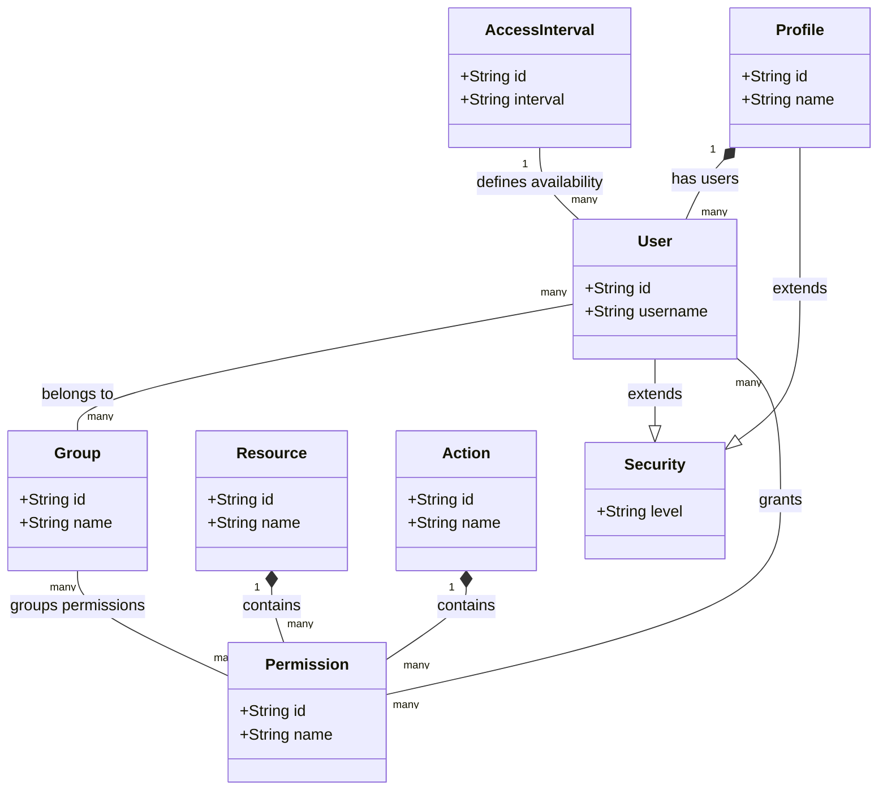

# Módulo Archbase-Security

O módulo `archbase-security` fornece funcionalidades robustas de segurança para aplicações Spring Boot, facilitando a implementação de controles de acesso baseados em permissões, autenticação JWT, e segurança de dados. Ele suporta uma configuração de permissões flexível que pode variar conforme o tenant, a empresa e o projeto, permitindo uma adaptação refinada às necessidades de negócios complexos.

## Principais Funcionalidades

- **Autenticação JWT**: Implementa autenticação utilizando tokens JWT para garantir a segurança das APIs.
- **Controle de Acesso Baseado em Permissões**: Utiliza um modelo de permissões detalhado que pode ser adaptado para diferentes tenants, empresas e projetos, oferecendo controle fino sobre o acesso a recursos.

## Controle de Acesso Flexível

O sistema de permissões no `archbase-security` é projetado para ser extremamente flexível, permitindo configurações distintas baseadas em diferentes níveis de agregação como Tenant, Company e Project. Isso significa que você pode definir permissões de forma granular, não apenas no nível global, mas também personalizadas para contextos específicos de negócios.

### Como Funciona

Permissões podem ser atribuídas de forma a considerar o contexto específico no qual o usuário opera. Isso é útil em cenários multi-tenant, onde diferentes organizações (tenants) podem requerer regras específicas, ou em empresas com múltiplos departamentos ou projetos com necessidades únicas de acesso e segurança.

## Diagrama de Entidades

O seguinte diagrama mostra as principais entidades envolvidas no módulo de segurança e suas relações:



## Uso da Anotação `HasPermission`

A anotação `HasPermission` é usada para aplicar controle de acesso nos métodos dentro de sua aplicação, especificando a ação e o recurso necessários para acessar o método.

### Exemplo de Uso

```java
@HasPermission(action="VIEW", resource="USER_PROFILE")
public UserProfile getUserProfile(String userId) {
    // implementação do método
}
```

### Configuração

Para configurar o módulo de segurança, ajuste as seguintes propriedades no seu `application.properties`:

```properties
# Chave secreta para assinatura JWT
archbase.security.jwt.secret-key=secret-key

# Validade do token JWT (em milissegundos)
archbase.security.jwt.token-expiration=3600000
```

## Customização e Extensão

O módulo foi projetado para ser altamente configurável e extensível. Você pode substituir componentes padrão ou adicionar novos comportamentos conforme necessário.

## Troubleshooting

Se encontrar problemas ao utilizar o módulo, verifique se as configurações de segurança estão corretas e consulte os logs de erro para mais detalhes.