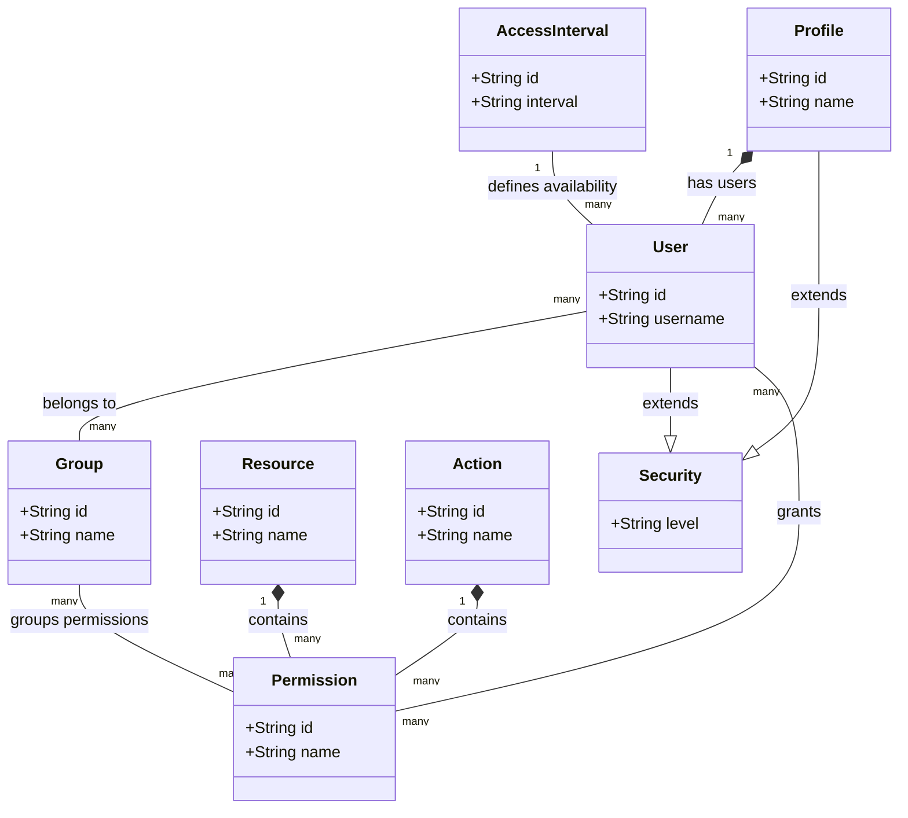

# Módulo Archbase-Security

O módulo `archbase-security` fornece funcionalidades robustas de segurança para aplicações Spring Boot, facilitando a implementação de controles de acesso baseados em permissões, autenticação JWT, e segurança de dados. Ele suporta uma configuração de permissões flexível que pode variar conforme o tenant, a empresa e o projeto, permitindo uma adaptação refinada às necessidades de negócios complexos.

---

## Por onde começar

| Se você quer… | Leia |
|---|---|
| **Entender como a autorização decide** — os cinco portões, qual anotação usar, por que negou | **[ARQUITETURA.md](ARQUITETURA.md)** ← comece aqui |
| Autenticação, login social, MFA, customizar a configuração | [readme-security.md](readme-security.md) |
| Ligar uma proteção sem quebrar produção | [../deployment/security-hardening.md](../deployment/security-hardening.md) |
| O desenho do core e por que ele é assim | [MODELO_CORE_AUTORIZACAO.md](MODELO_CORE_AUTORIZACAO.md) |

### O modelo em quatro linhas

Toda decisão de acesso passa por cinco portões, na mesma ordem, sempre:

```
1 IDENTITY   2 SCOPE   3 RESTRICTION   4 LEVEL   5 GRANT
   nega        nega        nega          nega     CONCEDE
```

**Os portões 1 a 4 só sabem negar. Só o portão 5 concede.** É por isso que restrição e catálogo
nunca competem: `@RequireProfile` e companhia trancam, `@HasPermission` abre. Ter a capacidade
atribuída não basta se uma tranca fechou; e passar por todas as trancas não abre nada sem
concessão no catálogo.

---

## Principais Funcionalidades

- **Autenticação JWT**: Implementa autenticação utilizando tokens JWT para garantir a segurança das APIs.
- **Controle de Acesso Baseado em Permissões**: Utiliza um modelo de permissões detalhado que pode ser adaptado para diferentes tenants, empresas e projetos, oferecendo controle fino sobre o acesso a recursos.

## Controle de Acesso Flexível

O sistema de permissões no `archbase-security` é projetado para ser extremamente flexível, permitindo configurações distintas baseadas em diferentes níveis de agregação como Tenant, Company e Project. Isso significa que você pode definir permissões de forma granular, não apenas no nível global, mas também personalizadas para contextos específicos de negócios.

### Como Funciona

Permissões podem ser atribuídas de forma a considerar o contexto específico no qual o usuário opera. Isso é útil em cenários multi-tenant, onde diferentes organizações (tenants) podem requerer regras específicas, ou em empresas com múltiplos departamentos ou projetos com necessidades únicas de acesso e segurança.

## Diagrama de Entidades

O seguinte diagrama mostra as principais entidades envolvidas no módulo de segurança e suas relações:


```mermaid
classDiagram
    class AccessInterval {
        +String id
        +String interval
    }
    class Group {
        +String id
        +String name
    }
    class Permission {
        +String id
        +String name
    }
    class Profile {
        +String id
        +String name
    }
    class Resource {
        +String id
        +String name
    }
    class Action {
        +String id
        +String name
    }
    class Security {
        +String level
    }
    class User {
        +String id
        +String username
    }
    
    Permission "many" -- "many" User : grants
    User "many" -- "many" Group : belongs to
    Group "many" -- "many" Permission : groups permissions
    Profile "1" *-- "many" User : has users
    Resource "1" *-- "many" Permission : contains
    Action "1" *-- "many" Permission : contains
    AccessInterval "1" -- "many" User : defines availability
    User --|> Security : extends
    Profile --|> Security : extends
```

## Uso da Anotação `HasPermission`

A anotação `HasPermission` é usada para aplicar controle de acesso nos métodos dentro de sua aplicação, especificando a ação e o recurso necessários para acessar o método.

### Exemplo de Uso

```java
@HasPermission(action="VIEW", resource="USER_PROFILE")
public UserProfile getUserProfile(String userId) {
    // implementação do método
}
```

### Configuração

Para configurar o módulo de segurança, ajuste as seguintes propriedades no seu `application.properties`:

```properties
# Chave secreta para assinatura JWT
archbase.security.jwt.secret-key=secret-key

# Validade do token JWT (em milissegundos)
archbase.security.jwt.token-expiration=3600000

# Validade da senha em dias (0 = sem expiração periódica, padrão)
archbase.security.password.expiration-days=0
```

## Expiração de senha e troca obrigatória

O Spring Security consulta `UserDetails#isCredentialsNonExpired()` antes de autenticar. No
`archbase-security` a regra é, nesta ordem:

| Condição | Resultado |
|----------|-----------|
| `BO_ALTERAR_SENHA_PROXIMO_LOGIN = 'S'` (`changePasswordOnNextLogin`) | credenciais **expiradas** — força a troca |
| `BO_SENHA_NUNCA_EXPIRA = 'S'` (`passwordNeverExpires`) ou nulo | credenciais válidas |
| `BO_SENHA_NUNCA_EXPIRA = 'N'` e `archbase.security.password.expiration-days = 0` | credenciais válidas (política desligada) |
| `BO_SENHA_NUNCA_EXPIRA = 'N'` e senha mais antiga que o prazo | credenciais **expiradas** |

A base do cálculo é a coluna `DT_ULTIMA_TROCA_SENHA`, atualizada automaticamente em todo fluxo de
troca de senha (`/auth/resetPassword`, `/auth/changePassword`, troca autenticada e atualização
administrativa). Usuário sem essa data (base legada) nunca expira por tempo — ligar a política não
derruba o login de toda a base de uma vez.

Ao redefinir a senha com token válido, `changePasswordOnNextLogin` é zerado e a contagem de validade
reiniciada; o usuário entra normalmente no login seguinte.

### Migração de schema (aditiva)

```sql
-- PostgreSQL
ALTER TABLE SEGURANCA ADD COLUMN IF NOT EXISTS DT_ULTIMA_TROCA_SENHA TIMESTAMP NULL;

-- Oracle
ALTER TABLE SEGURANCA ADD (DT_ULTIMA_TROCA_SENHA TIMESTAMP NULL);
```

> `SEGURANCA` é a tabela única da hierarquia `SecurityEntity` (`SINGLE_TABLE`, discriminador
> `TP_SEGURANCA`). A coluna é nullable — nenhum backfill é necessário.

### Mudança de comportamento (3.0.x → 3.1)

Até a 3.0.x, `isCredentialsNonExpired()` retornava `passwordNeverExpires` diretamente: qualquer
usuário com `BO_SENHA_NUNCA_EXPIRA = 'N'` era tratado como **"credenciais expiradas agora"** e não
conseguia autenticar nem logo após um reset de senha bem-sucedido. Quem usava esse efeito colateral
para forçar a troca de senha deve passar a usar `BO_ALTERAR_SENHA_PROXIMO_LOGIN = 'S'`, e quem quer
expiração periódica real deve configurar `archbase.security.password.expiration-days`.

## Customização e Extensão

O módulo foi projetado para ser altamente configurável e extensível. Você pode substituir componentes padrão ou adicionar novos comportamentos conforme necessário.

## Troubleshooting

Se encontrar problemas ao utilizar o módulo, verifique se as configurações de segurança estão corretas e consulte os logs de erro para mais detalhes.