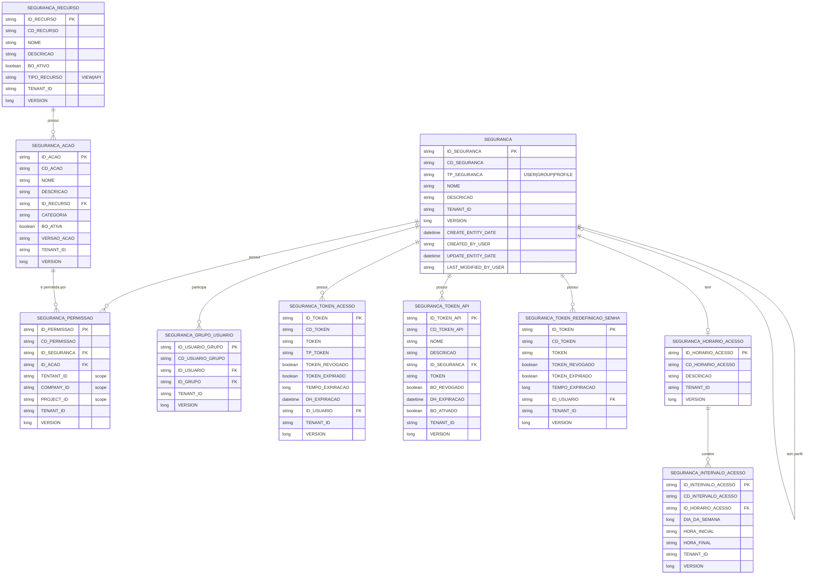

# Documentação de Entidades de Segurança e Permissões

## 1. Introdução e Visão Geral

### 1.1 Descrição do Módulo archbase-security

O módulo `archbase-security` é um componente fundamental do Archbase Framework, fornecendo uma infraestrutura completa e robusta para autenticação, autorização e gerenciamento de segurança em aplicações empresariais. Este módulo implementa padrões modernos de segurança, incluindo autenticação baseada em JWT, controle de acesso baseado em permissões (RBAC), e suporte completo para arquiteturas multi-tenant.

### 1.2 Conceitos Fundamentais

#### Domain-Driven Design (DDD)
Todas as entidades de segurança seguem os princípios de Domain-Driven Design, com clara separação entre:
- **Entidades de Persistência**: Classes que representam o modelo de dados (package `persistence`)
- **Entidades de Domínio**: Classes que representam o modelo de negócio (package `domain.entity`)
- **DTOs**: Objetos de transferência de dados para comunicação com clientes (package `domain.dto`)

#### Multi-Tenancy
O sistema é projetado desde o início para suportar múltiplas organizações (tenants) compartilhando a mesma infraestrutura, com isolamento completo de dados. Três níveis de granularidade são suportados:
- **Tenant**: Organização principal
- **Company**: Sub-organização dentro de um tenant
- **Project**: Projeto específico dentro de uma empresa

#### RBAC (Role-Based Access Control)
O controle de acesso é baseado em permissões que conectam entidades de segurança (usuários, grupos, perfis) a ações específicas sobre recursos, com suporte para escopos contextuais.

### 1.3 Filosofia da Arquitetura

A arquitetura do módulo de segurança segue os seguintes princípios:

1. **Segurança por Padrão**: Todos os endpoints são protegidos por padrão; acesso público deve ser explicitamente declarado
2. **Flexibilidade Contextual**: Permissões podem ser globais ou restritas a contextos específicos (tenant/company/project)
3. **Extensibilidade**: Suporte para customizações via delegates e enrichers
4. **Separação de Responsabilidades**: Clara divisão entre autenticação (quem você é) e autorização (o que você pode fazer)
5. **Auditabilidade**: Todas as entidades mantêm informações de criação e modificação

---

## 2. Modelo de Entidades

### 2.1 Hierarquia de Entidades de Segurança

#### SecurityEntity (Classe Abstrata Base)

**Localização**: `br.com.archbase.security.persistence.SecurityEntity`

SecurityEntity é a classe base abstrata para todas as entidades de segurança no sistema. Utiliza a estratégia Single Table Inheritance (STI) do JPA, onde todas as subclasses são armazenadas em uma única tabela `SEGURANCA`.

**Estratégia de Herança**:
```java
@Entity
@Table(name="SEGURANCA")
@Inheritance(strategy = InheritanceType.SINGLE_TABLE)
@DiscriminatorColumn(name="TP_SEGURANCA")
```

**Campos Comuns**:
- `id` (ID_SEGURANCA): Identificador único
- `code` (CD_SEGURANCA): Código de negócio
- `name` (NOME): Nome da entidade de segurança
- `description` (DESCRICAO): Descrição detalhada
- `tenantId`: Identificador do tenant (herdado de TenantPersistenceEntityBase)
- `version`: Controle de versionamento otimista
- `createEntityDate`: Data de criação
- `createdByUser`: Usuário criador
- `updateEntityDate`: Data da última atualização
- `lastModifiedByUser`: Último usuário que modificou

**Subclasses**:
- `UserEntity` (discriminador: "USUARIO")
- `GroupEntity` (discriminador: "SEGURANCA_GRUPO")
- `ProfileEntity` (discriminador: "SEGURANCA_PERFIL")

---

### 2.2 UserEntity

**Localização**: `br.com.archbase.security.persistence.UserEntity`

Representa um usuário no sistema, implementando `UserDetails` do Spring Security para integração nativa com o framework.

#### Campos Principais

**Credenciais**:
- `userName` (USER_NAME): Nome de usuário para login
- `password` (SENHA): Senha criptografada
- `email` (EMAIL): Endereço de email
- `nickname` (APELIDO): Nome de exibição amigável

**Controle de Segurança**:
- `isAdministrator` (BO_ADMINISTRADOR): Flag indicando se o usuário tem privilégios administrativos (bypassa verificação de permissões)
- `accountDeactivated` (BO_CONTA_DESATIVADA): Indica se a conta está desativada
- `accountLocked` (CONTA_BLOQUEADA): Indica se a conta está bloqueada

**Políticas de Senha**:
- `changePasswordOnNextLogin` (BO_ALTERAR_SENHA_PROXIMO_LOGIN): Força alteração de senha no próximo login
- `allowPasswordChange` (BO_PERMITE_ALTERAR_SENHA): Permite que o usuário altere sua senha
- `passwordNeverExpires` (BO_SENHA_NUNCA_EXPIRA): Senha não expira

**Controle de Acesso**:
- `allowMultipleLogins` (BO_PERMITE_MULTIPLICOS_LOGINS): Permite múltiplas sessões simultâneas
- `unlimitedAccessHours` (BO_HORARIO_LIVRE): Acesso ilimitado sem restrição de horário
- `avatar` (AVATAR): Imagem do avatar em formato LOB

#### Relacionamentos

- `profile` (PERFIL_ID): ManyToOne com ProfileEntity - perfil principal do usuário
- `accessSchedule` (HORARIO_ACESSO_ID): ManyToOne com AccessScheduleEntity - horários permitidos de acesso
- `groups`: OneToMany com UserGroupEntity - grupos aos quais o usuário pertence
- `tokens`: OneToMany com AccessTokenEntity - tokens JWT ativos do usuário

#### Métodos Especiais

**Integração com Spring Security**:
```java
@Override
public boolean isEnabled() {
    return !this.accountDeactivated && !this.accountLocked;
}

@Override
public boolean isAccountNonExpired() {
    return !this.accountDeactivated;
}

@Override
public boolean isAccountNonLocked() {
    return !this.accountLocked;
}

@Override
public boolean isCredentialsNonExpired() {
    return this.passwordNeverExpires;
}
```

---

### 2.3 GroupEntity e ProfileEntity

#### GroupEntity

**Localização**: `br.com.archbase.security.persistence.GroupEntity`

Representa um agrupamento lógico de usuários, facilitando a atribuição de permissões a múltiplos usuários simultaneamente.

**Campos**:
- Herda todos os campos de SecurityEntity (id, code, name, description)
- Sem campos adicionais específicos

**Uso Típico**: Agrupar usuários por departamento, equipe ou função organizacional (ex: "Equipe de Vendas", "Desenvolvedores Backend").

#### ProfileEntity

**Localização**: `br.com.archbase.security.persistence.ProfileEntity`

Representa um perfil ou papel no sistema, definindo um conjunto predefinido de permissões e comportamentos.

**Campos**:
- Herda todos os campos de SecurityEntity (id, code, name, description)
- Sem campos adicionais específicos

**Uso Típico**: Definir papéis funcionais com conjuntos específicos de permissões (ex: "Administrador", "Operador", "Consultor").

**Diferença entre Group e Profile**:
- **Group**: Agrupamento organizacional de usuários (baseado em estrutura)
- **Profile**: Papel funcional com permissões específicas (baseado em função)

---

### 2.4 Sistema de Permissões

#### PermissionEntity

**Localização**: `br.com.archbase.security.persistence.PermissionEntity`

Tabela: `SEGURANCA_PERMISSAO`

A entidade central do sistema de autorização, estabelecendo a ligação entre entidades de segurança e ações que podem ser executadas.

**Campos Principais**:
- `security` (ID_SEGURANCA): ManyToOne com SecurityEntity (usuário, grupo ou perfil)
- `action` (ID_ACAO): ManyToOne com ActionEntity (ação a ser permitida)

**Campos de Escopo Contextual**:
- `tenantId` (TENTANT_ID): Restringe permissão a um tenant específico (null = todos)
- `companyId` (COMPANY_ID): Restringe permissão a uma empresa específica (null = todas)
- `projectId` (PROJECT_ID): Restringe permissão a um projeto específico (null = todos)

**Método Especial**:
```java
@JsonIgnore
@Transient
public boolean allowAllTenantsAndCompaniesAndProjects() {
    return tenantId==null && companyId == null && projectId==null;
}
```

Este método identifica permissões globais (sem restrições de contexto).

**Lógica de Matching**:
- Valor `null` em um campo de escopo = wildcard (aceita qualquer valor)
- Permissão é concedida se todos os campos não-null corresponderem ao contexto atual

#### ResourceEntity

**Localização**: `br.com.archbase.security.persistence.ResourceEntity`

Tabela: `SEGURANCA_RECURSO`

Representa recursos protegidos no sistema.

**Campos**:
- `name` (NOME): Nome único do recurso
- `description` (DESCRICAO): Descrição detalhada
- `active` (BO_ATIVO): Indica se o recurso está ativo
- `type` (TIPO_RECURSO): Enum TipoRecurso (VIEW ou API)

**Constraint Único**: `(TENANT_ID, NOME)` - Nomes de recursos devem ser únicos dentro de um tenant

**Tipos de Recursos**:
- **VIEW**: Recursos de interface (páginas, componentes)
- **API**: Endpoints de API REST

#### ActionEntity

**Localização**: `br.com.archbase.security.persistence.ActionEntity`

Tabela: `SEGURANCA_ACAO`

Representa operações que podem ser executadas sobre recursos.

**Campos**:
- `name` (NOME): Nome da ação (ex: "VIEW", "CREATE", "UPDATE", "DELETE")
- `description` (DESCRICAO): Descrição detalhada da ação
- `resource` (ID_RECURSO): ManyToOne com ResourceEntity - recurso ao qual a ação pertence
- `category` (CATEGORIA): Categoria opcional para agrupamento
- `active` (BO_ATIVA): Indica se a ação está ativa
- `actionVersion` (VERSAO_ACAO): Versionamento da ação

**Relacionamento**: Uma ação está sempre vinculada a um recurso específico.

---

### 2.5 Controle de Acesso Temporal

#### AccessScheduleEntity

**Localização**: `br.com.archbase.security.persistence.AccessScheduleEntity`

Tabela: `SEGURANCA_HORARIO_ACESSO`

Define horários permitidos de acesso para usuários.

**Campos**:
- `description` (DESCRICAO): Descrição do horário de acesso
- `intervals`: OneToMany com AccessIntervalEntity - intervalos de tempo específicos

**Uso**: Restringe acesso de usuários a horários comerciais específicos ou janelas de manutenção.

#### AccessIntervalEntity

**Localização**: `br.com.archbase.security.persistence.AccessIntervalEntity`

Tabela: `SEGURANCA_INTERVALO_ACESSO`

Define um intervalo específico de tempo dentro de um horário de acesso.

**Campos**:
- `accessSchedule` (ID_HORARIO_ACESSO): ManyToOne com AccessScheduleEntity
- `dayOfWeek` (DIA_DA_SEMANA): Dia da semana (1-7, onde 1=Domingo)
- `startTime` (HORA_INICIAL): Hora de início (formato: "HH:mm")
- `endTime` (HORA_FINAL): Hora de término (formato: "HH:mm")

**Exemplo**:
```
Segunda-feira, 08:00 às 18:00
Terça-feira, 08:00 às 18:00
```

---

### 2.6 Gerenciamento de Tokens

#### AccessTokenEntity

**Localização**: `br.com.archbase.security.persistence.AccessTokenEntity`

Tabela: `SEGURANCA_TOKEN_ACESSO`

Armazena tokens JWT para autenticação de usuários.

**Campos**:
- `token` (TOKEN): String do token JWT (até 5000 caracteres, único)
- `tokenType` (TP_TOKEN): Enum TokenType (padrão: BEARER)
- `revoked` (TOKEN_REVOGADO): Indica se o token foi revogado
- `expired` (TOKEN_EXPIRADO): Indica se o token expirou
- `expirationTime` (TEMPO_EXPIRACAO): Timestamp de expiração em milissegundos
- `expirationDate` (DH_EXPIRACAO): Data e hora de expiração
- `user` (ID_USUARIO): ManyToOne com UserEntity - proprietário do token

**Ciclo de Vida**:
1. Token é gerado durante autenticação
2. Armazenado no banco com data de expiração
3. Validado em cada requisição
4. Marcado como expirado/revogado quando necessário

**Estratégias de Revogação**:
- Revogação manual (logout)
- Revogação automática ao mudar senha
- Revogação de tokens antigos ao gerar novos (quando `allowMultipleLogins=false`)

#### ApiTokenEntity

**Localização**: `br.com.archbase.security.persistence.ApiTokenEntity`

Tabela: `SEGURANCA_TOKEN_API`

Tokens de longa duração para comunicação serviço-a-serviço.

**Campos**:
- `name` (NOME): Nome identificador do token
- `description` (DESCRICAO): Descrição do propósito do token
- `user` (ID_SEGURANCA): ManyToOne com UserEntity - usuário associado
- `token` (TOKEN): String do token
- `revoked` (BO_REVOGADO): Indica se o token foi revogado
- `expirationDate` (DH_EXPIRACAO): Data de expiração
- `activated` (BO_ATIVADO): Indica se o token está ativado para uso

**Diferenças em relação a AccessToken**:
- Tokens de API têm duração muito maior
- Devem ser explicitamente ativados (`activated=true`)
- Usados para autenticação de serviços, não usuários humanos
- Não são gerados automaticamente durante login

#### PasswordResetTokenEntity

**Localização**: `br.com.archbase.security.persistence.PasswordResetTokenEntity`

Tabela: `SEGURANCA_TOKEN_REDEFINICAO_SENHA`

Tokens temporários para redefinição de senha.

**Campos**:
- `token` (TOKEN): String do token (13 caracteres numéricos)
- `revoked` (TOKEN_REVOGADO): Indica se o token foi revogado
- `expired` (TOKEN_EXPIRADO): Indica se o token expirou
- `expirationTime` (TEMPO_EXPIRACAO): Tempo de expiração em milissegundos
- `user` (ID_USUARIO): ManyToOne com UserEntity - usuário solicitante

**Características**:
- Token curto e numérico (fácil de digitar)
- Tempo de expiração padrão: 1 hora
- Uso único: revogado após ser utilizado
- Tokens anteriores são revogados ao gerar novo

**Fluxo**:
1. Usuário solicita redefinição
2. Token é gerado e enviado por email
3. Usuário submete token + nova senha
4. Sistema valida token e atualiza senha
5. Token é revogado
6. Todos os access tokens do usuário são invalidados

---

### 2.7 Relacionamentos

#### UserGroupEntity

**Localização**: `br.com.archbase.security.persistence.UserGroupEntity`

Tabela: `SEGURANCA_GRUPO_USUARIO`

Tabela de junção para relacionamento many-to-many entre User e Group.

**Campos**:
- `user` (ID_USUARIO): ManyToOne com UserEntity
- `group` (ID_GRUPO): ManyToOne com GroupEntity

**Finalidade**: Permite que um usuário pertença a múltiplos grupos e que um grupo contenha múltiplos usuários.

---

## 3. Arquitetura do Sistema de Permissões

### 3.1 Fluxo de Avaliação de Permissões

O sistema de permissões é implementado através da anotação `@HasPermission` e interceptado pelo `CustomAuthorizationManager`. O fluxo completo é:

#### Passo 1: Interceptação de Método
Quando um método anotado com `@HasPermission` é invocado, o Spring AOP intercepta a chamada.

```java
@HasPermission(
    action = "VIEW",
    resource = "USER_PROFILE",
    description = "View user profile"
)
public UserDto getUserProfile(String userId) {
    // Implementação
}
```

#### Passo 2: Extração de Parâmetros
O `CustomAuthorizationManager` extrai os parâmetros da anotação:
- `action`: Nome da ação a ser executada
- `resource`: Nome do recurso sendo acessado
- `tenantId`, `companyId`, `projectId`: Contextos (se vazios, obtém de `ArchbaseTenantContext`)

**Código**: `br.com.archbase.security.config.CustomAuthorizationManager:25-47`

```java
@Override
public AuthorizationDecision check(Supplier<Authentication> authentication, MethodInvocation methodInvocation) {
    Method method = methodInvocation.getMethod();
    HasPermission hasPermission = method.getAnnotation(HasPermission.class);

    if (hasPermission == null) {
        return new AuthorizationDecision(true);
    }

    String tenantId = hasPermission.tenantId().isEmpty() ?
        ArchbaseTenantContext.getTenantId() : hasPermission.tenantId();
    String companyId = hasPermission.companyId().isEmpty() ?
        ArchbaseTenantContext.getCompanyId() : hasPermission.companyId();

    boolean hasAccess = securityService.hasPermission(
        authentication.get(),
        hasPermission.action(),
        hasPermission.resource(),
        tenantId,
        companyId,
        hasPermission.projectId()
    );

    return new AuthorizationDecision(hasAccess);
}
```

#### Passo 3: Contexto do Tenant
Se os contextos não forem especificados na anotação, são obtidos de `ArchbaseTenantContext` (ThreadLocal).

#### Passo 4: Chamada ao Security Service
O `ArchbaseSecurityService.hasPermission()` é invocado para determinar acesso.

**Código**: `br.com.archbase.security.service.ArchbaseSecurityService:18-36`

```java
public boolean hasPermission(Authentication authentication, String action, String resource,
                            String tenantId, String companyId, String projectId) {
    // Bypass para administradores
    if (((UserEntity) authentication.getPrincipal()).getIsAdministrator() &&
        ((UserEntity) authentication.getPrincipal()).isEnabled()){
        return  true;
    }

    String userId = ((UserEntity) authentication.getPrincipal()).getId();
    List<PermissionEntity> permissions = permissionRepository.findBySecurityIdAndActionNameAndResourceName(
            userId, action, resource);

    // Permissão global (todos os contextos)
    if (permissions.stream().anyMatch(PermissionEntity::allowAllTenantsAndCompaniesAndProjects)){
        return true;
    }

    // Verificação com matching de contexto
    return permissions.stream().anyMatch(permission ->
            (tenantId == null || permission.getTenantId() == null || tenantId.equals(permission.getTenantId())) &&
            (companyId == null || permission.getCompanyId() == null || companyId.equals(permission.getCompanyId())) &&
            (projectId == null || permission.getProjectId() == null || projectId.equals(permission.getProjectId()))
    );
}
```

#### Passo 5: Verificação de Administrador
Se o usuário tem `isAdministrator=true` e está habilitado (`isEnabled()=true`), o acesso é concedido imediatamente.

#### Passo 6: Consulta de Permissões
Busca todas as permissões do usuário para a combinação ação + recurso no `PermissionRepository`.

#### Passo 7: Verificação de Permissões Globais
Se alguma permissão permite todos os contextos (`allowAllTenantsAndCompaniesAndProjects()`), acesso é concedido.

#### Passo 8: Matching de Contexto
Para cada permissão encontrada, verifica se os contextos correspondem:
- `null` na permissão = wildcard (aceita qualquer valor)
- `null` no contexto requisitado = sem restrição
- Valores devem coincidir se ambos forem não-null

#### Passo 9: Decisão de Autorização
Retorna `AuthorizationDecision(true)` se acesso concedido, `AuthorizationDecision(false)` caso contrário.

---

### 3.2 Modelo de Escopo de Permissões

O sistema suporta quatro níveis de granularidade para permissões:

#### Nível 1: Global (Sem Restrições)
```java
PermissionEntity permission = PermissionEntity.builder()
    .security(user)
    .action(viewAction)
    .tenantId(null)    // Wildcard
    .companyId(null)   // Wildcard
    .projectId(null)   // Wildcard
    .build();
```

**Uso**: Administradores ou serviços que precisam acesso irrestrito.

**Matching**: Qualquer contexto é aceito.

#### Nível 2: Tenant-Scoped
```java
PermissionEntity permission = PermissionEntity.builder()
    .security(user)
    .action(viewAction)
    .tenantId("tenant-123")  // Restrito
    .companyId(null)         // Wildcard
    .projectId(null)         // Wildcard
    .build();
```

**Uso**: Usuários que trabalham em um tenant específico, mas em qualquer empresa/projeto.

**Matching**: `tenantId` deve coincidir; company e project são irrelevantes.

#### Nível 3: Company-Scoped
```java
PermissionEntity permission = PermissionEntity.builder()
    .security(user)
    .action(viewAction)
    .tenantId("tenant-123")     // Restrito
    .companyId("company-456")   // Restrito
    .projectId(null)            // Wildcard
    .build();
```

**Uso**: Usuários restritos a uma empresa específica dentro de um tenant.

**Matching**: `tenantId` e `companyId` devem coincidir; project é irrelevante.

#### Nível 4: Project-Scoped (Mais Granular)
```java
PermissionEntity permission = PermissionEntity.builder()
    .security(user)
    .action(viewAction)
    .tenantId("tenant-123")     // Restrito
    .companyId("company-456")   // Restrito
    .projectId("project-789")   // Restrito
    .build();
```

**Uso**: Usuários com acesso apenas a projetos específicos.

**Matching**: Todos os três campos devem coincidir.

#### Lógica de Matching Detalhada

```
Permissão concedida SE:
  (permissionTenantId == null OU contextTenantId == null OU permissionTenantId == contextTenantId)
  E
  (permissionCompanyId == null OU contextCompanyId == null OU permissionCompanyId == contextCompanyId)
  E
  (permissionProjectId == null OU contextProjectId == null OU permissionProjectId == contextProjectId)
```

**Tabela de Verdade**:

| Permission Value | Context Value | Match? |
|-----------------|---------------|--------|
| null            | null          | ✓      |
| null            | "abc"         | ✓      |
| "abc"           | null          | ✓      |
| "abc"           | "abc"         | ✓      |
| "abc"           | "xyz"         | ✗      |

---

### 3.3 Bypass de Administrador

Usuários marcados como administradores têm tratamento especial no sistema.

**Condições para Bypass**:
1. `UserEntity.isAdministrator == true`
2. `UserEntity.isEnabled() == true` (não desativado e não bloqueado)

**Comportamento**:
- Administradores **não** passam pela verificação de permissões
- Acesso é concedido imediatamente
- Verificado antes de qualquer consulta ao banco de dados

**Código**: `ArchbaseSecurityService:19-21`

```java
if (((UserEntity) authentication.getPrincipal()).getIsAdministrator() &&
    ((UserEntity) authentication.getPrincipal()).isEnabled()){
    return  true;
}
```

**Importante**: O bypass só ocorre se a conta estiver ativa (`isEnabled()`). Contas bloqueadas ou desativadas, mesmo de administradores, são negadas.

---

## 4. Autenticação e Autorização

### 4.1 Fluxo de Autenticação JWT

#### Passo 1: Requisição de Login
Cliente envia credenciais para o endpoint de autenticação (geralmente `/api/v1/auth/login`):

```json
{
  "email": "usuario@exemplo.com",
  "password": "senhaSegura123"
}
```

#### Passo 2: Recepção pelo Controller
`ArchbaseAuthenticationController` recebe a requisição e delega para `ArchbaseAuthenticationService`.

#### Passo 3: Autenticação de Credenciais
O serviço utiliza `AuthenticationManager` do Spring Security para validar credenciais:

**Código**: `ArchbaseAuthenticationService:114-120`

```java
authenticationManager.authenticate(
    new UsernamePasswordAuthenticationToken(
        request.getEmail(),
        request.getPassword()
    )
);
```

Se as credenciais são inválidas, uma exceção é lançada e o processo termina.

#### Passo 4: Busca do Usuário
Após autenticação bem-sucedida, o usuário é carregado do repositório:

```java
var user = repository.findByEmail(request.getEmail())
    .orElseThrow(() -> new ArchbaseValidationException("Usuário não encontrado"));
```

#### Passo 5: Verificação de Token Existente
O sistema verifica se já existe um token válido não-expirado para o usuário (reutilização de token):

**Código**: `ArchbaseAuthenticationService:132-140`

```java
AccessTokenEntity accessToken = accessTokenPersistenceAdapter.findValidTokenByUser(user);

if (accessToken != null && !jwtService.isTokenExpired(accessToken.getToken())) {
    log.debug("Token válido encontrado para o usuário {}, reusando token", user.getEmail());
    var refreshToken = jwtService.generateRefreshToken(user);
    return buildAuthenticationResponse(accessToken, refreshToken.token(), user);
}
```

#### Passo 6: Revogação de Tokens Antigos
Se não houver token válido ou se `allowMultipleLogins=false`, todos os tokens antigos do usuário são revogados:

**Código**: `ArchbaseAuthenticationService:191-204`

```java
public void revokeAllUserTokens(UserEntity user) {
    var validUserTokens = accessTokenPersistenceAdapter.findAllValidTokenByUser(user);
    if (!validUserTokens.isEmpty()) {
        validUserTokens.forEach(token -> {
            token.setExpired(true);
            token.setRevoked(true);
        });
        tokenRepository.saveAll(validUserTokens);
    }
}
```

#### Passo 7: Geração de Tokens JWT
O serviço JWT gera dois tokens:

**Access Token** (curta duração):
```java
var jwtToken = jwtService.generateToken(user);
```

**Refresh Token** (longa duração):
```java
var refreshToken = jwtService.generateRefreshToken(user);
```

**Código**: `ArchbaseJwtService:78-97`

```java
private TokenResult buildToken(Map<String, Object> extraClaims, UserDetails userDetails, long expiration) {
    Instant now = Instant.now();
    Date issuedAt = Date.from(now);
    Date expiresAt = Date.from(now.plusMillis(expiration));

    String token = Jwts.builder()
            .setClaims(extraClaims)
            .setSubject(userDetails.getUsername())
            .setIssuedAt(issuedAt)
            .setExpiration(expiresAt)
            .signWith(getSignInKey(), SignatureAlgorithm.HS256)
            .compact();

    return new TokenResult(token, expiresAt.toInstant().toEpochMilli());
}
```

#### Passo 8: Persistência do Access Token
O access token é salvo no banco de dados:

**Código**: `ArchbaseAuthenticationService:158-176`

```java
private AccessTokenEntity saveUserToken(UserEntity usuario, ArchbaseJwtService.TokenResult jwtToken) {
    LocalDateTime expirationDateTime = convertToLocalDateTimeViaInstant(
        jwtService.extractExpiration(jwtToken.token())
    );

    var token = AccessTokenEntity.builder()
            .id(UUID.randomUUID().toString())
            .user(usuario)
            .token(jwtToken.token())
            .expirationTime(jwtToken.expiresIn())
            .expirationDate(expirationDateTime)
            .tokenType(TokenType.BEARER)
            .expired(false)
            .revoked(false)
            .build();
    return tokenRepository.save(token);
}
```

#### Passo 9: Construção da Resposta
Uma resposta de autenticação é construída e retornada ao cliente:

```java
return AuthenticationResponse.builder()
        .id(accessToken.getId())
        .accessToken(accessToken.getToken())
        .expirationTime(accessToken.getExpirationTime())
        .tokenType(TokenType.BEARER)
        .refreshToken(refreshToken.token())
        .user(user.toDomain())
        .build();
```

**Resposta JSON**:
```json
{
  "id": "uuid-do-token",
  "accessToken": "eyJhbGciOiJIUzI1NiIsInR5cCI6IkpXVCJ9...",
  "expirationTime": 1704067200000,
  "tokenType": "BEARER",
  "refreshToken": "eyJhbGciOiJIUzI1NiIsInR5cCI6IkpXVCJ9...",
  "user": { /* dados do usuário */ }
}
```

---

### 4.2 Validação de Token JWT

#### Interceptação de Requisições
O `JwtAuthenticationFilter` intercepta todas as requisições HTTP e processa o token JWT.

#### Extração do Token
Token é extraído do header `Authorization` no formato: `Bearer <token>`

#### Validação de Assinatura e Expiração
O serviço JWT valida:
1. **Assinatura**: Verifica se o token foi assinado com a chave secreta correta
2. **Expiração**: Verifica se o token não está expirado

**Código**: `ArchbaseJwtService:100-112`

```java
public boolean isTokenValid(String token, UserDetails userDetails) {
    final String username = extractUsername(token);
    return (username.equals(userDetails.getUsername())) && !isTokenExpired(token);
}

public boolean isTokenExpired(String token) {
    try {
        Date expiration = extractExpiration(token);
        return expiration.toInstant().isBefore(Instant.now());
    } catch (ExpiredJwtException e) {
        return true;
    }
}
```

#### Verificação no Banco de Dados
Confirma que o token não foi revogado no banco:
- Token deve existir em `AccessTokenEntity`
- `revoked` deve ser `false`
- `expired` deve ser `false`

#### Carregamento do UserDetails
Se o token é válido, carrega os detalhes do usuário associado:
```java
String username = jwtService.extractUsername(token);
UserDetails userDetails = userDetailsService.loadUserByUsername(username);
```

#### Configuração do SecurityContext
Define o usuário autenticado no contexto de segurança do Spring:
```java
UsernamePasswordAuthenticationToken authToken = new UsernamePasswordAuthenticationToken(
    userDetails, null, userDetails.getAuthorities()
);
SecurityContextHolder.getContext().setAuthentication(authToken);
```

---

### 4.3 Autenticação com API Token

Alternativa ao JWT para comunicação serviço-a-serviço ou integrações de longa duração.

#### Criação de API Token

```java
ApiTokenEntity apiToken = ApiTokenEntity.builder()
    .name("Integração Sistema Externo")
    .description("Token para integração com sistema de pagamento")
    .user(user)
    .token(generateSecureToken())
    .activated(true)
    .revoked(false)
    .expirationDate(LocalDateTime.now().plusYears(1))
    .build();
apiTokenRepository.save(apiToken);
```

#### Características
- **Longa Duração**: Típicamente meses ou anos
- **Ativação Explícita**: Deve ter `activated=true` para uso
- **Revogação Manual**: Não expira automaticamente; deve ser revogado manualmente
- **Sem Refresh**: Não há conceito de refresh token

#### Uso
Cliente inclui o token no header:
```
Authorization: ApiToken <token-value>
```

#### Validação
O filter verifica:
1. Token existe no banco
2. `activated=true`
3. `revoked=false`
4. Não expirou (`expirationDate > now()`)

---

### 4.4 Fluxo de Redefinição de Senha

#### Passo 1: Solicitação de Redefinição
Usuário fornece seu email através de um formulário de "Esqueci minha senha".

```java
authenticationService.sendResetPasswordEmail("usuario@exemplo.com");
```

#### Passo 2: Verificação do Usuário
Sistema verifica se o usuário existe e tem permissão para alterar senha:

**Código**: `ArchbaseAuthenticationService:257-270`

```java
Optional<UserEntity> usuarioOptional = repository.findByEmail(email);
if(usuarioOptional.isEmpty()) {
    throw new ArchbaseValidationException(
        String.format("Usuário com email %s não foi encontrado.", email)
    );
}
UserEntity user = usuarioOptional.get();
if (!user.getAllowPasswordChange()) {
    throw new ArchbaseValidationException(
        String.format("Usuário com email %s não possui autorização para alterar a senha.", email)
    );
}
```

#### Passo 3: Revogação de Tokens Anteriores
Qualquer token de redefinição anterior é revogado:

```java
revokeExistingTokens(user);
```

#### Passo 4: Geração do Token
Um token numérico de 13 caracteres é gerado:

**Código**: `ArchbaseAuthenticationService:272-277`

```java
public String createPasswordResetToken(User user) {
    String passwordResetToken = TokenGeneratorUtil.generateNumericToken();
    PasswordResetToken token = new PasswordResetToken(passwordResetToken, user);
    passwordResetTokenPersistenceAdapter.save(token);
    return passwordResetToken;
}
```

**Token Gerado**: Ex: "1234567890123" (13 dígitos)

#### Passo 5: Envio do Email
Token é enviado para o email do usuário via `ArchbaseEmailService`:

```java
archbaseEmailService.sendResetPasswordEmail(email, passwordResetToken, user.getUsername(), user.getName());
```

#### Passo 6: Submissão do Token
Usuário submete o token recebido junto com a nova senha:

```json
{
  "email": "usuario@exemplo.com",
  "passwordResetToken": "1234567890123",
  "newPassword": "novaSenhaSegura456"
}
```

#### Passo 7: Validação do Token
Sistema valida o token:

**Código**: `ArchbaseAuthenticationService:288-310`

```java
PasswordResetToken token = passwordResetTokenPersistenceAdapter.findToken(user, request.getPasswordResetToken());

if (token == null) {
    throw new ArchbaseValidationException("Token de redefinição de senha inválido.");
}

token.updateExpired();  // Atualiza flag de expiração
passwordResetTokenPersistenceAdapter.save(token);

if (token.isExpired()) {
    throw new ArchbaseValidationException("Token de redefinição de senha expirado, favor gerar novamente.");
}

if (token.isRevoked()) {
    throw new ArchbaseValidationException("Token de redefinição de senha inválido, favor utilizar o token mais recente.");
}
```

#### Passo 8: Atualização da Senha
Senha é criptografada e atualizada:

```java
user.setPassword(passwordEncoder.encode(request.getNewPassword()));
repository.save(user);
```

#### Passo 9: Revogação do Token
Token de redefinição é revogado após uso:

```java
token.revokeToken();
passwordResetTokenPersistenceAdapter.save(token);
```

#### Passo 10: Invalidação de Access Tokens
Todos os tokens de acesso do usuário são invalidados para forçar novo login:

```java
revokeAllUserTokens(user);
```

**Tempo de Expiração Padrão**: 1 hora (60 minutos)

---

## 5. Suporte Multi-Tenancy

### 5.1 Propagação de Contexto

#### ThreadLocal Storage
O contexto do tenant é armazenado em `ArchbaseTenantContext` usando ThreadLocal:

```java
public class ArchbaseTenantContext {
    private static final ThreadLocal<String> TENANT_ID = new ThreadLocal<>();
    private static final ThreadLocal<String> COMPANY_ID = new ThreadLocal<>();
    private static final ThreadLocal<String> PROJECT_ID = new ThreadLocal<>();

    public static void setTenantId(String tenantId) {
        TENANT_ID.set(tenantId);
    }

    public static String getTenantId() {
        return TENANT_ID.get();
    }

    // Métodos similares para company e project
}
```

#### Filtragem Automática
Todas as entidades estendem `TenantPersistenceEntityBase`, que inclui o campo `tenantId`. O Hibernate/JPA aplica filtros automáticos baseados no tenant atual.

#### Definição de Contexto
Contexto é tipicamente definido:
1. **No filtro de autenticação**: Extraído do token JWT ou header
2. **No início de uma requisição**: Via interceptor HTTP
3. **Manualmente**: Para operações administrativas

Exemplo:
```java
@Component
public class TenantFilter implements Filter {
    @Override
    public void doFilter(ServletRequest request, ServletResponse response, FilterChain chain) {
        HttpServletRequest httpRequest = (HttpServletRequest) request;
        String tenantId = httpRequest.getHeader("X-Tenant-ID");

        if (tenantId != null) {
            ArchbaseTenantContext.setTenantId(tenantId);
        }

        try {
            chain.doFilter(request, response);
        } finally {
            ArchbaseTenantContext.clear();
        }
    }
}
```

#### Uso na Avaliação de Permissões
O `CustomAuthorizationManager` obtém o contexto automaticamente:

**Código**: `CustomAuthorizationManager:35-38`

```java
String tenantId = hasPermission.tenantId().isEmpty() ?
    ArchbaseTenantContext.getTenantId() : hasPermission.tenantId();
String companyId = hasPermission.companyId().isEmpty() ?
    ArchbaseTenantContext.getCompanyId() : hasPermission.companyId();
```

#### Propagação em Operações Assíncronas
Para tarefas assíncronas, o contexto deve ser propagado explicitamente usando decorators:

```java
@Configuration
@EnableAsync
public class AsyncConfig implements AsyncConfigurer {
    @Override
    public Executor getAsyncExecutor() {
        ThreadPoolTaskExecutor executor = new ThreadPoolTaskExecutor();
        executor.setTaskDecorator(new TenantAwareTaskDecorator());
        executor.initialize();
        return executor;
    }
}

public class TenantAwareTaskDecorator implements TaskDecorator {
    @Override
    public Runnable decorate(Runnable runnable) {
        String tenantId = ArchbaseTenantContext.getTenantId();
        String companyId = ArchbaseTenantContext.getCompanyId();
        String projectId = ArchbaseTenantContext.getProjectId();

        return () -> {
            try {
                ArchbaseTenantContext.setTenantId(tenantId);
                ArchbaseTenantContext.setCompanyId(companyId);
                ArchbaseTenantContext.setProjectId(projectId);
                runnable.run();
            } finally {
                ArchbaseTenantContext.clear();
            }
        };
    }
}
```

---

### 5.2 Isolamento Multi-Nível

#### Nível 1: Tenant (Organização)
**Isolamento Completo de Dados**

Todos os dados são segregados por `tenantId`. Dois tenants diferentes nunca compartilham dados.

**Casos de Uso**:
- Aplicações SaaS multi-inquilino
- Plataformas com múltiplas organizações independentes

**Configuração**:
```properties
archbase.multitenancy.enabled=true
```

#### Nível 2: Company (Empresa)
**Sub-Organização dentro do Tenant**

Uma organização (tenant) pode ter múltiplas empresas. Cada empresa é uma subdivisão lógica com seus próprios dados.

**Casos de Uso**:
- Corporações com múltiplas subsidiárias
- Grupos empresariais com filiais independentes

**Exemplo**:
```
Tenant: "Grupo XYZ"
  ├── Company: "XYZ Brasil"
  ├── Company: "XYZ Argentina"
  └── Company: "XYZ Chile"
```

#### Nível 3: Project (Projeto)
**Granularidade Mais Fina**

Dentro de uma empresa, múltiplos projetos podem existir com dados e permissões segregadas.

**Casos de Uso**:
- Gestão de projetos de consultoria
- Desenvolvimento de software com múltiplos clientes

**Exemplo**:
```
Tenant: "Consultoria ABC"
  └── Company: "ABC Brasil"
       ├── Project: "Implementação Cliente A"
       ├── Project: "Manutenção Cliente B"
       └── Project: "Migração Cliente C"
```

#### Matriz de Isolamento

| Nível   | Tenant | Company | Project | Isolamento |
|---------|--------|---------|---------|------------|
| Tenant  | ✓      | -       | -       | Completo   |
| Company | ✓      | ✓       | -       | Por Empresa |
| Project | ✓      | ✓       | ✓       | Por Projeto |

#### Configuração de Permissões Multi-Nível

**Permissão Global**:
```java
// Usuário pode acessar em qualquer contexto
permission.setTenantId(null);
permission.setCompanyId(null);
permission.setProjectId(null);
```

**Permissão de Tenant**:
```java
// Usuário pode acessar qualquer empresa/projeto no tenant "ABC"
permission.setTenantId("ABC");
permission.setCompanyId(null);
permission.setProjectId(null);
```

**Permissão de Empresa**:
```java
// Usuário pode acessar qualquer projeto na empresa "ABC-BR"
permission.setTenantId("ABC");
permission.setCompanyId("ABC-BR");
permission.setProjectId(null);
```

**Permissão de Projeto**:
```java
// Usuário pode acessar apenas o projeto "PROJ-123"
permission.setTenantId("ABC");
permission.setCompanyId("ABC-BR");
permission.setProjectId("PROJ-123");
```

---

## 6. Anotações de Segurança

### 6.1 @HasPermission

**Localização**: `br.com.archbase.security.annotation.HasPermission`

Principal anotação para controle de acesso baseado em permissões.

#### Parâmetros

```java
public @interface HasPermission {
    String action();           // Nome da ação (obrigatório)
    String description();      // Descrição legível (obrigatório)
    String resource();         // Nome do recurso (obrigatório)
    String tenantId() default "";    // Contexto de tenant (opcional)
    String companyId() default "";   // Contexto de empresa (opcional)
    String projectId() default "";   // Contexto de projeto (opcional)
}
```

#### Uso Básico

```java
@RestController
@RequestMapping("/api/v1/users")
public class UserController {

    @GetMapping("/{id}")
    @HasPermission(
        action = "VIEW",
        resource = "USER",
        description = "View user details"
    )
    public UserDto getUser(@PathVariable String id) {
        return userService.findById(id);
    }

    @PostMapping
    @HasPermission(
        action = "CREATE",
        resource = "USER",
        description = "Create new user"
    )
    public UserDto createUser(@RequestBody UserDto user) {
        return userService.create(user);
    }

    @PutMapping("/{id}")
    @HasPermission(
        action = "UPDATE",
        resource = "USER",
        description = "Update user details"
    )
    public UserDto updateUser(@PathVariable String id, @RequestBody UserDto user) {
        return userService.update(id, user);
    }

    @DeleteMapping("/{id}")
    @HasPermission(
        action = "DELETE",
        resource = "USER",
        description = "Delete user"
    )
    public void deleteUser(@PathVariable String id) {
        userService.delete(id);
    }
}
```

#### Uso com Contextos Explícitos

```java
@GetMapping("/company/{companyId}/users")
@HasPermission(
    action = "VIEW",
    resource = "USER",
    description = "View users in company",
    companyId = "COMPANY_123"  // Contexto fixo
)
public List<UserDto> getUsersByCompany(@PathVariable String companyId) {
    return userService.findByCompany(companyId);
}
```

#### Uso com Contextos Dinâmicos

Quando contextos são vazios, são obtidos automaticamente de `ArchbaseTenantContext`:

```java
@GetMapping("/users")
@HasPermission(
    action = "VIEW",
    resource = "USER",
    description = "View users in current context"
    // tenantId, companyId, projectId vazios = usar contexto atual
)
public List<UserDto> getUsers() {
    // Contexto é determinado automaticamente baseado no tenant/company/project atual
    return userService.findAll();
}
```

#### Nomenclatura Recomendada

**Ações Padrão**:
- `VIEW`: Visualizar recurso
- `CREATE`: Criar novo recurso
- `UPDATE`: Atualizar recurso existente
- `DELETE`: Excluir recurso
- `EXECUTE`: Executar operação especial
- `EXPORT`: Exportar dados
- `IMPORT`: Importar dados

**Recursos**:
- Use nomes no singular: `USER`, `PRODUCT`, `ORDER`
- Use UPPER_SNAKE_CASE: `USER_PROFILE`, `SALES_REPORT`
- Seja específico: `FINANCIAL_REPORT` ao invés de `REPORT`

---

### 6.2 Outras Anotações

Embora o plano mencione `@RequireProfile`, `@RequireRole` e `@RequirePersona`, estas não foram encontradas no código analisado. O sistema atualmente utiliza primariamente `@HasPermission`.

Para implementar funcionalidades similares, pode-se:

#### Baseado em Profile

```java
@PreAuthorize("hasProfile('ADMINISTRATOR')")
public void adminOnlyOperation() {
    // Implementação
}
```

#### Baseado em Role (usando Spring Security padrão)

```java
@PreAuthorize("hasRole('ADMIN')")
public void adminOperation() {
    // Implementação
}

@PreAuthorize("hasAnyRole('ADMIN', 'MANAGER')")
public void managerOperation() {
    // Implementação
}
```

#### Expressões Complexas

```java
@PreAuthorize("@securityService.canAccessProject(#projectId)")
public void projectOperation(@PathVariable String projectId) {
    // Implementação
}
```

---

## 7. Propriedades de Configuração

### 7.1 Configuração de Segurança

```properties
# ========================================
# MÓDULO DE SEGURANÇA
# ========================================

# Habilita o módulo de segurança
archbase.security.enabled=true

# Habilita segurança no nível de método (@HasPermission, etc)
archbase.security.method.enabled=true
```

### 7.2 Configuração JWT

```properties
# ========================================
# JWT (JSON Web Tokens)
# ========================================

# Chave secreta para assinatura de tokens (obrigatória)
# IMPORTANTE: Use uma chave forte em produção (min. 256 bits base64)
archbase.security.jwt.secret-key=your-secret-key-here-replace-in-production

# Tempo de expiração do access token em milissegundos
# Padrão: 86400000 (24 horas)
archbase.security.jwt.token-expiration=86400000

# Tempo de expiração do refresh token em milissegundos
# Padrão: 604800000 (7 dias)
archbase.security.jwt.refresh-expiration=604800000
```

**Recomendações**:
- **Development**: 24 horas (86400000)
- **Production**: 1-4 horas (3600000-14400000)
- **Refresh Token**: 7-30 dias

### 7.3 Cache de Permissões

```properties
# ========================================
# CACHE DE PERMISSÕES
# ========================================

# Habilita cache de permissões para melhor performance
archbase.security.permission.cache.enabled=true

# TTL do cache em segundos (opcional)
archbase.security.permission.cache.ttl=3600

# Tamanho máximo do cache (opcional)
archbase.security.permission.cache.max-size=1000
```

### 7.4 Multi-Tenancy

```properties
# ========================================
# MULTI-TENANCY
# ========================================

# Habilita suporte multi-tenancy
archbase.multitenancy.enabled=true

# Pacotes para scan de entidades multi-tenant
archbase.multitenancy.scan-packages=br.com.yourcompany.domain
```

### 7.5 Exemplo de Configuração Completa

```properties
# application.properties (Produção)

# Segurança
archbase.security.enabled=true
archbase.security.method.enabled=true

# JWT
archbase.security.jwt.secret-key=${JWT_SECRET:your-secret-replace-me}
archbase.security.jwt.token-expiration=3600000
archbase.security.jwt.refresh-expiration=604800000

# Cache
archbase.security.permission.cache.enabled=true
archbase.security.permission.cache.ttl=3600
archbase.security.permission.cache.max-size=1000

# Multi-tenancy
archbase.multitenancy.enabled=true
archbase.multitenancy.scan-packages=br.com.yourcompany.domain,br.com.yourcompany.security

# Database
spring.datasource.url=${DATABASE_URL}
spring.datasource.username=${DATABASE_USER}
spring.datasource.password=${DATABASE_PASSWORD}
spring.jpa.hibernate.ddl-auto=validate
spring.jpa.show-sql=false

# Logging
logging.level.br.com.archbase.security=INFO
logging.level.org.springframework.security=WARN
```

---

## 8. Diagramas

### 8.1 Entity Relationship Diagram (ERD)



---

### 8.2 Fluxo de Avaliação de Permissões


---

### 8.3 Fluxo de Autenticação


---

### 8.4 Modelo de Escopo de Permissões


---

## 9. Exemplos de Uso

### 9.1 Criação de Usuário com Permissões

```java
@Service
public class SecuritySetupService {

    @Autowired
    private UserJpaRepository userRepository;

    @Autowired
    private ResourceJpaRepository resourceRepository;

    @Autowired
    private ActionJpaRepository actionRepository;

    @Autowired
    private PermissionJpaRepository permissionRepository;

    @Autowired
    private PasswordEncoder passwordEncoder;

    @Transactional
    public void createUserWithPermissions() {
        // 1. Criar Recurso
        ResourceEntity resource = ResourceEntity.builder()
            .id(UUID.randomUUID().toString())
            .code("RES_USER_MANAGEMENT")
            .name("USER_MANAGEMENT")
            .description("Gerenciamento de Usuários")
            .active(true)
            .type(TipoRecurso.API)
            .tenantId("TENANT_ABC")
            .build();
        resourceRepository.save(resource);

        // 2. Criar Ações no Recurso
        ActionEntity viewAction = ActionEntity.builder()
            .id(UUID.randomUUID().toString())
            .code("ACT_VIEW_USER")
            .name("VIEW")
            .description("Visualizar usuários")
            .resource(resource)
            .category("READ")
            .active(true)
            .tenantId("TENANT_ABC")
            .build();
        actionRepository.save(viewAction);

        ActionEntity createAction = ActionEntity.builder()
            .id(UUID.randomUUID().toString())
            .code("ACT_CREATE_USER")
            .name("CREATE")
            .description("Criar novos usuários")
            .resource(resource)
            .category("WRITE")
            .active(true)
            .tenantId("TENANT_ABC")
            .build();
        actionRepository.save(createAction);

        // 3. Criar Usuário
        UserEntity user = UserEntity.builder()
            .id(UUID.randomUUID().toString())
            .code("USR_JOHN_DOE")
            .name("John Doe")
            .description("Gerente de TI")
            .userName("john.doe")
            .email("john.doe@example.com")
            .password(passwordEncoder.encode("senhaSegura123"))
            .isAdministrator(false)
            .accountDeactivated(false)
            .accountLocked(false)
            .allowPasswordChange(true)
            .allowMultipleLogins(false)
            .passwordNeverExpires(false)
            .unlimitedAccessHours(true)
            .changePasswordOnNextLogin(false)
            .tenantId("TENANT_ABC")
            .createEntityDate(LocalDateTime.now())
            .createdByUser("SYSTEM")
            .build();
        userRepository.save(user);

        // 4. Atribuir Permissões ao Usuário
        // Permissão para visualizar usuários (escopo: toda a empresa BR)
        PermissionEntity viewPermission = PermissionEntity.builder()
            .id(UUID.randomUUID().toString())
            .code("PERM_VIEW_USER_BR")
            .security(user)
            .action(viewAction)
            .tenantId("TENANT_ABC")
            .companyId("COMPANY_BR")
            .projectId(null)  // Todos os projetos
            .createEntityDate(LocalDateTime.now())
            .createdByUser("SYSTEM")
            .build();
        permissionRepository.save(viewPermission);

        // Permissão para criar usuários (escopo: projeto específico)
        PermissionEntity createPermission = PermissionEntity.builder()
            .id(UUID.randomUUID().toString())
            .code("PERM_CREATE_USER_PROJ1")
            .security(user)
            .action(createAction)
            .tenantId("TENANT_ABC")
            .companyId("COMPANY_BR")
            .projectId("PROJECT_001")  // Apenas projeto 001
            .createEntityDate(LocalDateTime.now())
            .createdByUser("SYSTEM")
            .build();
        permissionRepository.save(createPermission);

        System.out.println("Usuário criado com sucesso!");
        System.out.println("- Pode VISUALIZAR usuários em toda empresa COMPANY_BR");
        System.out.println("- Pode CRIAR usuários apenas no PROJECT_001");
    }
}
```

---

### 9.2 Uso de @HasPermission

```java
@RestController
@RequestMapping("/api/v1/users")
public class UserManagementController {

    @Autowired
    private UserService userService;

    /**
     * Endpoint para listar todos os usuários.
     * Requer permissão VIEW no recurso USER_MANAGEMENT.
     * Contexto é obtido automaticamente de ArchbaseTenantContext.
     */
    @GetMapping
    @HasPermission(
        action = "VIEW",
        resource = "USER_MANAGEMENT",
        description = "List all users in current context"
    )
    public ResponseEntity<List<UserDto>> listUsers() {
        List<UserDto> users = userService.findAll();
        return ResponseEntity.ok(users);
    }

    /**
     * Endpoint para buscar usuário por ID.
     * Requer permissão VIEW no recurso USER_MANAGEMENT.
     */
    @GetMapping("/{id}")
    @HasPermission(
        action = "VIEW",
        resource = "USER_MANAGEMENT",
        description = "Get user by ID"
    )
    public ResponseEntity<UserDto> getUser(@PathVariable String id) {
        UserDto user = userService.findById(id);
        return ResponseEntity.ok(user);
    }

    /**
     * Endpoint para criar novo usuário.
     * Requer permissão CREATE no recurso USER_MANAGEMENT.
     */
    @PostMapping
    @HasPermission(
        action = "CREATE",
        resource = "USER_MANAGEMENT",
        description = "Create new user"
    )
    public ResponseEntity<UserDto> createUser(@RequestBody @Valid UserDto userDto) {
        UserDto createdUser = userService.create(userDto);
        return ResponseEntity.status(HttpStatus.CREATED).body(createdUser);
    }

    /**
     * Endpoint para atualizar usuário.
     * Requer permissão UPDATE no recurso USER_MANAGEMENT.
     */
    @PutMapping("/{id}")
    @HasPermission(
        action = "UPDATE",
        resource = "USER_MANAGEMENT",
        description = "Update user"
    )
    public ResponseEntity<UserDto> updateUser(
            @PathVariable String id,
            @RequestBody @Valid UserDto userDto) {
        UserDto updatedUser = userService.update(id, userDto);
        return ResponseEntity.ok(updatedUser);
    }

    /**
     * Endpoint para excluir usuário.
     * Requer permissão DELETE no recurso USER_MANAGEMENT.
     */
    @DeleteMapping("/{id}")
    @HasPermission(
        action = "DELETE",
        resource = "USER_MANAGEMENT",
        description = "Delete user"
    )
    public ResponseEntity<Void> deleteUser(@PathVariable String id) {
        userService.delete(id);
        return ResponseEntity.noContent().build();
    }

    /**
     * Endpoint para exportar relatório de usuários.
     * Requer permissão EXPORT no recurso USER_MANAGEMENT.
     * Contexto de empresa é fixo neste exemplo.
     */
    @GetMapping("/export")
    @HasPermission(
        action = "EXPORT",
        resource = "USER_MANAGEMENT",
        description = "Export users report",
        companyId = "COMPANY_BR"  // Fixo para empresa BR
    )
    public ResponseEntity<byte[]> exportUsers() {
        byte[] report = userService.generateReport();
        return ResponseEntity.ok()
            .header("Content-Type", "application/pdf")
            .header("Content-Disposition", "attachment; filename=users-report.pdf")
            .body(report);
    }
}
```

---

### 9.3 Configuração Customizada

```java
/**
 * Configuração customizada de segurança para a aplicação.
 * Implementa CustomSecurityConfiguration para personalizar comportamentos.
 */
@Configuration
@EnableWebSecurity
public class ApplicationSecurityConfig {

    @Autowired
    private ArchbaseJwtAuthenticationFilter jwtAuthFilter;

    @Autowired
    private AuthenticationProvider authenticationProvider;

    @Bean
    public SecurityFilterChain securityFilterChain(HttpSecurity http) throws Exception {
        http
            .csrf(csrf -> csrf.disable())
            .authorizeHttpRequests(auth -> auth
                // Endpoints públicos
                .requestMatchers("/api/v1/auth/**").permitAll()
                .requestMatchers("/api/v1/public/**").permitAll()
                .requestMatchers("/health", "/actuator/health").permitAll()

                // Endpoints de documentação
                .requestMatchers("/swagger-ui/**", "/v3/api-docs/**").permitAll()

                // Todos os outros endpoints requerem autenticação
                .anyRequest().authenticated()
            )
            .sessionManagement(session -> session
                .sessionCreationPolicy(SessionCreationPolicy.STATELESS)
            )
            .authenticationProvider(authenticationProvider)
            .addFilterBefore(jwtAuthFilter, UsernamePasswordAuthenticationFilter.class);

        return http.build();
    }

    /**
     * Configuração de CORS customizada.
     */
    @Bean
    public CorsConfigurationSource corsConfigurationSource() {
        CorsConfiguration configuration = new CorsConfiguration();
        configuration.setAllowedOrigins(Arrays.asList("http://localhost:3000", "https://app.example.com"));
        configuration.setAllowedMethods(Arrays.asList("GET", "POST", "PUT", "DELETE", "OPTIONS"));
        configuration.setAllowedHeaders(Arrays.asList("*"));
        configuration.setAllowCredentials(true);
        configuration.setMaxAge(3600L);

        UrlBasedCorsConfigurationSource source = new UrlBasedCorsConfigurationSource();
        source.registerCorsConfiguration("/**", configuration);
        return source;
    }

    /**
     * Configuração de encoder de senha.
     */
    @Bean
    public PasswordEncoder passwordEncoder() {
        return new BCryptPasswordEncoder(12);  // Força 12 para maior segurança
    }

    /**
     * Configuração de AuthenticationManager.
     */
    @Bean
    public AuthenticationManager authenticationManager(AuthenticationConfiguration config)
            throws Exception {
        return config.getAuthenticationManager();
    }

    /**
     * Configuração de AuthenticationProvider customizado.
     */
    @Bean
    public AuthenticationProvider authenticationProvider(
            UserDetailsService userDetailsService,
            PasswordEncoder passwordEncoder) {
        DaoAuthenticationProvider authProvider = new DaoAuthenticationProvider();
        authProvider.setUserDetailsService(userDetailsService);
        authProvider.setPasswordEncoder(passwordEncoder);
        return authProvider;
    }
}
```

---

### 9.4 Trabalho com API Tokens

```java
@Service
public class ApiTokenService {

    @Autowired
    private ApiTokenJpaRepository apiTokenRepository;

    @Autowired
    private UserJpaRepository userRepository;

    /**
     * Cria um novo token de API para integração externa.
     */
    @Transactional
    public ApiTokenDto createApiToken(CreateApiTokenRequest request) {
        // Buscar usuário associado
        UserEntity user = userRepository.findById(request.getUserId())
            .orElseThrow(() -> new ArchbaseValidationException("Usuário não encontrado"));

        // Gerar token seguro
        String token = generateSecureToken();

        // Calcular data de expiração (padrão: 1 ano)
        LocalDateTime expirationDate = LocalDateTime.now().plusYears(1);

        // Criar entidade de token
        ApiTokenEntity apiToken = ApiTokenEntity.builder()
            .id(UUID.randomUUID().toString())
            .code("API_TOKEN_" + UUID.randomUUID().toString().substring(0, 8))
            .name(request.getName())
            .description(request.getDescription())
            .user(user)
            .token(token)
            .activated(false)  // Deve ser ativado explicitamente
            .revoked(false)
            .expirationDate(expirationDate)
            .tenantId(user.getTenantId())
            .createEntityDate(LocalDateTime.now())
            .createdByUser(user.getId())
            .build();

        apiTokenRepository.save(apiToken);

        return apiToken.toDto();
    }

    /**
     * Ativa um token de API para uso.
     */
    @Transactional
    public void activateApiToken(String tokenId) {
        ApiTokenEntity apiToken = apiTokenRepository.findById(tokenId)
            .orElseThrow(() -> new ArchbaseValidationException("Token não encontrado"));

        if (apiToken.getRevoked()) {
            throw new ArchbaseValidationException("Token foi revogado e não pode ser ativado");
        }

        if (LocalDateTime.now().isAfter(apiToken.getExpirationDate())) {
            throw new ArchbaseValidationException("Token expirado");
        }

        apiToken.setActivated(true);
        apiToken.setUpdateEntityDate(LocalDateTime.now());
        apiTokenRepository.save(apiToken);
    }

    /**
     * Revoga um token de API.
     */
    @Transactional
    public void revokeApiToken(String tokenId) {
        ApiTokenEntity apiToken = apiTokenRepository.findById(tokenId)
            .orElseThrow(() -> new ArchbaseValidationException("Token não encontrado"));

        apiToken.setRevoked(true);
        apiToken.setActivated(false);
        apiToken.setUpdateEntityDate(LocalDateTime.now());
        apiTokenRepository.save(apiToken);
    }

    /**
     * Valida um token de API.
     */
    public boolean validateApiToken(String token) {
        Optional<ApiTokenEntity> apiTokenOpt = apiTokenRepository.findByToken(token);

        if (apiTokenOpt.isEmpty()) {
            return false;
        }

        ApiTokenEntity apiToken = apiTokenOpt.get();

        // Verificações
        if (apiToken.getRevoked()) {
            return false;
        }

        if (!apiToken.getActivated()) {
            return false;
        }

        if (LocalDateTime.now().isAfter(apiToken.getExpirationDate())) {
            return false;
        }

        return true;
    }

    /**
     * Gera um token seguro usando SecureRandom.
     */
    private String generateSecureToken() {
        SecureRandom random = new SecureRandom();
        byte[] bytes = new byte[64];
        random.nextBytes(bytes);
        return Base64.getUrlEncoder().withoutPadding().encodeToString(bytes);
    }
}

/**
 * Exemplo de uso em cliente externo.
 */
@Component
public class ExternalApiClient {

    @Value("${api.token}")
    private String apiToken;

    public void callExternalService() {
        HttpHeaders headers = new HttpHeaders();
        headers.set("Authorization", "ApiToken " + apiToken);
        headers.setContentType(MediaType.APPLICATION_JSON);

        HttpEntity<String> entity = new HttpEntity<>(headers);

        RestTemplate restTemplate = new RestTemplate();
        ResponseEntity<String> response = restTemplate.exchange(
            "https://api.example.com/v1/data",
            HttpMethod.GET,
            entity,
            String.class
        );

        // Processar resposta
    }
}
```

---

### 9.5 Configuração de Horários de Acesso

```java
@Service
public class AccessScheduleService {

    @Autowired
    private AccessScheduleJpaRepository scheduleRepository;

    /**
     * Cria um horário de acesso comercial padrão (Seg-Sex 8h-18h).
     */
    @Transactional
    public AccessScheduleDto createBusinessHoursSchedule(String tenantId) {
        // Criar horário de acesso
        AccessScheduleEntity schedule = new AccessScheduleEntity();
        schedule.setId(UUID.randomUUID().toString());
        schedule.setCode("SCH_BUSINESS_HOURS");
        schedule.setDescription("Horário Comercial - Segunda a Sexta 8h às 18h");
        schedule.setTenantId(tenantId);
        schedule.setCreateEntityDate(LocalDateTime.now());
        schedule.setCreatedByUser("SYSTEM");

        // Criar intervalos para dias úteis (Segunda=2 a Sexta=6)
        List<AccessIntervalEntity> intervals = new ArrayList<>();
        for (long day = 2; day <= 6; day++) {
            AccessIntervalEntity interval = AccessIntervalEntity.builder()
                .id(UUID.randomUUID().toString())
                .code("INT_BUSINESS_DAY_" + day)
                .accessSchedule(schedule)
                .dayOfWeek(day)
                .startTime("08:00")
                .endTime("18:00")
                .tenantId(tenantId)
                .createEntityDate(LocalDateTime.now())
                .createdByUser("SYSTEM")
                .build();
            intervals.add(interval);
        }

        schedule.setIntervals(intervals);
        scheduleRepository.save(schedule);

        return schedule.toDto();
    }

    /**
     * Cria um horário de acesso 24/7.
     */
    @Transactional
    public AccessScheduleDto create24x7Schedule(String tenantId) {
        AccessScheduleEntity schedule = new AccessScheduleEntity();
        schedule.setId(UUID.randomUUID().toString());
        schedule.setCode("SCH_24X7");
        schedule.setDescription("Acesso 24 horas - Todos os dias");
        schedule.setTenantId(tenantId);
        schedule.setCreateEntityDate(LocalDateTime.now());
        schedule.setCreatedByUser("SYSTEM");

        // Criar intervalos para todos os dias (Domingo=1 a Sábado=7)
        List<AccessIntervalEntity> intervals = new ArrayList<>();
        for (long day = 1; day <= 7; day++) {
            AccessIntervalEntity interval = AccessIntervalEntity.builder()
                .id(UUID.randomUUID().toString())
                .code("INT_24X7_DAY_" + day)
                .accessSchedule(schedule)
                .dayOfWeek(day)
                .startTime("00:00")
                .endTime("23:59")
                .tenantId(tenantId)
                .createEntityDate(LocalDateTime.now())
                .createdByUser("SYSTEM")
                .build();
            intervals.add(interval);
        }

        schedule.setIntervals(intervals);
        scheduleRepository.save(schedule);

        return schedule.toDto();
    }

    /**
     * Cria um horário de acesso customizado.
     */
    @Transactional
    public AccessScheduleDto createCustomSchedule(
            String tenantId,
            String description,
            List<AccessIntervalDto> intervalDtos) {

        AccessScheduleEntity schedule = new AccessScheduleEntity();
        schedule.setId(UUID.randomUUID().toString());
        schedule.setCode("SCH_CUSTOM_" + UUID.randomUUID().toString().substring(0, 8));
        schedule.setDescription(description);
        schedule.setTenantId(tenantId);
        schedule.setCreateEntityDate(LocalDateTime.now());
        schedule.setCreatedByUser("SYSTEM");

        List<AccessIntervalEntity> intervals = intervalDtos.stream()
            .map(dto -> AccessIntervalEntity.builder()
                .id(UUID.randomUUID().toString())
                .code("INT_" + UUID.randomUUID().toString().substring(0, 8))
                .accessSchedule(schedule)
                .dayOfWeek(dto.getDayOfWeek())
                .startTime(dto.getStartTime())
                .endTime(dto.getEndTime())
                .tenantId(tenantId)
                .createEntityDate(LocalDateTime.now())
                .createdByUser("SYSTEM")
                .build())
            .collect(Collectors.toList());

        schedule.setIntervals(intervals);
        scheduleRepository.save(schedule);

        return schedule.toDto();
    }

    /**
     * Atribui horário de acesso a um usuário.
     */
    @Transactional
    public void assignScheduleToUser(String userId, String scheduleId) {
        UserEntity user = userRepository.findById(userId)
            .orElseThrow(() -> new ArchbaseValidationException("Usuário não encontrado"));

        AccessScheduleEntity schedule = scheduleRepository.findById(scheduleId)
            .orElseThrow(() -> new ArchbaseValidationException("Horário de acesso não encontrado"));

        user.setAccessSchedule(schedule);
        user.setUnlimitedAccessHours(false);  // Desabilitar acesso ilimitado
        userRepository.save(user);
    }
}
```

---

## 10. Melhores Práticas

### 10.1 Design de Permissões

#### Nomenclatura de Recursos e Ações

**Recursos**:
- Use nomes claros e específicos
- Singular, UPPER_SNAKE_CASE
- Exemplos: `USER`, `PRODUCT`, `SALES_ORDER`, `FINANCIAL_REPORT`

**Ações**:
- Verbos padrão para operações CRUD: `VIEW`, `CREATE`, `UPDATE`, `DELETE`
- Ações especiais claras: `EXPORT`, `IMPORT`, `EXECUTE`, `APPROVE`, `REJECT`
- Evite ações genéricas como `MANAGE` ou `ACCESS`

#### Granularidade de Permissões

**Muito Granular** (não recomendado):
```
VIEW_USER_EMAIL
VIEW_USER_PHONE
VIEW_USER_ADDRESS
```

**Equilíbrio Adequado** (recomendado):
```
VIEW_USER
VIEW_USER_SENSITIVE_DATA
```

**Muito Genérico** (não recomendado):
```
MANAGE_EVERYTHING
```

#### Composição de Permissões

Permita que perfis e grupos componham múltiplas permissões:

```java
// Perfil "Gerente de Vendas"
Profile salesManager = createProfile("SALES_MANAGER");
assignPermissions(salesManager, Arrays.asList(
    new Permission(VIEW, CUSTOMER),
    new Permission(CREATE, CUSTOMER),
    new Permission(UPDATE, CUSTOMER),
    new Permission(VIEW, SALES_ORDER),
    new Permission(CREATE, SALES_ORDER),
    new Permission(APPROVE, SALES_ORDER)
));
```

---

### 10.2 Configuração de Segurança

#### Secrets e Chaves

**Nunca**:
- Hardcode secrets no código
- Commite secrets no repositório
- Use a mesma chave em todos os ambientes

**Sempre**:
- Use variáveis de ambiente ou serviços de gerenciamento de secrets (AWS Secrets Manager, Azure Key Vault)
- Gere chaves fortes (mínimo 256 bits para JWT)
- Rotacione chaves periodicamente

**Exemplo**:
```bash
# .env (não commitado)
JWT_SECRET=your-very-long-and-secure-secret-key-here-minimum-256-bits
DATABASE_PASSWORD=another-secure-password
```

```properties
# application.properties
archbase.security.jwt.secret-key=${JWT_SECRET}
spring.datasource.password=${DATABASE_PASSWORD}
```

#### Configuração de CORS

**Desenvolvimento**:
```java
configuration.setAllowedOrigins(Arrays.asList("*"));  // Aceitar todos
```

**Produção**:
```java
configuration.setAllowedOrigins(Arrays.asList(
    "https://app.example.com",
    "https://admin.example.com"
));  // Apenas domínios específicos
```

#### Whitelist de Endpoints Públicos

Seja explícito sobre o que é público:

```java
.requestMatchers("/api/v1/auth/login", "/api/v1/auth/register").permitAll()
.requestMatchers("/health", "/actuator/health").permitAll()
.requestMatchers("/swagger-ui/**", "/v3/api-docs/**").permitAll()
.anyRequest().authenticated()
```

#### HTTPS em Produção

**Sempre** force HTTPS em produção:

```java
http.requiresChannel(channel -> channel
    .anyRequest().requiresSecure()
);
```

---

### 10.3 Multi-Tenancy

#### Propagação de Contexto

**Sempre**:
- Defina o contexto de tenant no início de cada requisição
- Limpe o contexto no finally block
- Propague contexto para threads assíncronas

**Exemplo de Filtro**:
```java
@Component
public class TenantContextFilter implements Filter {

    @Override
    public void doFilter(ServletRequest request, ServletResponse response, FilterChain chain)
            throws IOException, ServletException {
        HttpServletRequest httpRequest = (HttpServletRequest) request;

        try {
            // Extrair contexto de headers ou token JWT
            String tenantId = extractTenantId(httpRequest);
            String companyId = extractCompanyId(httpRequest);
            String projectId = extractProjectId(httpRequest);

            // Definir contexto
            ArchbaseTenantContext.setTenantId(tenantId);
            ArchbaseTenantContext.setCompanyId(companyId);
            ArchbaseTenantContext.setProjectId(projectId);

            chain.doFilter(request, response);
        } finally {
            // SEMPRE limpar contexto
            ArchbaseTenantContext.clear();
        }
    }
}
```

#### Validação de Tenant

Valide que o usuário autenticado pertence ao tenant requisitado:

```java
@Component
public class TenantValidator {

    public void validateUserBelongsToTenant(UserEntity user, String requestedTenantId) {
        if (!user.getTenantId().equals(requestedTenantId)) {
            throw new SecurityException("Usuário não pertence ao tenant requisitado");
        }
    }
}
```

#### Operações Assíncronas

Use decorators para propagar contexto:

```java
@Configuration
@EnableAsync
public class AsyncConfig implements AsyncConfigurer {

    @Override
    public Executor getAsyncExecutor() {
        ThreadPoolTaskExecutor executor = new ThreadPoolTaskExecutor();
        executor.setTaskDecorator(new TenantAwareTaskDecorator());
        executor.initialize();
        return executor;
    }
}
```

---

### 10.4 Gerenciamento de Tokens

#### TTL (Time To Live)

**Access Tokens**:
- Desenvolvimento: 24 horas
- Produção: 1-4 horas
- Alta segurança: 15-30 minutos

**Refresh Tokens**:
- Desenvolvimento: 7 dias
- Produção: 7-30 dias
- Alta segurança: 1-7 dias

#### Revogação

**Sempre revogue tokens**:
- Ao fazer logout
- Ao mudar senha
- Ao detectar atividade suspeita
- Ao desativar/bloquear conta

```java
@Service
public class TokenRevocationService {

    @Transactional
    public void revokeAllUserTokens(String userId) {
        List<AccessTokenEntity> tokens = tokenRepository.findAllValidTokenByUserId(userId);
        tokens.forEach(token -> {
            token.setRevoked(true);
            token.setExpired(true);
        });
        tokenRepository.saveAll(tokens);
    }
}
```

#### Limpeza de Tokens Expirados

Implemente job periódico para limpar tokens antigos:

```java
@Component
public class TokenCleanupJob {

    @Autowired
    private AccessTokenJpaRepository tokenRepository;

    @Scheduled(cron = "0 0 2 * * ?")  // Todo dia às 2h da manhã
    @Transactional
    public void cleanupExpiredTokens() {
        LocalDateTime cutoffDate = LocalDateTime.now().minusDays(30);
        int deleted = tokenRepository.deleteExpiredTokensOlderThan(cutoffDate);
        log.info("Limpeza de tokens: {} tokens expirados removidos", deleted);
    }
}
```

#### Auditoria de Tokens

Mantenha logs de criação e uso de tokens:

```java
@Aspect
@Component
public class TokenAuditAspect {

    @AfterReturning(pointcut = "execution(* ArchbaseAuthenticationService.authenticate(..))", returning = "response")
    public void auditTokenCreation(AuthenticationResponse response) {
        log.info("Token criado para usuário: {}, expiração: {}",
            response.getUser().getEmail(),
            response.getExpirationTime());
    }

    @AfterReturning("execution(* TokenRevocationService.revokeAllUserTokens(..))")
    public void auditTokenRevocation(JoinPoint joinPoint) {
        String userId = (String) joinPoint.getArgs()[0];
        log.warn("Todos os tokens revogados para usuário: {}", userId);
    }
}
```

---

## 11. Troubleshooting

### 11.1 Problemas Comuns

#### Erro: "Token inválido" mesmo com token correto

**Sintomas**:
- Token parece válido mas autenticação falha
- Erro "Invalid JWT signature"

**Causas Possíveis**:
1. Chave secreta diferente entre geração e validação
2. Token gerado em um ambiente, validado em outro com chave diferente

**Solução**:
```bash
# Verificar que a mesma chave está configurada
echo $JWT_SECRET

# Verificar propriedade no application.properties
archbase.security.jwt.secret-key=${JWT_SECRET}
```

#### Erro: "Access Denied" para administrador

**Sintomas**:
- Usuário tem `isAdministrator=true` mas acesso negado
- Permissões não são bypassadas

**Causas Possíveis**:
1. Conta desativada (`accountDeactivated=true`)
2. Conta bloqueada (`accountLocked=true`)
3. Método `isEnabled()` retorna `false`

**Solução**:
```sql
-- Verificar status da conta
SELECT id, user_name, bo_administrador, bo_conta_desativada, conta_bloqueada
FROM seguranca
WHERE tp_seguranca = 'USUARIO' AND id = 'user-id';

-- Reativar conta se necessário
UPDATE seguranca
SET bo_conta_desativada = 'N', conta_bloqueada = 'N'
WHERE id = 'user-id';
```

#### Erro: Contexto de tenant null em operações assíncronas

**Sintomas**:
- Operações síncronas funcionam
- Operações assíncronas falham com "Tenant context not found"

**Causa**:
- Contexto ThreadLocal não propagado para nova thread

**Solução**:
Implementar `TenantAwareTaskDecorator` (ver seção 10.3)

#### Erro: "Token expired" imediatamente após login

**Sintomas**:
- Token expira segundos após geração
- Tempo de expiração parece errado

**Causas Possíveis**:
1. Configuração de expiração em formato errado
2. Fuso horário incorreto

**Solução**:
```properties
# Tempo em MILISSEGUNDOS, não segundos
# Errado (1 hora em segundos):
archbase.security.jwt.token-expiration=3600

# Correto (1 hora em milissegundos):
archbase.security.jwt.token-expiration=3600000
```

---

### 11.2 Dicas de Debug

#### Habilitar Logging Detalhado

```properties
# application.properties
logging.level.br.com.archbase.security=DEBUG
logging.level.org.springframework.security=DEBUG
logging.level.br.com.archbase.ddd.context=DEBUG

# Logar SQL queries
spring.jpa.show-sql=true
spring.jpa.properties.hibernate.format_sql=true
logging.level.org.hibernate.type.descriptor.sql.BasicBinder=TRACE
```

#### Debugar Avaliação de Permissões

Adicione logs em `ArchbaseSecurityService`:

```java
@Service
public class ArchbaseSecurityService {

    public boolean hasPermission(...) {
        log.debug("=== Avaliação de Permissão ===");
        log.debug("Usuário: {}", userId);
        log.debug("Ação: {}, Recurso: {}", action, resource);
        log.debug("Contexto - Tenant: {}, Company: {}, Project: {}", tenantId, companyId, projectId);

        if (user.getIsAdministrator() && user.isEnabled()) {
            log.debug("Bypass: Usuário é administrador");
            return true;
        }

        List<PermissionEntity> permissions = permissionRepository.findBySecurityIdAndActionNameAndResourceName(...);
        log.debug("Permissões encontradas: {}", permissions.size());

        for (PermissionEntity permission : permissions) {
            log.debug("Verificando permissão: tenantId={}, companyId={}, projectId={}",
                permission.getTenantId(), permission.getCompanyId(), permission.getProjectId());
        }

        // ... resto da lógica
    }
}
```

#### Inspecionar Token JWT

Use ferramentas online para decodificar JWT:
- https://jwt.io/
- https://token.dev/

Ou crie endpoint de debug (APENAS EM DESENVOLVIMENTO):

```java
@RestController
@RequestMapping("/api/debug")
@Profile("dev")
public class DebugController {

    @Autowired
    private ArchbaseJwtService jwtService;

    @GetMapping("/token-info")
    public Map<String, Object> getTokenInfo(@RequestHeader("Authorization") String authHeader) {
        String token = authHeader.replace("Bearer ", "");

        Map<String, Object> info = new HashMap<>();
        info.put("username", jwtService.extractUsername(token));
        info.put("expiration", jwtService.extractExpiration(token));
        info.put("isExpired", jwtService.isTokenExpired(token));

        return info;
    }
}
```

---

### 11.3 Monitoramento

#### Métricas Recomendadas

```java
@Component
public class SecurityMetrics {

    private final Counter authenticationAttempts;
    private final Counter authenticationFailures;
    private final Counter permissionDenials;
    private final Timer authenticationTime;

    public SecurityMetrics(MeterRegistry registry) {
        this.authenticationAttempts = Counter.builder("security.authentication.attempts")
            .description("Total authentication attempts")
            .register(registry);

        this.authenticationFailures = Counter.builder("security.authentication.failures")
            .description("Failed authentication attempts")
            .register(registry);

        this.permissionDenials = Counter.builder("security.permission.denials")
            .description("Permission denied events")
            .register(registry);

        this.authenticationTime = Timer.builder("security.authentication.time")
            .description("Time taken to authenticate")
            .register(registry);
    }

    public void recordAuthenticationAttempt() {
        authenticationAttempts.increment();
    }

    public void recordAuthenticationFailure() {
        authenticationFailures.increment();
    }

    public void recordPermissionDenial() {
        permissionDenials.increment();
    }

    public Timer.Sample startAuthenticationTimer() {
        return Timer.start();
    }

    public void stopAuthenticationTimer(Timer.Sample sample) {
        sample.stop(authenticationTime);
    }
}
```

#### Alertas

Configure alertas para:
- Taxa de falhas de autenticação > 10% em 5 minutos
- Spike em negações de permissão
- Tokens expirados não limpos após 30 dias
- Usuários com mais de X tokens ativos (possível vazamento)

---

## 12. Referências e Recursos Adicionais

### 12.1 Documentação Relacionada

- [readme-security.md](/home/mayker/projects/archbase-app-framework/archbase-security/readme-security.md) - Guia abrangente de segurança do Archbase
- [CLAUDE.md](/home/mayker/projects/archbase-app-framework/CLAUDE.md) - Instruções gerais do framework

### 12.2 Arquivos Principais

#### Entidades de Persistência
- `SecurityEntity.java` - Classe base abstrata
- `UserEntity.java` - Entidade de usuário
- `GroupEntity.java` - Entidade de grupo
- `ProfileEntity.java` - Entidade de perfil
- `PermissionEntity.java` - Entidade de permissão
- `ResourceEntity.java` - Entidade de recurso
- `ActionEntity.java` - Entidade de ação
- `AccessTokenEntity.java` - Entidade de token JWT
- `ApiTokenEntity.java` - Entidade de token API
- `PasswordResetTokenEntity.java` - Entidade de token de redefinição de senha
- `AccessScheduleEntity.java` - Entidade de horário de acesso
- `AccessIntervalEntity.java` - Entidade de intervalo de acesso
- `UserGroupEntity.java` - Tabela de junção User-Group

#### Serviços e Configuração
- `ArchbaseSecurityService.java` - Serviço principal de autorização
- `ArchbaseJwtService.java` - Serviço de geração e validação de JWT
- `ArchbaseAuthenticationService.java` - Serviço de autenticação
- `CustomAuthorizationManager.java` - Gerenciador de autorização customizado
- `MethodSecurityConfig.java` - Configuração de segurança no nível de método
- `ArchbaseJwtAuthenticationFilter.java` - Filtro de autenticação JWT

#### Anotações
- `HasPermission.java` - Anotação principal para controle de acesso

#### Repositórios
- `PermissionJpaRepository.java` - Repositório de permissões

### 12.3 Tecnologias Utilizadas

- **Spring Boot 3.2.5**: Framework principal
- **Spring Security 6**: Infraestrutura de segurança
- **JWT (jjwt 0.11.5)**: Autenticação baseada em tokens
- **JPA/Hibernate**: Persistência de dados
- **Lombok**: Redução de boilerplate
- **Java 17**: Linguagem de programação

### 12.4 Padrões e Especificações

- **RFC 7519**: JSON Web Token (JWT)
- **RFC 6750**: OAuth 2.0 Bearer Token Usage
- **OWASP Top 10**: Considerações de segurança
- **DDD (Domain-Driven Design)**: Arquitetura do domínio

---

## Conclusão

Este documento fornece uma visão abrangente do sistema de segurança e permissões do Archbase Framework. O módulo `archbase-security` implementa um modelo robusto e flexível que suporta:

- Autenticação JWT moderna e segura
- Controle de acesso granular baseado em permissões
- Suporte completo para multi-tenancy
- Flexibilidade para customizações específicas da aplicação
- Escalabilidade para aplicações empresariais complexas

Para questões, suporte ou contribuições, consulte a documentação principal do projeto ou entre em contato com a equipe de desenvolvimento.

---

**Versão do Documento**: 1.0
**Data**: 2026-01-22
**Autor**: Archbase Team
**Arquivos Analisados**: 13 entidades + 6 serviços/configurações
