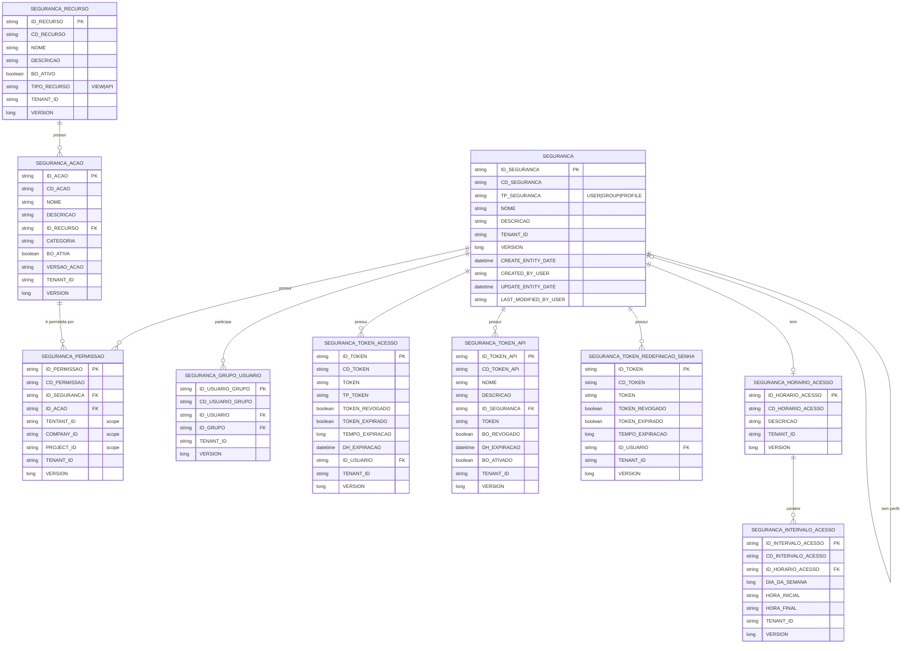

[← Voltar ao Índice dos Diagramas](README.md) | [Voltar ao Índice Principal](../README.md) | [Próximo: Fluxos →](flows.md)

---

# Entity Relationship Diagram (ERD)

## Introdução

Este diagrama mostra o modelo de dados completo do módulo `archbase-security`, incluindo todas as tabelas, campos e relacionamentos entre entidades.

---

## Diagrama Completo



---

## Descrição das Tabelas

### SEGURANCA (Entidades de Segurança)

**Estratégia**: Single Table Inheritance (STI)
**Discriminador**: `TP_SEGURANCA`

Esta tabela armazena três tipos de entidades:
- **USER** (`TP_SEGURANCA = 'USUARIO'`): Usuários do sistema
- **GROUP** (`TP_SEGURANCA = 'SEGURANCA_GRUPO'`): Grupos de usuários
- **PROFILE** (`TP_SEGURANCA = 'SEGURANCA_PERFIL'`): Perfis/papéis

**Relacionamentos**:
- Auto-relacionamento: UserEntity → ProfileEntity (um usuário tem um perfil)
- OneToMany com SEGURANCA_PERMISSAO
- OneToMany com SEGURANCA_GRUPO_USUARIO
- OneToMany com SEGURANCA_TOKEN_ACESSO
- OneToMany com SEGURANCA_TOKEN_API
- ManyToOne com SEGURANCA_HORARIO_ACESSO (opcional)

---

### SEGURANCA_PERMISSAO (Permissões)

Tabela central do sistema RBAC, ligando entidades de segurança a ações.

**Campos de Escopo** (definem contexto da permissão):
- `TENTANT_ID`: Tenant específico (null = todos)
- `COMPANY_ID`: Empresa específica (null = todas)
- `PROJECT_ID`: Projeto específico (null = todos)

**Relacionamentos**:
- ManyToOne com SEGURANCA (usuário, grupo ou perfil)
- ManyToOne com SEGURANCA_ACAO

**Ver**: [Sistema de Permissões](../entities/permission-entities.md)

---

### SEGURANCA_RECURSO (Recursos)

Recursos protegidos no sistema (APIs, páginas, funcionalidades).

**Tipos**:
- `VIEW`: Recursos de interface
- `API`: Endpoints REST

**Relacionamentos**:
- OneToMany com SEGURANCA_ACAO

**Ver**: [Entidades de Recursos](../entities/permission-entities.md#resourceentity)

---

### SEGURANCA_ACAO (Ações)

Operações que podem ser executadas sobre recursos.

**Ações Típicas**: VIEW, CREATE, UPDATE, DELETE, EXECUTE, EXPORT, IMPORT

**Relacionamentos**:
- ManyToOne com SEGURANCA_RECURSO
- OneToMany com SEGURANCA_PERMISSAO

**Ver**: [Entidades de Ações](../entities/permission-entities.md#actionentity)

---

### SEGURANCA_TOKEN_ACESSO (Access Tokens JWT)

Armazena tokens JWT para autenticação de usuários.

**Características**:
- Curta duração (minutos/horas)
- Gerado automaticamente no login
- Pode ser revogado ou expirar

**Relacionamentos**:
- ManyToOne com SEGURANCA (usuário proprietário)

**Ver**: [Access Tokens](../entities/token-entities.md#accesstokenentity)

---

### SEGURANCA_TOKEN_API (API Tokens)

Tokens de longa duração para serviços.

**Características**:
- Longa duração (meses/anos)
- Criação manual
- Requer ativação explícita (`BO_ATIVADO`)

**Relacionamentos**:
- ManyToOne com SEGURANCA (usuário associado)

**Ver**: [API Tokens](../entities/token-entities.md#apitokenentity)

---

### SEGURANCA_TOKEN_REDEFINICAO_SENHA (Password Reset Tokens)

Tokens temporários para redefinição de senha.

**Características**:
- Token numérico de 13 caracteres
- Expiração: 1 hora
- Uso único (revogado após uso)

**Relacionamentos**:
- ManyToOne com SEGURANCA (usuário solicitante)

**Ver**: [Password Reset Tokens](../entities/token-entities.md#passwordresettokenentity)

---

### SEGURANCA_GRUPO_USUARIO (Relacionamento User-Group)

Tabela de junção para relacionamento many-to-many entre usuários e grupos.

**Relacionamentos**:
- ManyToOne com SEGURANCA (usuário)
- ManyToOne com SEGURANCA (grupo)

---

### SEGURANCA_HORARIO_ACESSO (Horários de Acesso)

Define horários permitidos de acesso para usuários.

**Relacionamentos**:
- OneToMany com SEGURANCA_INTERVALO_ACESSO
- OneToMany com SEGURANCA (usuários que usam este horário)

**Ver**: [AccessScheduleEntity](../entities/core-entities.md#accessscheduleentity)

---

### SEGURANCA_INTERVALO_ACESSO (Intervalos de Tempo)

Define intervalos específicos dentro de um horário de acesso.

**Campos Importantes**:
- `DIA_DA_SEMANA`: 1 (Domingo) a 7 (Sábado)
- `HORA_INICIAL`: Formato "HH:mm"
- `HORA_FINAL`: Formato "HH:mm"

**Relacionamentos**:
- ManyToOne com SEGURANCA_HORARIO_ACESSO

**Ver**: [AccessIntervalEntity](../entities/core-entities.md#accessintervalentity)

---

## Índices Recomendados

Para otimização de performance:

```sql
-- Índice para busca de permissões
CREATE INDEX idx_permission_security_action
ON SEGURANCA_PERMISSAO(ID_SEGURANCA, ID_ACAO);

-- Índice para matching de contexto
CREATE INDEX idx_permission_context
ON SEGURANCA_PERMISSAO(TENTANT_ID, COMPANY_ID, PROJECT_ID);

-- Índice para busca de usuários por email
CREATE UNIQUE INDEX idx_user_email
ON SEGURANCA(TENANT_ID, EMAIL) WHERE TP_SEGURANCA = 'USUARIO';

-- Índice para busca de tokens
CREATE UNIQUE INDEX idx_token_value
ON SEGURANCA_TOKEN_ACESSO(TOKEN);

CREATE UNIQUE INDEX idx_api_token_value
ON SEGURANCA_TOKEN_API(TOKEN);
```

---

## Constraints de Integridade

### Constraints Únicos

| Tabela | Constraint | Campos |
|--------|-----------|--------|
| SEGURANCA | Código único por tenant | (TENANT_ID, CD_SEGURANCA) |
| SEGURANCA | Email único (usuários) | (TENANT_ID, EMAIL) WHERE TP='USUARIO' |
| SEGURANCA | Username único (usuários) | (TENANT_ID, USER_NAME) WHERE TP='USUARIO' |
| SEGURANCA_RECURSO | Nome único por tenant | (TENANT_ID, NOME) |
| SEGURANCA_ACAO | Nome único por recurso | (ID_RECURSO, NOME, TENANT_ID) |
| SEGURANCA_TOKEN_ACESSO | Token único | (TOKEN) |
| SEGURANCA_TOKEN_API | Token único | (TOKEN) |
| SEGURANCA_GRUPO_USUARIO | User-Group único | (ID_USUARIO, ID_GRUPO) |

---

## Observações sobre Multi-Tenancy

**Todas as tabelas possuem o campo `TENANT_ID`**, garantindo isolamento de dados por tenant.

**Filtragem Automática**: O framework aplica automaticamente filtros baseados em `ArchbaseTenantContext` para todas as queries.

**Ver**: [Multi-Tenancy](../architecture/multi-tenancy.md) para detalhes sobre propagação de contexto.

---

**Ver também**:
- [Visão Geral das Entidades](../entities/overview.md) - Descrição detalhada de cada entidade
- [Sistema de Permissões](../architecture/permissions-system.md) - Como permissões funcionam
- [Fluxos de Sistema](flows.md) - Diagramas de sequência

---

[← Voltar ao Índice dos Diagramas](README.md) | [Voltar ao Índice Principal](../README.md) | [Próximo: Fluxos →](flows.md)
