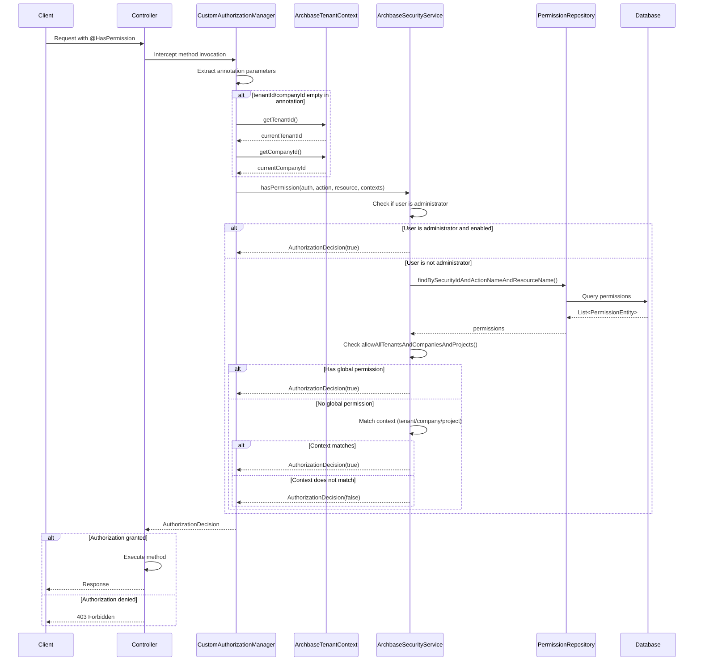
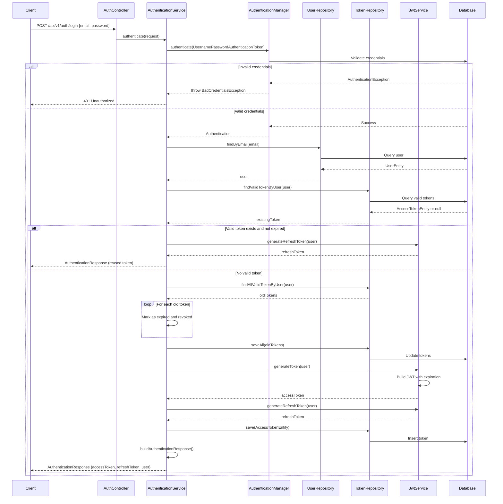
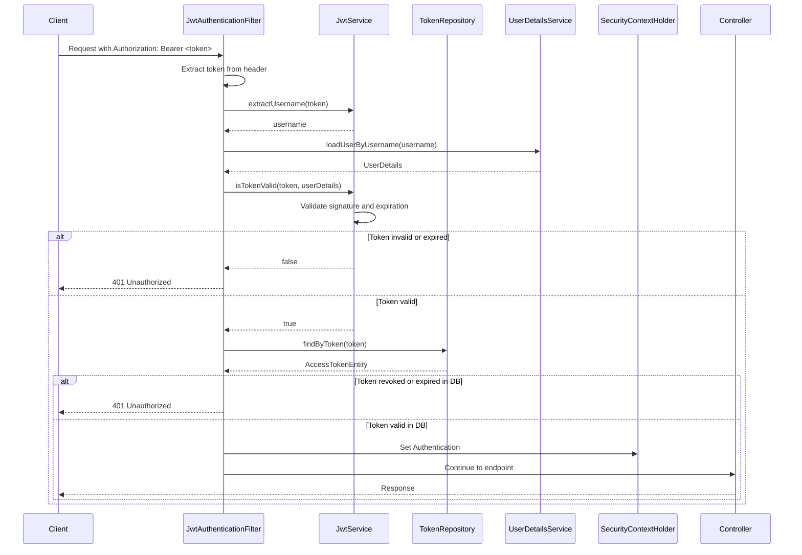

[← Anterior: ERD](entity-relationships.md) | [Voltar ao Índice dos Diagramas](README.md) | [Voltar ao Índice Principal](../README.md) | [Próximo: Escopos de Permissões →](permission-scopes.md)

---

# Fluxos de Sistema

## Introdução

Este documento contém diagramas de sequência que ilustram os principais fluxos do módulo `archbase-security`:
1. **Fluxo de Avaliação de Permissões**: Como `@HasPermission` funciona internamente
2. **Fluxo de Autenticação JWT**: Processo completo de login

---

## 1. Fluxo de Avaliação de Permissões

Este diagrama mostra o fluxo completo desde a interceptação de um método anotado com `@HasPermission` até a decisão final de autorização.



### Passos Detalhados

1. **Client → Controller**: Cliente faz requisição HTTP para endpoint protegido
2. **Controller → CustomAuthorizationManager**: Spring AOP intercepta método anotado com `@HasPermission`
3. **Extração de Parâmetros**: Manager extrai `action`, `resource`, `tenantId`, `companyId`, `projectId` da anotação
4. **Obtenção de Contexto** (condicional): Se contextos vazios na anotação, busca de `ArchbaseTenantContext`
5. **Chamada ao Security Service**: Delega verificação de permissão para `ArchbaseSecurityService`
6. **Verificação de Administrador**: Se usuário é admin **E** está habilitado → acesso concedido (bypass)
7. **Consulta de Permissões** (se não admin): Busca permissões no banco para user+action+resource
8. **Verificação Global**: Se alguma permissão é global (`allowAllTenantsAndCompaniesAndProjects()`) → concedido
9. **Matching de Contextos**: Verifica se contextos da permissão combinam com contexto da requisição
10. **Decisão Final**: Retorna `AuthorizationDecision(true/false)` para Spring Security
11. **Execução/Rejeição**: Método executado se concedido, ou `403 Forbidden` se negado

**Ver**: [Sistema de Permissões](../architecture/permissions-system.md) para descrição detalhada de cada passo.

---

## 2. Fluxo de Autenticação JWT

Este diagrama mostra o processo completo de autenticação, desde o login até a geração de tokens JWT.



### Passos Detalhados

1. **Client → AuthController**: Cliente envia credenciais (email/password) para `/api/v1/auth/login`
2. **AuthController → AuthenticationService**: Controller delega para service
3. **Validação de Credenciais**: `AuthenticationManager` valida via Spring Security
4. **Se Inválido**: Retorna `401 Unauthorized`
5. **Se Válido**: Busca usuário completo no `UserRepository`
6. **Verificação de Token Existente**: Verifica se já existe token válido não-expirado
7. **Reutilização de Token** (se existe e válido): Gera apenas refresh token e retorna token existente
8. **Geração de Novo Token** (se não existe ou expirado):
   - Revoga todos os tokens antigos do usuário (se `allowMultipleLogins=false`)
   - Gera novo access token JWT
   - Gera refresh token
   - Persiste access token no banco
   - Constrói resposta com ambos os tokens
9. **Resposta ao Cliente**: Retorna `AuthenticationResponse` com tokens e dados do usuário

**Ver**: [Sistema de Autenticação](../architecture/authentication-system.md) para descrição detalhada do fluxo.

---

## 3. Fluxo de Validação de Token JWT (Requisições Subsequentes)



### Passos de Validação

1. **Extração do Token**: Do header `Authorization: Bearer <token>`
2. **Extração do Username**: Do payload JWT
3. **Carregamento do UserDetails**: Busca dados completos do usuário
4. **Validação do JWT**: Verifica assinatura e expiração
5. **Verificação no Banco**: Confirma que token não foi revogado
6. **Configuração de Contexto**: Define `Authentication` no `SecurityContext`
7. **Processamento da Requisição**: Controller processa normalmente

**Importante**: Token é validado **em cada requisição** para garantir que não foi revogado.

---

## Componentes Envolvidos

### Fluxo de Permissões

| Componente | Responsabilidade |
|-----------|------------------|
| **CustomAuthorizationManager** | Intercepta métodos com `@HasPermission` |
| **ArchbaseTenantContext** | Fornece contexto de tenant/company/project |
| **ArchbaseSecurityService** | Lógica de verificação de permissões |
| **PermissionRepository** | Acesso a permissões no banco |

### Fluxo de Autenticação

| Componente | Responsabilidade |
|-----------|------------------|
| **AuthController** | Recebe requisições de login |
| **AuthenticationService** | Orquestra processo de autenticação |
| **AuthenticationManager** | Valida credenciais (Spring Security) |
| **JwtService** | Gera e valida tokens JWT |
| **TokenRepository** | Persiste e consulta tokens |
| **UserRepository** | Acesso a usuários no banco |

---

## Exceções Comuns

### Durante Avaliação de Permissões

| Exceção | Quando Ocorre | HTTP Status |
|---------|---------------|-------------|
| `AccessDeniedException` | Permissão negada | 403 Forbidden |
| `AuthenticationException` | Usuário não autenticado | 401 Unauthorized |

### Durante Autenticação

| Exceção | Quando Ocorre | HTTP Status |
|---------|---------------|-------------|
| `BadCredentialsException` | Credenciais inválidas | 401 Unauthorized |
| `AccountExpiredException` | Conta desativada | 401 Unauthorized |
| `LockedException` | Conta bloqueada | 401 Unauthorized |
| `ExpiredJwtException` | Token JWT expirado | 401 Unauthorized |

---

## Otimizações de Performance

### Cache de Permissões

O sistema pode cachear resultados de `PermissionRepository.find...()` para reduzir queries:

```properties
archbase.security.permission.cache.enabled=true
archbase.security.permission.cache.ttl=3600
```

**Efeito**: Query ao banco ocorre apenas na primeira verificação; verificações subsequentes usam cache.

### Bypass para Administradores

Administradores pulam toda a verificação de permissões no banco, resultando em response time mais rápido.

---

**Ver também**:
- [Sistema de Permissões](../architecture/permissions-system.md) - Detalhes técnicos de avaliação
- [Sistema de Autenticação](../architecture/authentication-system.md) - Detalhes técnicos de JWT
- [Entity Relationship Diagram](entity-relationships.md) - Modelo de dados

---

[← Anterior: ERD](entity-relationships.md) | [Voltar ao Índice dos Diagramas](README.md) | [Voltar ao Índice Principal](../README.md) | [Próximo: Escopos de Permissões →](permission-scopes.md)
