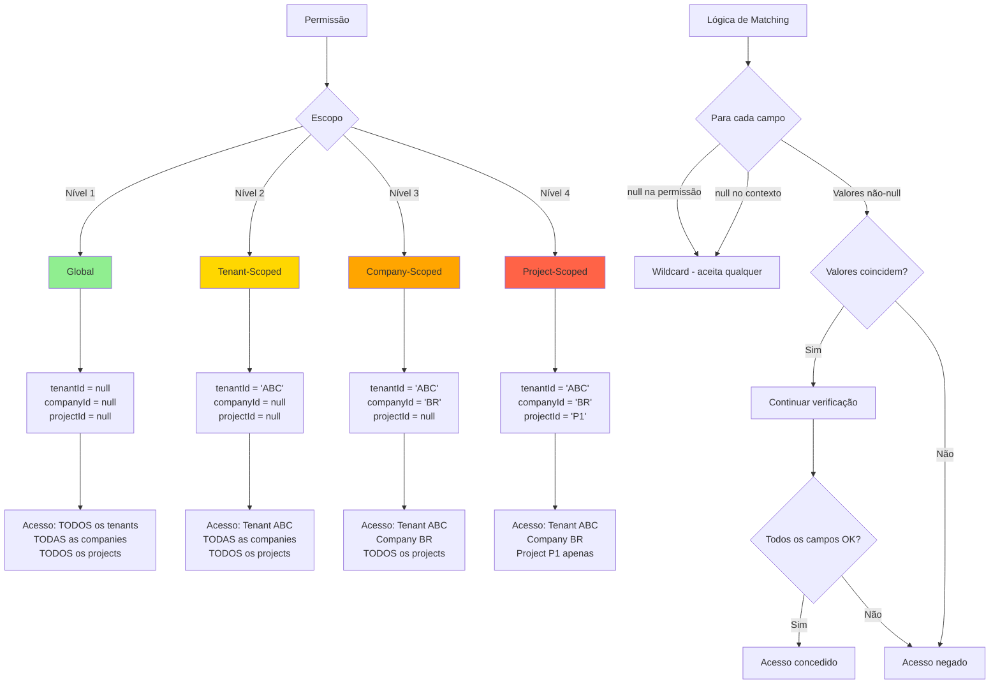

[← Anterior: Fluxos](flows.md) | [Voltar ao Índice dos Diagramas](README.md) | [Voltar ao Índice Principal](../README.md)

---

# Modelo de Escopo de Permissões

## Introdução

Este diagrama ilustra os 4 níveis hierárquicos de granularidade de permissões e a lógica de matching de contextos. O sistema permite permissões desde globais (sem restrições) até altamente específicas (restritas a um projeto específico).

---

## Diagrama de Hierarquia de Escopos



---

## Descrição dos Níveis

### Nível 1: Global (Verde)

**Configuração**:
```java
tenantId = null
companyId = null
projectId = null
```

**Acesso**: Permissão válida em **qualquer contexto**.

**Uso Típico**:
- Administradores de sistema
- Serviços globais de monitoramento
- Funcionalidades não restritas por tenant

**Exemplo**:
```java
PermissionEntity permission = PermissionEntity.builder()
    .security(systemAdmin)
    .action(manageUsersAction)
    .tenantId(null)    // Wildcard
    .companyId(null)   // Wildcard
    .projectId(null)   // Wildcard
    .build();
```

---

### Nível 2: Tenant-Scoped (Amarelo)

**Configuração**:
```java
tenantId = "ACME_CORP"
companyId = null
projectId = null
```

**Acesso**: Permissão válida apenas no tenant especificado, mas em **qualquer company/project** dentro dele.

**Uso Típico**:
- Administradores de tenant
- Usuários que trabalham em múltiplas empresas do mesmo tenant
- Gerentes de organização

**Exemplo**:
```java
PermissionEntity permission = PermissionEntity.builder()
    .security(tenantManager)
    .action(viewReportsAction)
    .tenantId("ACME_CORP")  // Apenas este tenant
    .companyId(null)        // Todas as companies
    .projectId(null)        // Todos os projects
    .build();
```

---

### Nível 3: Company-Scoped (Laranja)

**Configuração**:
```java
tenantId = "ACME_CORP"
companyId = "ACME_BRASIL"
projectId = null
```

**Acesso**: Permissão válida apenas na company especificada, mas em **qualquer project** dentro dela.

**Uso Típico**:
- Gerentes de filial
- Supervisores de empresa
- Usuários restritos a uma subsidiária específica

**Exemplo**:
```java
PermissionEntity permission = PermissionEntity.builder()
    .security(companyManager)
    .action(approveExpensesAction)
    .tenantId("ACME_CORP")
    .companyId("ACME_BRASIL")  // Apenas esta company
    .projectId(null)           // Todos os projects
    .build();
```

---

### Nível 4: Project-Scoped (Vermelho)

**Configuração**:
```java
tenantId = "ACME_CORP"
companyId = "ACME_BRASIL"
projectId = "PROJ_2024_001"
```

**Acesso**: Permissão válida **apenas no project específico**.

**Uso Típico**:
- Membros de equipe de projeto
- Consultores alocados a projetos específicos
- Desenvolvedores em projetos de cliente

**Exemplo**:
```java
PermissionEntity permission = PermissionEntity.builder()
    .security(projectLead)
    .action(editDocumentsAction)
    .tenantId("ACME_CORP")
    .companyId("ACME_BRASIL")
    .projectId("PROJ_2024_001")  // Apenas este project
    .build();
```

---

## Lógica de Matching de Contextos

### Algoritmo

Para **cada campo** de contexto (`tenantId`, `companyId`, `projectId`), a permissão é aceita SE:

```
(valor na permissão == null) OU
(valor no contexto == null) OU
(valor na permissão == valor no contexto)
```

**Todos os três campos devem satisfazer a condição** para que a permissão seja concedida.

### Tabela de Verdade (por campo)

| Permissão | Contexto | Match? | Motivo |
|-----------|----------|--------|--------|
| `null` | `null` | ✓ | Sem restrição em ambos |
| `null` | `"abc"` | ✓ | Permissão permite qualquer valor (wildcard) |
| `"abc"` | `null` | ✓ | Contexto não especifica restrição |
| `"abc"` | `"abc"` | ✓ | Valores coincidem exatamente |
| `"abc"` | `"xyz"` | ✗ | Valores diferentes |

### Fluxograma de Decisão

```
Para cada permissão encontrada:

1. Verificar tenantId:
   ├─ Se permissão.tenantId == null → OK (wildcard)
   ├─ Se contexto.tenantId == null → OK (sem restrição)
   ├─ Se permissão.tenantId == contexto.tenantId → OK
   └─ Caso contrário → NEGAR ACESSO

2. Verificar companyId:
   ├─ Se permissão.companyId == null → OK (wildcard)
   ├─ Se contexto.companyId == null → OK (sem restrição)
   ├─ Se permissão.companyId == contexto.companyId → OK
   └─ Caso contrário → NEGAR ACESSO

3. Verificar projectId:
   ├─ Se permissão.projectId == null → OK (wildcard)
   ├─ Se contexto.projectId == null → OK (sem restrição)
   ├─ Se permissão.projectId == contexto.projectId → OK
   └─ Caso contrário → NEGAR ACESSO

4. Se TODOS os campos OK → CONCEDER ACESSO
   Caso contrário → NEGAR ACESSO
```

---

## Exemplos Práticos de Matching

### Exemplo 1: Permissão Global vs. Contexto Específico

**Permissão**:
```java
tenantId = null
companyId = null
projectId = null
```

**Contexto da Requisição**:
```java
tenantId = "ABC"
companyId = "ABC-BR"
projectId = "PROJ-1"
```

**Resultado**: ✓ **MATCH**
- `tenantId`: null (wildcard) → aceita "ABC"
- `companyId`: null (wildcard) → aceita "ABC-BR"
- `projectId`: null (wildcard) → aceita "PROJ-1"

---

### Exemplo 2: Permissão Tenant vs. Contexto Company

**Permissão**:
```java
tenantId = "ABC"
companyId = null
projectId = null
```

**Contexto da Requisição**:
```java
tenantId = "ABC"
companyId = "ABC-BR"
projectId = "PROJ-1"
```

**Resultado**: ✓ **MATCH**
- `tenantId`: "ABC" == "ABC" → OK
- `companyId`: null (wildcard) → aceita "ABC-BR"
- `projectId`: null (wildcard) → aceita "PROJ-1"

---

### Exemplo 3: Permissão Project vs. Contexto Diferente

**Permissão**:
```java
tenantId = "ABC"
companyId = "ABC-BR"
projectId = "PROJ-1"
```

**Contexto da Requisição**:
```java
tenantId = "ABC"
companyId = "ABC-BR"
projectId = "PROJ-2"  // Projeto diferente!
```

**Resultado**: ✗ **NO MATCH**
- `tenantId`: "ABC" == "ABC" → OK
- `companyId`: "ABC-BR" == "ABC-BR" → OK
- `projectId`: "PROJ-1" != "PROJ-2" → **FALHA**

---

### Exemplo 4: Múltiplas Permissões (OR lógico)

**Permissões do Usuário**:
1. `tenantId="ABC", companyId="ABC-BR", projectId="PROJ-1"`
2. `tenantId="ABC", companyId="ABC-AR", projectId=null`

**Contexto da Requisição**:
```java
tenantId = "ABC"
companyId = "ABC-AR"
projectId = "PROJ-5"
```

**Análise**:
- Permissão 1: ✗ NO MATCH (companyId diferente: "ABC-BR" != "ABC-AR")
- Permissão 2: ✓ **MATCH** (tenant e company coincidem, project é wildcard)

**Resultado Final**: ✓ **ACESSO CONCEDIDO** (pelo menos uma permissão fez match)

---

## Matriz de Isolamento

| Nível | Tenant | Company | Project | Isolamento | Casos de Uso |
|-------|--------|---------|---------|------------|--------------|
| **Global** | - | - | - | Nenhum | Admins, serviços globais |
| **Tenant** | ✓ | - | - | Por organização | Gerentes de tenant, multi-company |
| **Company** | ✓ | ✓ | - | Por empresa | Gerentes de filial, supervisores |
| **Project** | ✓ | ✓ | ✓ | Por projeto | Equipes de projeto, consultores |

**Legenda**:
- ✓ = Campo especificado (restringe acesso)
- \- = Campo null (wildcard, sem restrição)

---

## Recomendações de Design

### 1. Princípio do Menor Privilégio

Sempre conceda o **nível mais restrito** de permissão necessário:

❌ **Ruim** (excessivamente permissivo):
```java
// Usuário só precisa acessar PROJ-1, mas recebe acesso global
permission.setTenantId(null);
permission.setCompanyId(null);
permission.setProjectId(null);
```

✓ **Bom** (apenas o necessário):
```java
// Usuário recebe acesso apenas ao projeto específico
permission.setTenantId("ABC");
permission.setCompanyId("ABC-BR");
permission.setProjectId("PROJ-1");
```

### 2. Uso de Perfis para Escopo Padrão

Defina permissões com escopos apropriados em perfis:

```java
// Perfil "ADMIN_TENANT" com permissões tenant-scoped
Profile adminTenant = new Profile("ADMIN_TENANT");
adminTenant.addPermission(manageUsersAction, "ABC", null, null);

// Perfil "PROJECT_MEMBER" com permissões project-scoped
Profile projectMember = new Profile("PROJECT_MEMBER");
projectMember.addPermission(viewDocsAction, "ABC", "ABC-BR", "PROJ-1");
```

### 3. Auditoria de Permissões Globais

Permissões globais devem ser **raras e auditadas**:

```java
// Auditar quem tem permissões globais
List<PermissionEntity> globalPermissions = permissionRepository.findAll()
    .stream()
    .filter(PermissionEntity::allowAllTenantsAndCompaniesAndProjects)
    .collect(Collectors.toList());
```

---

## Configuração de Contexto

O contexto usado no matching vem de `ArchbaseTenantContext`:

```java
// Definir contexto (tipicamente em filtro HTTP)
ArchbaseTenantContext.setTenantId("ABC");
ArchbaseTenantContext.setCompanyId("ABC-BR");
ArchbaseTenantContext.setProjectId("PROJ-1");

// Obter contexto (usado automaticamente por @HasPermission)
String tenantId = ArchbaseTenantContext.getTenantId();
```

**Ver**: [Multi-Tenancy](../architecture/multi-tenancy.md) para detalhes sobre propagação de contexto.

---

**Ver também**:
- [Sistema de Permissões](../architecture/permissions-system.md) - Fluxo completo de avaliação
- [Entidades de Permissão](../entities/permission-entities.md) - Modelo de dados
- [Multi-Tenancy](../architecture/multi-tenancy.md) - Propagação de contexto

---

[← Anterior: Fluxos](flows.md) | [Voltar ao Índice dos Diagramas](README.md) | [Voltar ao Índice Principal](../README.md)
