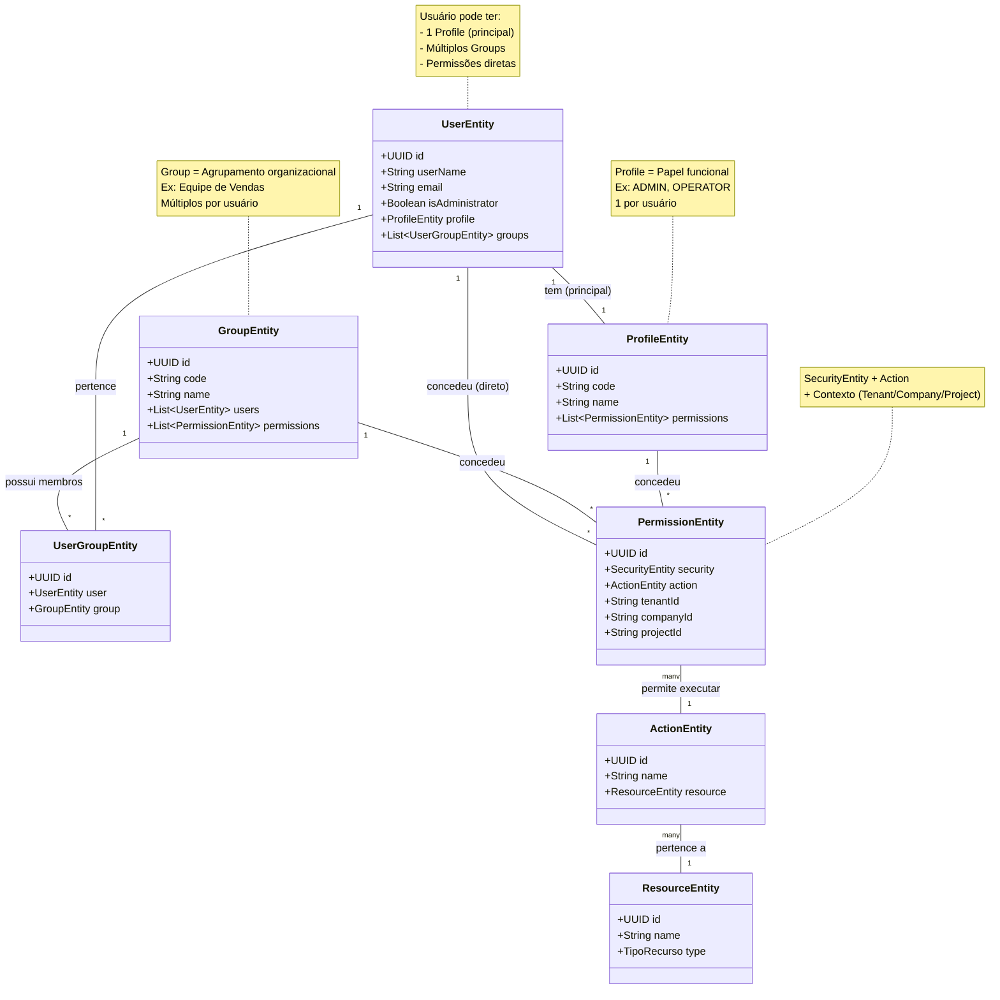
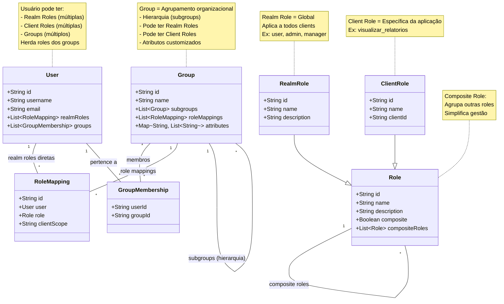

# Análise Comparativa: Archbase vs Keycloak

## Índice

1. [Introdução](#introdução)
2. [Diagrama de Entidades do Archbase](#diagrama-de-entidades-do-archbase)
3. [Diagrama de Entidades do Keycloak](#diagrama-de-entidades-do-keycloak)
4. [Comparação dos Modelos](#comparação-dos-modelos)
5. [Diferenças Conceituais](#diferenças-conceituais)
6. [Equivalência Sugerida](#equivalência-sugerida)
7. [Quando Usar Cada Modelo](#quando-usar-cada-modelo)

---

## Introdução

Este documento apresenta uma análise comparativa entre os modelos de segurança do **Archbase Framework** e do **Keycloak**, com foco especial nas estruturas de permissões e controle de acesso.

### Propósito

- **Archbase**: Framework de desenvolvimento empresarial com segurança embutida
- **Keycloak**: Solução IAM (Identity and Access Management) standalone

### Escopo

Esta análise foca em:
- Modelos de entidades de segurança
- Estrutura de permissões
- Controle de acesso baseado em roles (RBAC)
- Padrões de organização de usuários

---

## Diagrama de Entidades do Archbase

### Modelo de Permissões



### Características Principais

#### ProfileEntity
- **Cardinalidade**: 1 por usuário
- **Propósito**: Define o papel funcional principal do usuário
- **Exemplos**: ADMIN, OPERATOR, VIEWER
- **Mutabilidade**: Geralmente fixo, define a categoria principal

#### GroupEntity
- **Cardinalidade**: Múltiplos por usuário
- **Propósito**: Agrupamento organizacional
- **Exemplos**: Equipe de Vendas, Departamento Financeiro, Projeto X
- **Hierarquia**: Não suporta subgrupos

#### PermissionEntity
- **Componentes**: SecurityEntity + ActionEntity + Contexto
- **Escopo**: Tenant/Company/Project
- **Granularidade**: Alta (ação específica sobre recurso específico)
- **Atribuição**: Direta ao usuário, via Profile ou via Group

#### Multi-Tenancy
- **Três níveis**: Tenant → Company → Project
- **Isolamento**: Permissões podem ser restritas a qualquer nível
- **Contexto**: Propagado automaticamente via `ArchbaseTenantContext`

---

## Diagrama de Entidades do Keycloak

### Modelo de Permissões



### Características Principais

#### RealmRole
- **Cardinalidade**: Múltiplas por usuário
- **Propósito**: Permissões globais aplicáveis a todos os clients
- **Exemplos**: user, admin, manager, editor
- **Escopo**: Todo o realm

#### ClientRole
- **Cardinalidade**: Múltiplas por usuário
- **Propósito**: Permissões específicas de uma aplicação
- **Exemplos**: visualizar_relatorios, aprovar_transacoes
- **Escopo**: Client específico

#### Group
- **Cardinalidade**: Múltiplos por usuário
- **Propósito**: Agrupamento organizacional
- **Exemplos**: Financeiro, Vendas, TI
- **Hierarquia**: Suporta subgrupos (aninhamento)
- **Atributos**: Suporta atributos customizados
- **Roles**: Pode ter Realm Roles e Client Roles

#### Composite Roles
- **Conceito**: Role que agrupa múltiplas outras roles
- **Benefício**: Simplifica gestão de permissões
- **Herança**: Herda todas as permissões das roles contidas

#### No Token
```json
{
  "realm_access": {
    "roles": ["user", "manager"]
  },
  "resource_access": {
    "minha-aplicacao": {
      "roles": ["visualizar_relatorios", "editar_relatorios"]
    }
  }
}
```

---

## Comparação dos Modelos

### Tabela Comparativa

| Aspecto | Archbase | Keycloak |
|---------|----------|----------|
| **Entidade de Usuário** | `UserEntity` | `User` |
| **Papel Funcional (Role)** | `ProfileEntity` (1 por usuário) | `RealmRole` (múltiplas por usuário) |
| **Agrupamento** | `GroupEntity` (múltiplos) | `Group` (múltiplos, com hierarquia) |
| **Permissão** | `PermissionEntity` (Security + Action + Contexto) | `RoleMapping` (User/Group + Role) |
| **Especificidade** | Action + Resource + Tenant/Company/Project | Realm Role ou Client Role |
| **Cardinalidade de Roles** | 1 Profile, N Groups | N Realm Roles, N Client Roles, N Groups |
| **Hierarquia de Groups** | Não suporta | Suporta subgroups |
| **Atributos em Groups** | Não | Sim (customizados) |
| **Roles Compostas** | Não suporta nativamente | Sim (Composite Roles) |
| **Multi-Tenancy Nativo** | Sim (Tenant/Company/Project) | Não (requer customization) |
| **Granularidade de Permissões** | Alta (ação + recurso + contexto) | Média (role) |

### Diferenças Chave

#### 1. Cardinalidade de Roles Principais

**Archbase:**
- Usuário tem **1 Profile** (papel principal)
- Usa Groups para permissões adicionais
- Modelo mais estruturado

**Keycloak:**
- Usuário pode ter **N Realm Roles**
- Mais flexível para acumulação de papéis
- Modelo mais flexível

#### 2. Hierarquia

**Archbase:**
- Groups não têm suporte a hierarquia
- Relação plana entre grupos

**Keycloak:**
- Groups suportam subgroups aninhados
- Permite modelar estruturas organizacionais complexas
- Ex: `Empresa > Administrativo > Financeiro`

#### 3. Multi-Tenancy

**Archbase:**
- Multi-tenancy nativo (Tenant/Company/Project)
- Permissões podem ser restritas por contexto
- Isolamento automático via `ArchbaseTenantContext`

**Keycloak:**
- Não possui multi-tenancy nativo
- Usa Realms para isolamento (não é verdadeiro multi-tenancy)
- Workaround: atributos customizados ou mappers

#### 4. Granularidade de Permissões

**Archbase:**
```
PermissionEntity:
  + SecurityEntity (User/Group/Profile)
  + ActionEntity (VIEW, CREATE, UPDATE, DELETE)
  + ResourceEntity (USER, REPORT, TRANSACTION)
  + Contexto (Tenant/Company/Project)
```

**Keycloak:**
```
RoleMapping:
  + User/Group
  + Role (Realm ou Client)
  + Role pode representar qualquer permissão
```

---

## Diferenças Conceituais

### Profile (Archbase) vs Realm Role (Keycloak)

| Característica | ProfileEntity | RealmRole |
|----------------|---------------|-----------|
| Cardinalidade | 1 por usuário | Múltiplas por usuário |
| Propósito | Papel principal | Papéis funcionais |
| Exemplo | "ADMIN" | "user", "manager", "editor" |
| Mutabilidade | Usuário tem 1 principal | Usuário acumula múltiplas |
| Semântica | Categoria principal | Coleção de permissões |

**Implicações:**

- **Archbase**: Mais estruturado, define claramente a categoria do usuário
- **Keycloak**: Mais flexível, permite usuários com múltiplos papéis funcionais

### Group (Archbase) vs Group (Keycloak)

| Característica | GroupEntity | Group (Keycloak) |
|----------------|-------------|------------------|
| Hierarquia | Não suporta | Suporta subgroups |
| Atributos | Não | Sim (customizados) |
| Roles | Via PermissionEntity | Via RoleMapping direto |
| Cardinalidade | Múltiplos por usuário | Múltiplos por usuário |
| Herança | Não existe | Herda roles do pai |

**Implicações:**

- **Archbase**: Groups são coleções simples de usuários com permissões
- **Keycloak**: Groups são estruturas organizacionais complexas

### Permissões

**Archbase:**
```
User/Group/Profile + Action → PermissionEntity
                              ↓
                        Contexto (Tenant/Company/Project)
```

**Exemplo prático:**
```java
// Permissão global
PermissionEntity p1 = new PermissionEntity();
p1.setSecurity(user);
p1.setAction(viewReportAction);
// Sem restrição de contexto = global

// Permissão específica
PermissionEntity p2 = new PermissionEntity();
p2.setSecurity(group);
p2.setAction(editReportAction);
p2.setTenantId("tenant-123");
p2.setCompanyId("company-456");
// Restrita a um tenant/company específico
```

**Keycloak:**
```
User/Group + Role → RoleMapping
                  ↓
            Realm Role ou Client Role
```

**Exemplo prático:**
```json
// Role no token
{
  "realm_access": {
    "roles": ["user", "manager"]
  },
  "resource_access": {
    "app-financeiro": {
      "roles": ["visualizar_relatorios"]
    }
  }
}
// Aplica globalmente, sem contexto específico
```

---

## Equivalência Sugerida

### Mapeamento Conceitual

#### Opção 1: Mapeamento por Cardinalidade

| Keycloak | Archbase | Observação |
|----------|----------|------------|
| Realm Role | GroupEntity | Pois usuário pode ter múltiplas |
| Client Role | GroupEntity | Pois usuário pode ter múltiplas |
| Group | GroupEntity | Mapeamento direto |
| - | ProfileEntity | Não existe equivalente (1 por usuário) |

**Quando usar:** Quando a aplicação Keycloak usa múltiplas realm roles por usuário.

#### Opção 2: Mapeamento Semântico

| Keycloak | Archbase | Observação |
|----------|----------|------------|
| Realm Role (única principal) | ProfileEntity | Se usuário tiver apenas 1 |
| Realm Roles (múltiplas) | GroupEntity | Converter para Groups |
| Client Roles | GroupEntity | Sempre como Groups |
| Groups | GroupEntity | Mapeamento direto |

**Quando usar:** Quando é possível distinguir uma realm role "principal".

### Estratégias de Migração

#### Keycloak → Archbase

**Cenário 1: Usuário com 1 Realm Role**
```
Keycloak:
  User: joao.silva
  Realm Roles: [ADMIN]

Archbase:
  UserEntity: joao.silva
  ProfileEntity: ADMIN
```

**Cenário 2: Usuário com Múltiplas Realm Roles**
```
Keycloak:
  User: joao.silva
  Realm Roles: [user, manager, editor]

Archbase:
  UserEntity: joao.silva
  ProfileEntity: user  // ou "PADRAO"
  Groups:
    - GroupEntity: manager (com permissões de manager)
    - GroupEntity: editor (com permissões de editor)
```

**Cenário 3: Client Roles**
```
Keycloak:
  Client: app-financeiro
  Client Roles: [visualizar_relatorios, editar_relatorios]

Archbase:
  GroupEntity: app-financeiro-user
  Permissions:
    - Action: VIEW, Resource: RELATORIO
    - Action: EDIT, Resource: RELATORIO
```

**Cenário 4: Groups com Hierarquia**
```
Keycloak:
  Group: Empresa/Administrativo/Financeiro
  Roles: [user, visualizar_relatorios]

Archbase:
  GroupEntity: Financeiro
  Permissions:
    - (todas as permissões do grupo)
  // Subgrupos se tornam grupos irmãos
  // OU: usar convenção de nomenclatura:
  // - "Financeiro-AP"
  // - "Financeiro-Contas a Pagar"
```

#### Archbase → Keycloak

**Cenário 1: Profile como Realm Role**
```
Archbase:
  UserEntity: joao.silva
  ProfileEntity: ADMIN

Keycloak:
  User: joao.silva
  Realm Roles: [ADMIN]
```

**Cenário 2: Groups como Realm Roles**
```
Archbase:
  UserEntity: joao.silva
  Groups: [Vendas, Suporte]

Keycloak:
  User: joao.silva
  Realm Roles: [Vendas, Suporte]
  // OU
  Groups: [Vendas, Suporte] (com role mappings)
```

**Cenário 3: Multi-Tenancy**
```
Archbase:
  PermissionEntity: (tenant-123, company-456)
  Action: VIEW, Resource: REPORT

Keycloak:
  // Não existe equivalente direto
  // Opção 1: Client por tenant/company
  Client: tenant-123-company-456
  Client Roles: [view_report]

  // Opção 2: Atributos customizados
  User Attribute: tenant = "tenant-123"
  User Attribute: company = "company-456"
  Role: view_report
  // Validação no nível da aplicação
```

---

## Quando Usar Cada Modelo

### Use Archbase Quando:

1. **Multi-Tenancy é Requisito Core**
   - Aplicações SaaS com múltiplas organizações
   - Necessidade de isolamento Tenant/Company/Project
   - Contexto de segurança precisa ser propagado automaticamente

2. **Granularidade Fina de Permissões**
   - Permissões específicas por contexto
   - Ações distintas sobre recursos específicos
   - Controle de acesso em múltiplos níveis

3. **Integração com DDD**
   - Aplicação usando Domain-Driven Design
   - Entidades de segurança como parte do domínio
   - Necessidade de validações de negócio customizadas

4. **Aplicação Monolítica ou Modular**
   - Framework de desenvolvimento completo
   - Segurança integrada com outras funcionalidades
   - Controle total sobre o modelo de dados

5. **Validações de Negócio Complexas**
   - Permissões com regras de negócio
   - Temporalidade de acesso (data/hora específicas)
   - Fluxos de aprovação customizados

### Use Keycloak Quando:

1. **SSO (Single Sign-On) é Prioridade**
   - Múltiplas aplicações compartilhando login
   - SSO entre aplicações diferentes
   - Centralização da autenticação

2. **Identity Federation é Necessária**
   - Integração com LDAP/Active Directory
   - Social login (Google, Facebook, etc.)
   - SAML 2.0 ou OpenID Connect

3. **Gestão de Identidades Externa**
   - Equipe de segurança/IT gerencia usuários
   - Console administrativo rico
   - Auditoria e compliance

4. **Ecosistema de Aplicações Heterogêneas**
   - Aplicações em diferentes tecnologias
   - Terceiros precisam autenticar
   - API Gateway com autenticação centralizada

5. **Padrões de Indústria são Requisito**
   - OAuth 2.0 / OpenID Connect
   - Compliance com padrões de segurança
   - Ferramenta consolidada no mercado

### Combinando Ambos

#### Arquitetura Híbrida

```
┌─────────────────────────────────────────┐
│           Aplicações                    │
│  ┌──────────┐  ┌──────────┐             │
│  │   App 1  │  │   App 2  │             │
│  │ (Spring) │  │ (React)  │             │
│  └────┬─────┘  └────┬─────┘             │
└───────┼─────────────┼────────────────────┘
        │             │
        ▼             ▼
┌─────────────────────────────────────────┐
│         API Gateway / Archbase          │
│  ┌────────────────────────────────┐     │
│  │  Archbase Security Module      │     │
│  │  - Multi-tenancy               │     │
│  │  - Permissões contextuais      │     │
│  │  - Validações de negócio       │     │
│  └──────────┬─────────────────────┘     │
└─────────────┼───────────────────────────┘
              │
              ▼
┌─────────────────────────────────────────┐
│            Keycloak                      │
│  - Autenticação centralizada            │
│  - SSO                                   │
│  - Identity Federation                  │
│  - Social Login                         │
└─────────────────────────────────────────┘
```

#### Fluxo de Autenticação Híbrido

1. **Usuário** acessa Aplicação
2. **Aplicação** redireciona para Keycloak (login)
3. **Keycloak** autentica e emite JWT
4. **Aplicação** recebe JWT e valida assinatura
5. **Archbase** extrai claims do JWT e:
   - Cria contexto de segurança local
   - Mapeia roles do Keycloak para Groups/Profiles
   - Aplica multi-tenancy se aplicável
   - Valida permissões contextuais

#### Configuração Archbase para Keycloak

```yaml
# application.yml
archbase:
  security:
    enabled: true
    jwt:
      # Usa chave pública do Keycloak
      secret: ${KEYCLOAK_PUBLIC_KEY}
      # Valida issuer do Keycloak
      issuer: https://keycloak.example.com/realms/myapp
    # Mapeamento de roles
    keycloak:
      realm-role-mapping:
        ADMIN: PROFILE_ADMIN
        USER: PROFILE_USER
      client-role-mapping:
        visualizar_relatorios: GROUP_REPORT_VIEWER
        editar_relatorios: GROUP_REPORT_EDITOR
  multitenancy:
    enabled: true
    # Propaga tenant ID do claim do Keycloak
    tenant-claim: tenant_id
    company-claim: company_id
    project-claim: project_id
```

---

## Conclusão

### Resumo das Diferenças Principais

| Aspecto | Archbase | Keycloak |
|---------|----------|----------|
| **Foco Principal** | Framework de desenvolvimento | Gestão de identidades |
| **Multi-Tenancy** | Nativo (3 níveis) | Não nativo |
| **Cardinalidade de Roles** | 1 Profile, N Groups | N Realm Roles, N Client Roles |
| **Hierarquia de Groups** | Não suporta | Suporta subgroups |
| **Granularidade** | Alta (ação + recurso + contexto) | Média (role) |
| **Extensibilidade** | Via código (DDD) | Via plugins/SPI |
| **SSO** | Não nativo | Nativo |
| **Identity Federation** | Não nativo | Nativo |

### Qual Escolher?

**Escolha Archbase se:**
- Está construindo uma aplicação empresarial com Spring Boot
- Multi-tenancy é um requisito core
- Precisa de granularidade fina de permissões
- Quer controle total sobre o modelo de dados
- A aplicação é autocontida (sem necessidade de SSO)

**Escolha Keycloak se:**
- Precisa de SSO entre múltiplas aplicações
- Identity federation (LDAP, social login) é necessária
- Quer uma solução standalone de IAM
- Equipe de segurança gerencia identidades externamente
- Precisa de compliance com padrões OAuth 2.0/OIDC

**Considere Ambos se:**
- Tem múltiplas aplicações heterogêneas
- Precisa de SSO + multi-tenancy específico da aplicação
- Quer centralizar autenticação (Keycloak) mas delegar autorização contextual (Archbase)

---

## Recursos Adicionais

### Documentação Archbase

- [Visão Geral das Entidades](../entities/overview.md)
- [Sistema de Permissões](../entities/permission-entities.md)
- [Arquitetura de Multi-Tenancy](../architecture/multi-tenancy.md)
- [Guias de Configuração](./configuration.md)

### Documentação Keycloak

- [Guia Completo do Keycloak](../keycloak-entidades-guia.md)
- [Documentação Oficial Keycloak](https://www.keycloak.org/documentation)
- [Keycloak Admin REST API](https://www.keycloak.org/docs-api/latest/rest-api/)

### Exemplos de Integração

Veja exemplos práticos de integração entre Archbase e Keycloak em:
- [Exemplos de Código](./code-examples.md)
- [Melhores Práticas](./best-practices.md)

---

**Versão do Documento**: 1.0
**Data**: Janeiro 2026
**Autor**: Archbase Security Team
