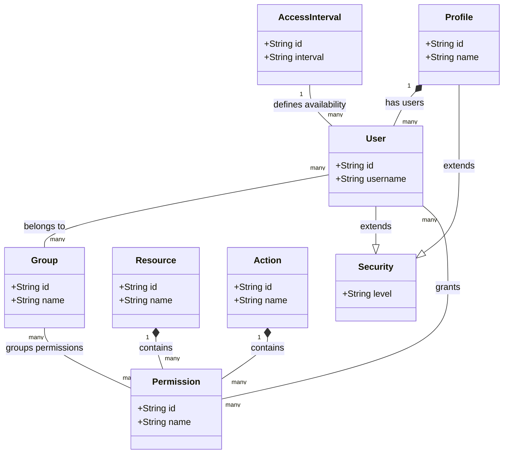
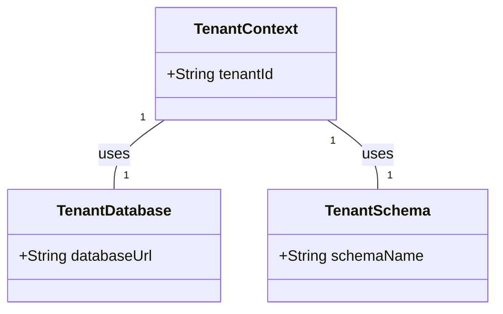

# Índice
- [Módulo Archbase-Security](#módulo-archbase-security)
    - [Principais Funcionalidades](#principais-funcionalidades)
    - [Controle de Acesso Flexível](#controle-de-acesso-flexível)
        - [Como Funciona](#como-funciona)
    - [Diagrama de Entidades](#diagrama-de-entidades)
    - [Uso da Anotação `HasPermission`](#uso-da-anotação-`haspermission`)
        - [Exemplo de Uso](#exemplo-de-uso)
        - [Configuração](#configuração)
- [Chave secreta para assinatura JWT](#chave-secreta-para-assinatura-jwt)
- [Validade do token JWT (em milissegundos)](#validade-do-token-jwt-(em-milissegundos))
    - [Customização e Extensão](#customização-e-extensão)
    - [Troubleshooting](#troubleshooting)
- [Módulo Archbase-Multitenancy](#módulo-archbase-multitenancy)
    - [Principais Funcionalidades](#principais-funcionalidades)
    - [Configuração do Módulo Archbase-Multitenancy](#configuração-do-módulo-archbase-multitenancy)
- [Ativar suporte a multitenancy](#ativar-suporte-a-multitenancy)
- [Pacote para escanear anotações de permissão (requerido se usando controle de acesso por inquilino)](#pacote-para-escanear-anotações-de-permissão-(requerido-se-usando-controle-de-acesso-por-inquilino))
    - [Diagrama de Entidades](#diagrama-de-entidades)
    - [Uso Básico do Multitenancy](#uso-básico-do-multitenancy)
        - [Exemplo de Configuração de Interceptador](#exemplo-de-configuração-de-interceptador)
- [Archbase-Starter](#archbase-starter)
    - [Funcionalidades Incluídas](#funcionalidades-incluídas)
    - [Configuração](#configuração)
    - [Uso Básico](#uso-básico)
- [Archbase-Starter-Core](#archbase-starter-core)
    - [Funcionalidades Incluídas](#funcionalidades-incluídas)
    - [Personalização e Exclusão de Módulos](#personalização-e-exclusão-de-módulos)
        - [Desabilitando Módulos via Propriedades](#desabilitando-módulos-via-propriedades)
        - [Sobrepor Configurações](#sobrepor-configurações)
            - [Exemplo de Sobreposição](#exemplo-de-sobreposição)
    - [Configuração e Uso Básico](#configuração-e-uso-básico)
        - [Configuração do Swagger](#configuração-do-swagger)
- [Archbase-Starter-Multitenancy](#archbase-starter-multitenancy)
    - [Funcionalidades Incluídas](#funcionalidades-incluídas)
    - [Configuração e Uso Básico](#configuração-e-uso-básico)
        - [Configurando o Identificador de Tenancy](#configurando-o-identificador-de-tenancy)
- [Archbase-Starter-Security](#archbase-starter-security)
    - [Funcionalidades Incluídas](#funcionalidades-incluídas)
    - [Configuração e Uso Básico](#configuração-e-uso-básico)
    - [Customização de Segurança](#customização-de-segurança)
        - [Exemplo de Customização de Autenticação](#exemplo-de-customização-de-autenticação)
        - [Desabilitando Segurança](#desabilitando-segurança)


# Módulo Archbase-Security

O módulo `archbase-security` fornece funcionalidades robustas de segurança para aplicações Spring Boot, facilitando a implementação de controles de acesso baseados em permissões, autenticação JWT, e segurança de dados. Ele suporta uma configuração de permissões flexível que pode variar conforme o tenant, a empresa e o projeto, permitindo uma adaptação refinada às necessidades de negócios complexos.

## Principais Funcionalidades

- **Autenticação JWT**: Implementa autenticação utilizando tokens JWT para garantir a segurança das APIs.
- **Controle de Acesso Baseado em Permissões**: Utiliza um modelo de permissões detalhado que pode ser adaptado para diferentes tenants, empresas e projetos, oferecendo controle fino sobre o acesso a recursos.

## Controle de Acesso Flexível

O sistema de permissões no `archbase-security` é projetado para ser extremamente flexível, permitindo configurações distintas baseadas em diferentes níveis de agregação como Tenant, Company e Project. Isso significa que você pode definir permissões de forma granular, não apenas no nível global, mas também personalizadas para contextos específicos de negócios.

### Como Funciona

Permissões podem ser atribuídas de forma a considerar o contexto específico no qual o usuário opera. Isso é útil em cenários multi-tenant, onde diferentes organizações (tenants) podem requerer regras específicas, ou em empresas com múltiplos departamentos ou projetos com necessidades únicas de acesso e segurança.

## Diagrama de Entidades

O seguinte diagrama mostra as principais entidades envolvidas no módulo de segurança e suas relações:



## Uso da Anotação `HasPermission`

A anotação `HasPermission` é usada para aplicar controle de acesso nos métodos dentro de sua aplicação, especificando a ação e o recurso necessários para acessar o método.

### Exemplo de Uso

```java
@HasPermission(action="VIEW", resource="USER_PROFILE")
public UserProfile getUserProfile(String userId) {
    // implementação do método
}
```

### Configuração

Para configurar o módulo de segurança, ajuste as seguintes propriedades no seu `application.properties`:

```properties
# Chave secreta para assinatura JWT
archbase.security.jwt.secret-key=secret-key

# Validade do token JWT (em milissegundos)
archbase.security.jwt.token-expiration=3600000
```

## Customização e Extensão

O módulo foi projetado para ser altamente configurável e extensível. Você pode substituir componentes padrão ou adicionar novos comportamentos conforme necessário.

## Troubleshooting

Se encontrar problemas ao utilizar o módulo, verifique se as configurações de segurança estão corretas e consulte os logs de erro para mais detalhes.


# Módulo Archbase-Multitenancy

O módulo `archbase-multitenancy` é projetado para facilitar a implementação de aplicações multi-inquilino em Spring Boot, oferecendo uma gestão eficiente de múltiplos inquilinos em um único ambiente de aplicação.

## Principais Funcionalidades

- **Isolamento de Dados**: Garante que os dados de cada inquilino sejam isolados e inacessíveis por outros inquilinos.
- **Configuração Flexível**: Suporta várias estratégias de isolamento de dados, tais como esquema separado, banco de dados separado, ou distinções dentro de um mesmo banco de dados.
- **Integração Transparente**: Facilmente integrável com o Spring Boot, usando abstrações simples para manipular a identidade do inquilino através de solicitações HTTP.

## Configuração do Módulo Archbase-Multitenancy

Para ativar e configurar o multitenancy em sua aplicação, ajuste as seguintes propriedades no seu `application.properties` ou `application.yml`:

```properties
# Ativar suporte a multitenancy
archbase.multitenancy.enabled=true

# Pacote para escanear anotações de permissão (requerido se usando controle de acesso por inquilino)
archbase.multitenancy.scan-packages=br.com.exemplo.minhaapp
```

## Diagrama de Entidades

O seguinte diagrama simplificado mostra como o multitenancy pode ser implementado usando entidades de contexto de inquilino:



## Uso Básico do Multitenancy

Depois de configurar o suporte a multitenancy, você pode acessar e manipular dados de maneira que respeite o contexto do inquilino atual. Isso é geralmente gerenciado automaticamente pelo framework, assegurando que as operações de banco de dados estejam corretamente contextualizadas pelo inquilino identificado.

### Exemplo de Configuração de Interceptador

Você pode configurar um interceptador para extrair e definir o ID do inquilino de cada solicitação HTTP, como mostrado abaixo:

```java
@Bean
public HandlerInterceptor tenantInterceptor() {
    return new TenantInterceptor();
}
```


# Archbase-Starter

O `archbase-starter` é o módulo base que facilita a integração e configuração de todos os módulos básicos necessários para uma aplicação Spring Boot seguindo as práticas recomendadas da Archbase. Este starter inclui configurações essenciais que são comuns a todas as aplicações.

## Funcionalidades Incluídas
- Configurações básicas de Spring Boot.
- Integração com `archbase-starter-core`, `archbase-starter-security`, e `archbase-starter-multitenancy`.

## Configuração

Este starter não requer configurações específicas, pois serve principalmente como um agregador de outros starters. Ele automaticamente configura seu projeto para usar os módulos Core, Security e Multitenancy, caso sejam incluídos no classpath.

## Uso Básico

Inclua o `archbase-starter` em seu arquivo `pom.xml` para começar a usar:

```xml
<dependency>
    <groupId>com.archbase</groupId>
    <artifactId>archbase-starter</artifactId>
    <version>1.0.0</version>
</dependency>
```
Este starter não necessita de configurações adicionais para uso básico.


# Archbase-Starter-Core

O `archbase-starter-core` é projetado para fornecer todas as configurações essenciais e infraestrutura comuns para projetos baseados em Spring Boot. Ele inclui internacionalização, configurações de serialização JSON, e suporte extensivo para JPA.

## Funcionalidades Incluídas
- **RSQL**: Suporte para RSQL, permitindo filtragem e busca avançada através de URLs.
- **Spring MVC**: Configuração básica do Spring MVC com serialização e deserialização personalizada.
- **Bean Validation**: Integração com Hibernate Validator para validação de beans.
- **Locale**: Configuração padrão do locale para `pt-BR`, facilitando a internacionalização.
- **Jackson Configuration**: Customizações no ObjectMapper para melhor tratamento de JSON, incluindo módulos como Hibernate5Module para lidar com entidades Hibernate.
- **Swagger**: Configuração pronta para uso do Swagger para documentação da API.
- **TaskExecutor**: Configuração de um `TaskExecutor` para gerenciamento eficiente de tarefas assíncronas.

## Personalização e Exclusão de Módulos

Os starters da Archbase foram projetados para serem flexíveis, permitindo aos desenvolvedores excluir módulos específicos ou desabilitar funcionalidades conforme necessário.

### Desabilitando Módulos via Propriedades

Para desabilitar um módulo específico, você pode utilizar a propriedade `enabled` no seu arquivo `application.properties` ou `application.yml`. Por exemplo, para desabilitar o módulo de multitenancy:

```properties
archbase.multitenancy.enabled=false
```

### Sobrepor Configurações

Se você deseja sobrepor qualquer configuração padrão ou bean fornecido pelo starter, você pode declarar seu próprio bean com a mesma assinatura no seu contexto de aplicação. Spring Boot usará sua declaração de bean em vez da fornecida pelo starter, graças ao mecanismo de `@ConditionalOnMissingBean`.

#### Exemplo de Sobreposição

Para substituir o `LocaleResolver` padrão que define o locale como `pt-BR`, você pode definir o seguinte bean:

```java
@Bean
public LocaleResolver localeResolver() {
    SessionLocaleResolver resolver = new SessionLocaleResolver();
    resolver.setDefaultLocale(new Locale("en", "US")); // Definir para inglês americano
    return resolver;
}
```

## Configuração e Uso Básico

Inclua o `archbase-starter-core` no seu projeto para ativar automaticamente as configurações:

```xml
<dependency>
    <groupId>com.archbase</groupId>
    <artifactId>archbase-starter-core</artifactId>
    <version>1.0.0</version>
</dependency>
```
Configurações adicionais podem ser feitas através de `application.properties` para ajustar o comportamento padrão das funcionalidades incluídas.

### Configuração do Swagger

Para customizar a configuração do Swagger, ajuste as seguintes propriedades:

```properties
archbase.swagger.title=Minha API
archbase.swagger.description=Descrição detalhada da API
archbase.swagger.version=v1
archbase.swagger.terms-of-service-url=http://examplo.com/terms
archbase.swagger.contact.name=Suporte Técnico
archbase.swagger.contact.url=http://examplo.com/contact
archbase.swagger.contact.email=suporte@examplo.com
```

Estas propriedades permitem definir os detalhes da sua API que serão exibidos na interface do Swagger.


# Archbase-Starter-Multitenancy

O `archbase-starter-multitenancy` oferece uma solução pronta para aplicações que necessitam suportar múltiplos inquilinos, gerenciando isolamento de dados e contextos de tenancy de forma eficiente. Este starter é automaticamente carregado se o `archbase-starter` estiver incluído no projeto.

## Funcionalidades Incluídas
- Configuração automática para isolamento de tenancy.
- Suporte a estratégias de isolamento como banco de dados separados, esquemas separados ou filtragem por coluna.

## Configuração e Uso Básico

Para ativar o multitenancy em seu projeto, adicione o starter:

```xml
<dependency>
    <groupId>com.archbase</groupId>
    <artifactId>archbase-starter-multitenancy</artifactId>
    <version>1.0.0</version>
</dependency>
```

### Configurando o Identificador de Tenancy

Você pode configurar como o tenant é identificado em cada requisição:

```java
@Bean
public TenantResolver tenantResolver() {
    return new HeaderTenantResolver();
}
```


# Archbase-Starter-Security

O `archbase-starter-security` facilita a implementação de robustas funcionalidades de segurança em aplicações Spring Boot, fornecendo configurações pré-definidas para autenticação, autorização e controle de acesso. Este starter é automaticamente carregado se o `archbase-starter` estiver incluído no projeto.

## Funcionalidades Incluídas
- Configurações pré-definidas para uso de JWT para autenticação.
- Suporte a autorizações complexas baseadas em roles e permissões.
- Integração fácil com diferentes fontes de dados de usuários.

## Configuração e Uso Básico

Para utilizar o `archbase-starter-security`, adicione-o ao seu projeto:

```xml
<dependency>
    <groupId>com.archbase</groupId>
    <artifactId>archbase-starter-security</artifactId>
    <version>1.0.0</version>
</dependency>
```

## Customização de Segurança

O starter permite extensa customização para se adaptar às necessidades específicas do seu projeto.

### Exemplo de Customização de Autenticação

Para customizar a autenticação, você pode fornecer sua própria implementação do `AuthenticationProvider`:

```java
@Bean
public AuthenticationProvider customAuthenticationProvider() {
    return new CustomAuthenticationProvider();
}
```

### Desabilitando Segurança

Para desabilitar a segurança em desenvolvimento, você pode usar a propriedade:

```properties
archbase.security.enabled=false
```
